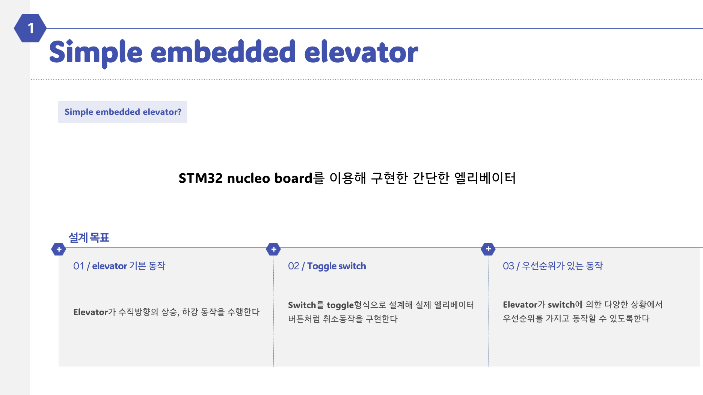
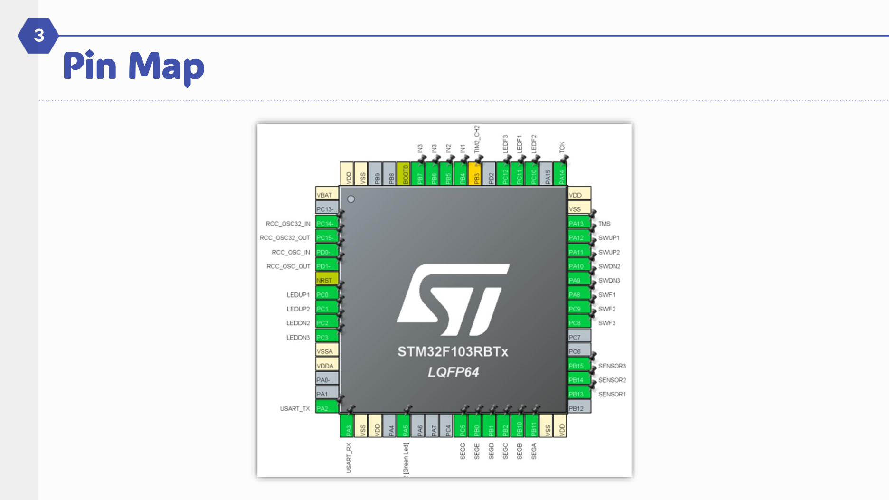
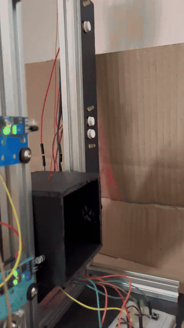

# STM32 Mini Elevator Controller
> STM32 Nucleo 기반으로 3층 엘리베이터를 모사한 임베디드 제어 프로젝트입니다. 외부 Hall 버튼, 내부 층 선택 버튼, 요청 LED, Step Motor, 7-Segment 표시기를 하나의 상태 머신처럼 묶어 동작시키는 데 초점을 맞췄습니다.

## Project Info

| 항목 | 내용 |
|---|---|
| 기간 | `2024.08 ~ 2024.11` |
| Board | `STM32 Nucleo` |
| MCU Family | `STM32F103` |
| Language | `C` |
| Core Keywords | `GPIO` `Step Motor` `Timer` `7-Segment` `Scheduler` `Debouncing` |

## Overview

- 이 프로젝트의 핵심은 "버튼이 눌리면 모터가 돈다" 수준이 아니라, 여러 층에서 동시에 들어오는 요청을 어떤 순서로 처리할지를 펌웨어 관점에서 설계하는 데 있습니다.
- 발표 자료에서 정의한 목표는 세 가지입니다.
- elevator 기본 동작 구현
- toggle switch 기반 버튼 입력 처리
- 우선순위가 있는 이동 동작
- 최종 코드 기준으로는 `elevator_final.c`에 실제 제어 로직이 정리되어 있고, `elevator_project/elevator_test/Core/Src/main.c`는 CubeIDE로 생성한 초기 스캐폴드에 가깝습니다.

## System Composition

- 외부 버튼: 1층 Up, 2층 Up, 2층 Down, 3층 Down
- 내부 버튼: 1층, 2층, 3층
- 요청 표시: 외부/내부 호출 상태를 LED로 토글 표시
- 구동부: 4상 제어 방식의 Step Motor
- 상태 표시: 현재 층을 7-Segment에 출력
- 시간 제어: `TIM2` 카운터 기반의 세밀한 모터 delay 제어

## Why This Project Is Better Than It Looks

- 이동 중에도 `input_button()`를 계속 호출해 새로운 요청을 받아들입니다. 즉, 정지 상태에서만 입력을 보는 구조가 아닙니다.
- `button_check()`는 방향을 고려한 `SCAN` 유사 스케줄링으로 다음 층을 선택합니다.
- 도착 시 `led_check()`가 현재 방향과 층을 기준으로 요청을 소거하고 LED를 끕니다.
- `motor_delay()`는 `HAL_Delay()`만 쓰지 않고 `TIM2` 카운터를 직접 읽어 step timing을 더 촘촘하게 맞춥니다.
- 층 이동은 단순 방향 플래그가 아니라 `STEP`, `totalSteps`, `currentFloor`, `targetFloor`로 상태가 연결되어 있어 작은 상태기계로 볼 수 있습니다.

## ETRI Portfolio Focus

PDF 포트폴리오에서는 이 프로젝트를 RTL 중심 프로젝트를 보완하는 MCU 기반 제어 시스템 경험으로 정리했습니다. 핵심은 버튼, LED, step motor, 7-segment를 각각 따로 제어한 것이 아니라, 외부/내부 요청을 상태로 저장하고 현재 층과 이동 방향을 고려해 다음 목적지를 선택하는 하나의 제어 흐름으로 통합했다는 점입니다.

- 역할: 팀장으로서 step motor 제어, elevator 동작 로직, 전체 시스템 통합 담당
- 제어 구조: 외부 hall button과 내부 floor button 요청을 분리 저장하고 도착 시점에 요청 소거
- 하드웨어 이해: STM32F103 datasheet와 header file을 보며 peripheral register/MMIO 동작 확인
- 협업 경험: MCU 경험이 적은 팀원도 참여할 수 있도록 기능을 작게 나누고 스터디를 병행

이 경험은 이후 APB/AHB/AXI 같은 register interface를 RTL로 설계할 때 software가 hardware register를 어떻게 제어하는지 이해하는 연결점이 되었습니다.

---

## Design Slides

  
  

---

## Implementation Details

### 1. Request Input and LED Toggle

- `input_button()`는 각 버튼을 폴링하면서 눌림을 감지하면 대응 LED를 토글하고, 버튼 상태 배열을 뒤집습니다.
- 사용되는 상태 배열은 다음과 같습니다.
- `upButton[MAXFLOOR]`
- `downButton[MAXFLOOR]`
- `fButton[MAXFLOOR]`
- 각 버튼 입력 뒤에는 `HAL_Delay(100)`과 버튼이 떼어질 때까지 기다리는 루프를 넣어, 가장 단순하지만 확실한 blocking debouncing 구조를 사용합니다.

### 2. Direction-Aware Scheduling

- `button_check()`가 이 프로젝트의 핵심입니다.
- 상승 중(`direction == 1`)에는 현재 층 이상에서 `UP/내부 호출`을 우선 처리하고, 같은 방향 요청이 모두 끝난 뒤 위쪽 `DOWN` 요청과 아래층 요청을 회수합니다.
- 하강 중(`direction == 2`)에는 반대로 `DOWN/내부 호출`을 우선 처리합니다.
- 정지 상태에서는 가장 가까운 요청 층을 고르고, 거리가 같으면 더 높은 층을 선택합니다.
- 즉, FCFS처럼 단순히 먼저 누른 버튼만 보는 것이 아니라, 현재 진행 방향을 유지하면서 효율을 높이는 엘리베이터식 스케줄링을 직접 구현했습니다.

### 3. Arrival Handling

- `led_check()`는 현재 방향과 현재 층을 기준으로 도착한 요청을 해제합니다.
- 상승 중이면 해당 층의 `upButton`, 하강 중이면 `downButton`을 우선 소거하고, 내부 버튼(`fButton`)은 방향과 무관하게 도착 시 해제합니다.
- 이 구조 덕분에 같은 층에 대한 외부 호출과 내부 호출이 분리된 채 관리됩니다.

### 4. Step Motor Drive

- `motor_on()`은 현재 `stepNumber`에 따라 `IN1 ~ IN4`를 활성화합니다.
- `up_floor()`와 `down_floor()`는 각각 정방향/역방향 step sequence를 수행합니다.
- 한 층 이동량은 `STEP = 135`로 정의돼 있고, 이동 중에는 `totalSteps`를 증가 또는 감소시킵니다.
- `motor_delay()`는 `TIM2` 카운터를 직접 읽어 대기하므로, coarse한 `HAL_Delay()`보다 step timing을 더 세밀하게 제어할 수 있습니다.

### 5. Speed Profile

- `speed`는 `SPEEDINIT = 20`에서 시작합니다.
- 각 step의 delay는 `60*1000*1000/200/speed`로 계산됩니다.
- 이동 마지막 5 step에서는 `speed = speed - DECREASE`가 적용돼 delay가 길어지고, 결과적으로 종단부에서 감속하는 형태가 됩니다.
- 정교한 가감속 제어는 아니지만, 기계 구조물에 바로 충격이 가지 않도록 최소한의 속도 프로파일을 넣은 구현입니다.

### 6. Floor Tracking and Display

- `update_currentFloor()`는 센서 인터럽트 대신 `totalSteps` 누적값을 기준으로 현재 층을 갱신합니다.
- `STEP`, `STEP*2`, `STEP*3`에 대응해 1층, 2층, 3층을 판단합니다.
- `display_floor()`는 7-Segment 세그먼트 배열(`num[3][6]`)을 사용해 현재 층을 출력합니다.

## What The Code Suggests Technically

- 발표 자료에는 층 센서가 포함되어 있지만, 최종 코드에서는 센서 기반 층 판정보다 `totalSteps` 기반 층 추적이 주 경로입니다.
- `HAL_GPIO_EXTI_Callback()` 안의 센서 처리 코드는 주석 처리되어 있어, 하드웨어 센서를 고려한 설계는 있었지만 최종 데모는 open-loop step counting에 더 가까웠다고 볼 수 있습니다.
- 그래서 이 프로젝트의 진짜 포인트는 센서 융합보다도 다음 두 가지입니다.
- 버튼 요청 관리
- 방향 우선 스케줄링과 모터 구동의 결합

## Limitations and Next Step

- 현재 층 판정이 step count 기반이어서, 모터 slip이나 missed step이 누적되면 오차가 생길 수 있습니다.
- 버튼 입력 처리는 blocking delay 방식이라, 더 많은 층이나 더 빠른 응답성을 원하면 인터럽트 또는 non-blocking debounce 방식으로 바꾸는 편이 좋습니다.
- 스케줄링은 3층 기준으로 충분히 명확하지만, 층 수가 늘어나면 요청 큐 구조를 별도로 두는 편이 유지보수에 유리합니다.
- 센서 핀 정의가 이미 있으므로, 다음 단계에서는 실제 층 센서 기반 closed-loop 보정으로 확장하기 좋습니다.

---

## Demo

  

## Files

- [최종 제어 코드](./elevator_final.c)
- [중간 버전 코드 1](./elevator_origin.c)
- [중간 버전 코드 2](./elevator_good.c)
- [CubeIDE 프로젝트](./elevator_project/elevator_test)
- [발표 자료 PDF](./simple%20embedded%20elevator.pdf)
- [발표 자료 PPTX](./simple%20embedded%20elevator.pptx)
- [원본 시연 영상](./시연영상.mp4)

## Wrap-Up

- 이 프로젝트는 작은 3층 모형이지만, 실제로는 요청 입력, 상태 저장, 우선순위 결정, 모터 시퀀스 제어, 층 표시를 하나의 흐름으로 묶는 임베디드 제어 문제를 다룹니다.
- 이후에 진행한 다른 STM32 프로젝트들에 비해 그래픽이나 통신은 적지만, "상태를 갖는 시스템을 C로 제어한다"는 감각을 가장 직접적으로 보여주는 프로젝트입니다.
- 특히 `button_check()`의 방향 우선 처리와, 이동 중에도 입력을 계속 받아들이는 구조는 이 README에서 가장 강조할 만한 구현 포인트입니다.
