# Embedded SW
> ATtiny2313A/4313부터 STM32F401CC까지, 핀 제약이 큰 AVR 환경에서의 디바이스 통합부터 DMA 기반 그래픽 렌더링과 터치 UI 게임까지 단계적으로 확장한 임베디드 소프트웨어 포트폴리오입니다.

## Project Info

| 항목 | 내용 |
|---|---|
| 기간 | `2024.12.23 ~ 2025.01.24` |
| MCU | `ATtiny2313A` `ATtiny4313` `STM32F401CCU6` |
| Language | `C` |
| Core Keywords | `GPIO` `Interrupt` `Timer` `PWM` `SPI` `UART` `USB CDC` `DMA` `ILI9341` `XPT2046` |

## Why This Portfolio Matters

- AVR 단계에서는 한정된 핀 수 안에서 `HD44780`, `MAX7219`, `SH1106`, `PS/2 Keyboard`, `CP2102`, `Rotary Encoder`, `PWM LED`를 동시에 붙이면서 자원 공유 문제를 직접 해결했습니다.
- 2차 프로젝트에서는 `Pin Change Interrupt + Timer Compare` 조합으로 소프트웨어 UART RX를 구현하고, 하드웨어 UART TX와 결합해 입력 디바이스를 통합했습니다.
- STM32 단계에서는 `TIM Encoder`, `SPI 3채널`, `DMA`, `Addressable LED`, `ILI9341`, `XPT2046`를 엮어 더 높은 수준의 UI와 렌더링 로직으로 확장했습니다.
- README 내용은 각 차수 보고서와 실제 소스 코드를 함께 읽고 재정리했습니다. 단순 기능 나열이 아니라 "어떤 제약을 어떻게 풀었는지"를 중심으로 정리했습니다.

## Project Roadmap

| 구분 | 주제 | 핵심 포인트 |
|---|---|---|
| 1차 | ATtiny2313A 타이머 | 3종 디스플레이 동시 구동, 폴링 기반 타이머, 시간 표시 동기화 |
| 2차 | ATtiny4313 통합 제어 | Rotary Encoder 인터럽트, PWM 밝기 제어, PS/2 키보드, 소프트웨어 UART RX |
| 3차 필수 | STM32F401 그래픽/멀티 SPI | DMA 기반 ILI9341 출력, Encoder-LED Ring-SH1106-MAX7219 연동, Sprite/Tilemap 렌더러 |
| 3차 선택 | STM32F401 터치 게임 | XPT2046 터치 좌표 보정, 카드 매칭 게임, 시도 횟수 표시, 게임 완료 연출 |

---

## 1차 프로젝트: ATtiny2313A Multi-Display Timer

### 무엇을 만들었나

- `HD44780 LCD`, `MAX7219 7-Segment`, `SH1106 OLED`에 같은 시간을 동시에 표시하는 타이머를 만들었습니다.
- 스위치 1로 시작, 스위치 2로 정지 및 초기화가 가능하며, `99시간`을 넘기면 동작을 멈추도록 구현했습니다.
- 보고서에 적힌 것처럼 정확한 타이머 인터럽트가 아니라 `while` 루프 기반 clock count 방식으로 시간을 세고, LCD 출력 지연을 코드에서 보정했습니다.

### 코드에서 확인한 구현 포인트

- `main.c`에서 `lcd_write_nibble()` / `lcd_write_byte()`로 `HD44780` 4-bit 인터페이스를 직접 구현했습니다.
- `SpiUSITx()`를 사용해 AVR `USI` 기반 직렬 전송 루틴을 만들고, 이를 `MAX7219`와 `SH1106` 양쪽에 재사용했습니다.
- `max_print_init()`는 모든 자리를 decode 모드로 두지 않고, `H`, `S`를 보여주는 자리만 non-decode로 설정해 고정 텍스트를 표시합니다.
- `sh1106_text_font24()`는 폰트 데이터를 `PROGMEM`에서 읽어 와 24px 숫자를 출력합니다.
- `display()` 하나에서 LCD, 7-Segment, OLED 출력을 같이 갱신해 세 디스플레이의 표현이 분리되지 않도록 정리했습니다.
- `timer == 350000` 조건과 `timer += 96000` 보정값으로 LCD 출력 지연을 상쇄하려 한 흔적이 코드와 보고서에 모두 남아 있습니다.

### 보고서 기준 한계와 개선 방향

- 시간 측정 정확도는 루프 실행 시간과 LCD 지연에 의존하므로 하드웨어 타이머 기반 구현보다 부정확합니다.
- 스위치 입력은 폴링 기반이라 디바운싱과 인터럽트 기반 제어로 개선 여지가 있습니다.

### 자료

- [소스 코드](./1차프로젝트/main.c)
- [결과 보고서 PDF](./1차프로젝트/우상욱_1차과제프로젝트보고서.pdf)
- [회로도](./1차프로젝트/회로도.png)
- [원본 영상 1](./1차프로젝트/영상/기본동작영상.mp4)
- [원본 영상 2](./1차프로젝트/영상/99시간이상Test.mp4)

### Demo

  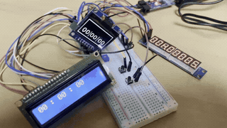
  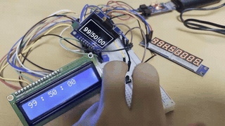

  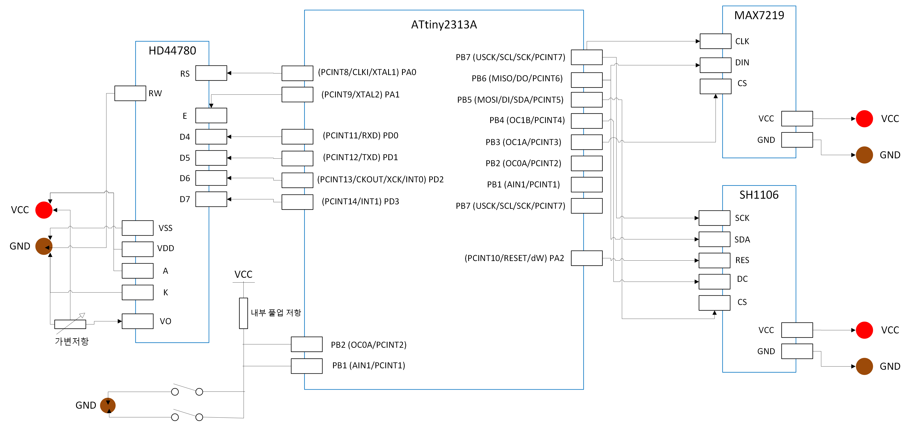

---

## 2차 프로젝트: ATtiny4313 Peripheral Integration

### 무엇을 만들었나

- `Rotary Encoder`, `PWM LED`, `PS/2 Keyboard`, `CP2102 UART`, `HD44780`, `MAX7219`, `SH1106`를 한 보드에서 동시에 동작시키는 통합 제어 프로젝트입니다.
- Rotary 입력은 인터럽트로 읽고, 그 값을 `OCR0B`에 반영해 LED 밝기를 바꾸며, 밝기 값은 `SH1106`에 3자리 숫자로 표시합니다.
- PS/2 키보드 입력은 인터럽트로 수집한 뒤 ASCII로 변환하고, `UART TX`로 PC에 전송합니다.
- 받은 데이터는 `HD44780`에 누적 표시하고, `MAX7219`에는 scan code와 parity/stop bit, ASCII nibble을 나눠 보여줍니다.

### 코드에서 확인한 구현 포인트

- `PCINT2_vect`와 `TIMER1_COMPA_vect`를 조합해 시작 비트를 감지하고, 반비트/한비트 간격으로 샘플링하는 소프트웨어 UART RX를 구현했습니다.
- TX는 `uart_tx()`로 하드웨어 UART를 그대로 활용해, 제한된 타이머 자원을 RX 쪽에 집중했습니다.
- `ps2_scan_to_ascii()`는 break code, modifier, shift state를 따로 관리하며 scan code를 ASCII로 변환합니다.
- `ISR(PCINT1_vect)`에서 Rotary A/B 위상을 비교해 증가/감소 방향을 판단하고, `counter` 값을 `250` 범위 안에서 순환시키도록 구현했습니다.
- `rotary_func()`는 `OCR0B = 250 - counter`로 PWM 밝기를 반전 매핑하고, 같은 값을 OLED 숫자로 다시 표시합니다.
- `main()`에서는 `USICR &= ~(1<<USIWM0)`를 반복해서 설정하며 LCD 데이터 핀과 SPI 핀의 공유 충돌을 회피합니다. 보고서에서도 이 하드웨어 자원 공유 이슈를 핵심 제약으로 설명합니다.
- LCD는 16자마다 줄바꿈, 32자마다 화면 전체 clear를 수행해 수신 문자열을 계속 볼 수 있도록 했습니다.

### 설계상 의미

- 단순히 주변장치를 많이 연결한 수준이 아니라, "어떤 기능은 인터럽트로, 어떤 기능은 타이머로, 어떤 통신은 소프트웨어로 우회할 것인가"를 선택하며 자원을 재배치한 프로젝트입니다.
- 특히 `PS/2 -> ASCII -> UART -> LCD/MAX7219`로 이어지는 데이터 경로가 하나의 실시간 파이프라인처럼 동작합니다.

### 자료

- [소스 코드](./2차프로젝트/main.c)
- [결과 보고서 PDF](./2차프로젝트/임베디드SW2차프로젝트결과보고서.pdf)
- [회로도](./2차프로젝트/회로도.png)
- [원본 영상](./2차프로젝트/동작영상.mp4)

### Demo

  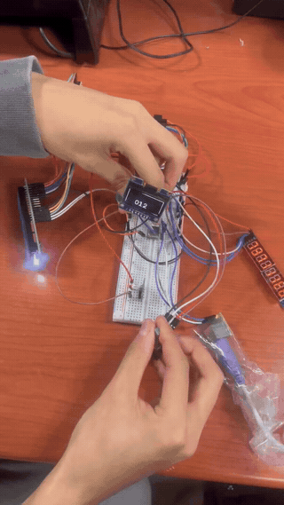

  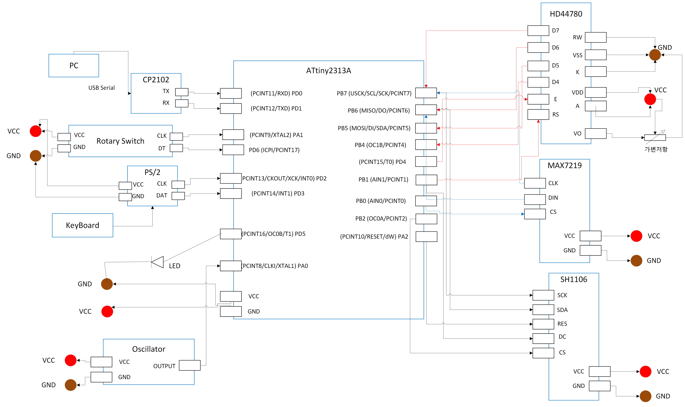

---

## 3차 필수 프로젝트: STM32F401 Multi-SPI Control and DMA Graphics

### 무엇을 만들었나

- `STM32F401CCU6`로 넘어오면서 `ILI9341 TFT`, `MAX7219`, `SH1106`, `Addressable LED Ring`, `Rotary Encoder`를 함께 제어하는 그래픽 중심 프로젝트로 확장했습니다.
- 보고서 기준 기능은 크게 두 축입니다.
- 하나는 Encoder 값에 따라 `LED Ring 위치/색상`, `SH1106 bar`, `MAX7219 숫자`가 함께 반응하는 멀티-SPI 제어 파트입니다.
- 다른 하나는 `ILI9341`에 RGB gradation, sprite rendering, tilemap scrolling을 구현하는 렌더링 파트입니다.

### 코드 구조

- `Src/spi_allRun.c`
- `Src/ili9341.c`
- `Src/render.c`
- `Src/main.c`

### 코드에서 확인한 구현 포인트

- `main.c`는 `line_buf[2][ILI9341_WIDTH*2]` 이중 버퍼를 두고, 한 줄을 계산한 뒤 `HAL_SPI_Transmit_DMA()`로 전송하는 scanline 방식으로 화면을 출력합니다.
- `draw_line_gradation()`과 `end_of_frame_gradation()`은 프레임마다 시작 밝기를 이동시키면서 RGB band가 움직이는 gradation 효과를 만듭니다.
- `ILI9341_Init()`에는 gamma 관련 초기화 시퀀스가 포함되어 있어, 보고서에서 언급한 색감 보정 의도가 코드에도 반영되어 있습니다.
- `render.c`는 단순한 이미지 출력이 아니라 다음 기능을 포함합니다.
- `tilemap` 스크롤
- 투명색(`transparent_colour`)을 고려한 sprite 합성
- scanline 단위 active sprite 계산
- entity 기반 애니메이션과 이동 방향별 walk frame 변경
- 즉, 이 프로젝트는 단순 LCD 테스트가 아니라 "MCU에서 돌아가는 경량 2D 렌더러"에 가깝습니다.
- `spi_allRun.c`는 `SPI2`로 `24개 Addressable LED`를 구동합니다. `set_spi_bits()`에서 각 비트를 `3-bit pulse pattern`으로 변환해 WS2812 계열 타이밍을 맞추는 구조를 확인할 수 있습니다.
- 같은 파일에서 `SPI3`는 `MAX7219`와 `SH1106`를 맡고, `TIM1->CNT` Encoder 값을 읽어 `MAX7219 숫자 + OLED bar + LED ring 위치`를 동시에 업데이트합니다.

### 프로젝트를 읽으며 확인한 포인트

- 보고서에는 `DMA`와 `buffer 두 개`를 활용했다고 적혀 있는데, 실제로 `main.c`의 line buffer 두 개와 DMA 송신이 그대로 들어 있습니다.
- `render.c`의 tilemap/sprite 엔진은 현재 main loop에서 gradation 데모 코드와 분리돼 있지만, 포함된 영상과 소스 기준으로 별도 렌더링 데모를 수행한 흔적이 명확합니다.
- 이 차수부터는 단순 주변장치 제어를 넘어, `데이터 생성(render) - 버퍼링 - DMA 송신 - 디스플레이 출력`의 파이프라인을 설계하는 단계로 넘어갑니다.

### 자료

- [메인 제어 코드](./3-1차프로젝트/소스코드/Src/main.c)
- [렌더러 코드](./3-1차프로젝트/소스코드/Src/render.c)
- [멀티 SPI 제어 코드](./3-1차프로젝트/소스코드/Src/spi_allRun.c)
- [결과 보고서 PDF](./3-1차프로젝트/임베디드SW3차필수프로젝트결과보고서.pdf)
- [IOC 화면](./3-1차프로젝트/ioc화면.png)
- [원본 영상 1](./3-1차프로젝트/영상/renderScroll.mp4)
- [원본 영상 2](./3-1차프로젝트/영상/RGBScroll.mp4)
- [원본 영상 3](./3-1차프로젝트/영상/spi_all_run.mp4)

### Demo

  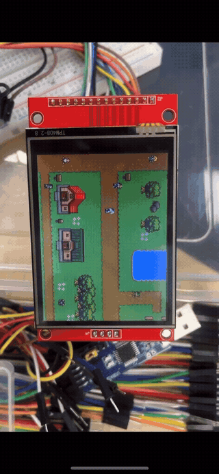
  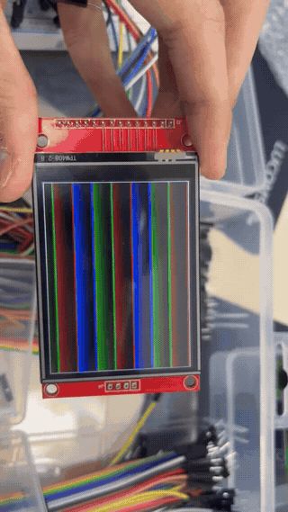
  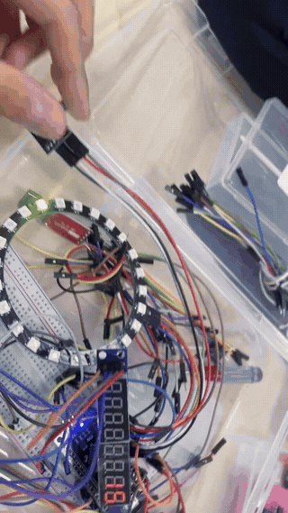

  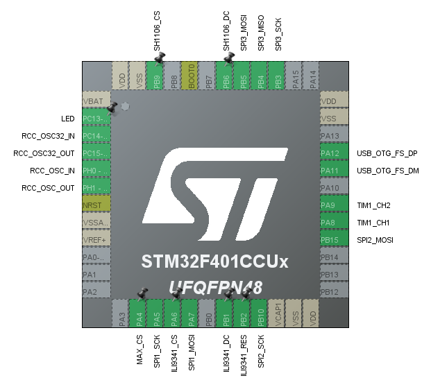

---

## 3차 선택 프로젝트: STM32F401 Touch Card Matching Game

### 무엇을 만들었나

- `ILI9341 + XPT2046 Touch` 조합으로 카드 뒤집기 게임을 구현했습니다.
- 8장의 카드를 뒤집어 짝을 맞추는 구조이며, 시도 횟수는 화면 좌측 상단과 `MAX7219`에 표시됩니다.
- 모든 카드를 맞추면 `Addressable LED Ring`이 순차 점등되며 게임 종료 연출을 수행합니다.

### 코드에서 확인한 구현 포인트

- `HAL_GPIO_EXTI_Callback()`에서 터치 IRQ 발생 시 `touch_en = 1`만 세우고, 실제 좌표 읽기와 게임 로직은 main loop에서 처리해 인터럽트 부담을 낮췄습니다.
- `xpt2046.c`의 `xpt_get()`은 좌표를 16회 샘플링해 평균값을 만든 뒤, `MIN/MAX RAW` 보정값을 이용해 LCD 좌표계로 환산합니다.
- `xy.h`에는 카드 8장의 고정 위치가 정의되어 있고, `ILI9341_gameInit()`가 초기 배치를 구성합니다.
- `ILI9341_cardShape()`는 터치된 좌표가 어느 카드 영역인지 판단해 앞면 이미지를 그리고, 카드 ID를 반환합니다.
- main loop는 카드 두 장을 선택하면 `prev * next` 곱으로 짝을 판정합니다.
- `1 x 5`
- `2 x 7`
- `3 x 6`
- `4 x 8`
- 불일치 시 `ILI9341_cardBack()`으로 다시 뒷면을 덮고, 일치 시 그대로 유지합니다.
- `ILI9341_tryDisplay()`는 화면의 시도 횟수를 갱신하고, 게임 종료 시에는 `MAX7219`와 `ledRing_run()`이 별도 피드백을 제공합니다.
- `_write()`에서 `CDC_Transmit_FS()`를 사용하므로 USB CDC를 통한 디버그 출력 경로도 준비되어 있습니다.

### 보고서 기준 개선 방향

- 터치 보정값을 더 정교하게 맞출 수 있습니다.
- 게임 로직을 함수 단위로 더 잘게 나눠 구조화할 여지가 있습니다.
- 메뉴와 미니게임 확장도 충분히 가능한 상태입니다.

### 자료

- [메인 게임 로직](./3-2차프로젝트/Core/Src/main.c)
- [터치 입력 드라이버](./3-2차프로젝트/Core/Src/xpt2046.c)
- [디스플레이/게임 UI 코드](./3-2차프로젝트/Core/Src/ili9341.c)
- [결과 보고서 PDF](./3-2차프로젝트/임베디드SW3차선택프로젝트결과보고서.pdf)
- [IOC 화면](./3-2차프로젝트/IOC화면캡처.png)
- [원본 영상](./3-2차프로젝트/시연영상.mp4)

### Demo

  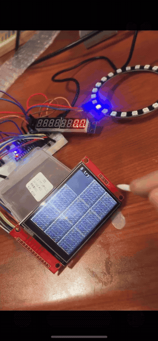

  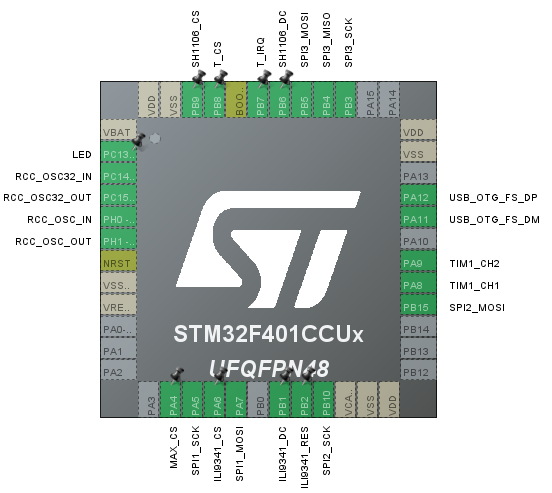

---

## Files

- `1차프로젝트`, `2차프로젝트`: AVR 단계의 단일 `main.c` 중심 프로젝트
- `3-1차프로젝트/소스코드`: STM32 필수 프로젝트 소스
- `3-2차프로젝트/Core`: STM32 선택 프로젝트 소스
- `assets/gifs`: README용으로 생성한 데모 GIF

## Wrap-Up

- 이 포트폴리오는 "간단한 MCU 실습 모음"이 아니라, 제한된 리소스 환경에서 시작해 점진적으로 시스템 통합 난도를 끌어올린 기록입니다.
- AVR 단계에서는 핀 공유와 인터럽트 설계가 핵심이었고, STM32 단계에서는 버퍼링, DMA, 멀티 SPI, UI/입력 처리까지 설계 범위가 넓어졌습니다.
- 특히 2차의 소프트웨어 UART RX, 3차 필수의 scanline + DMA 출력, 3차 선택의 터치 보정과 게임 상태 관리는 이 포트폴리오의 기술 밀도를 가장 잘 보여주는 포인트입니다.
