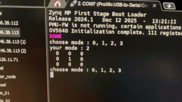
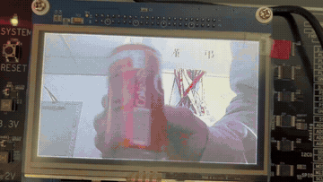
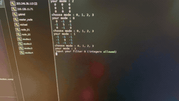
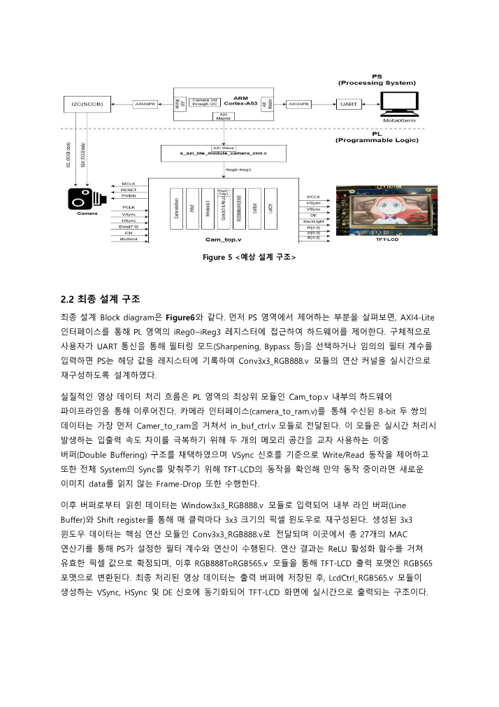
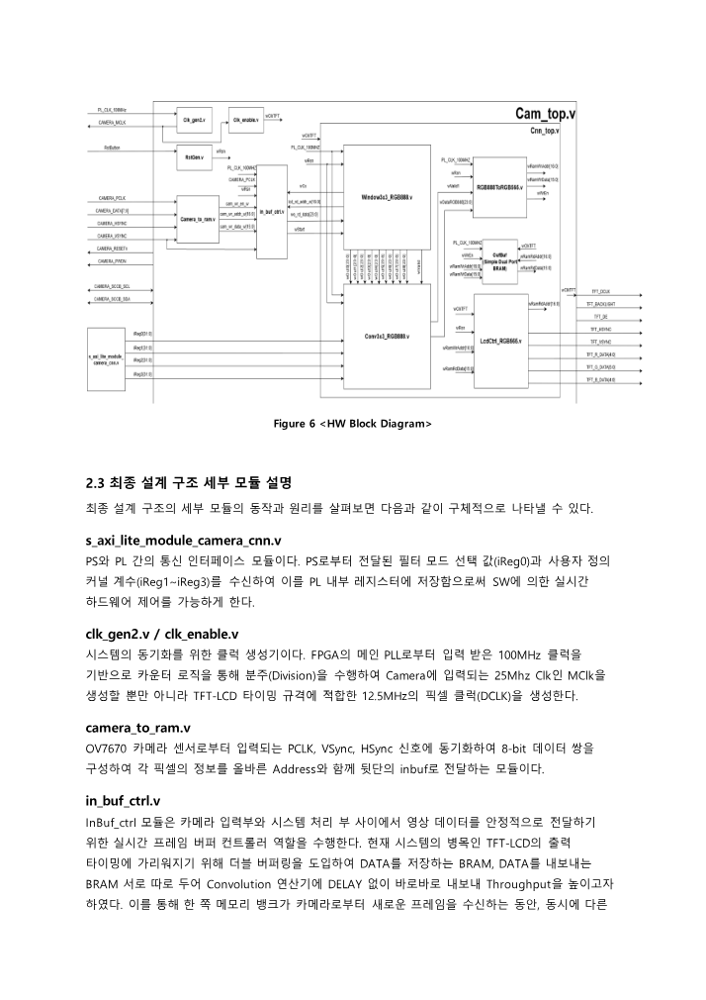
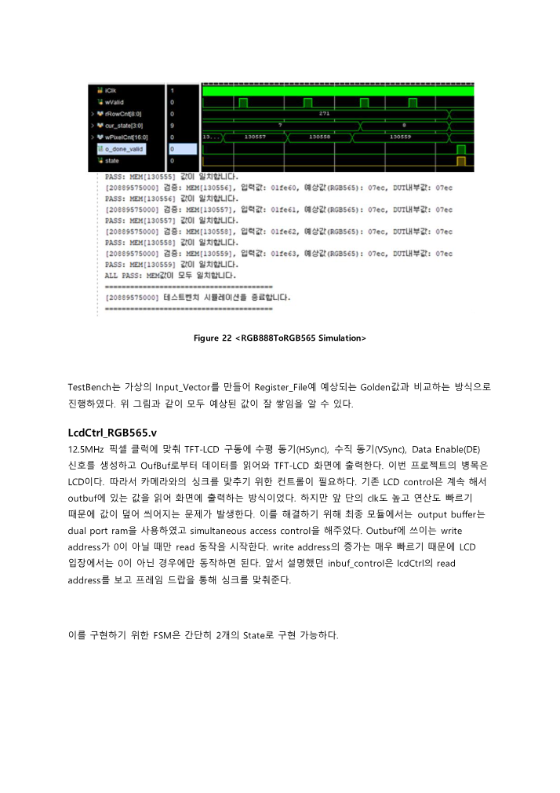
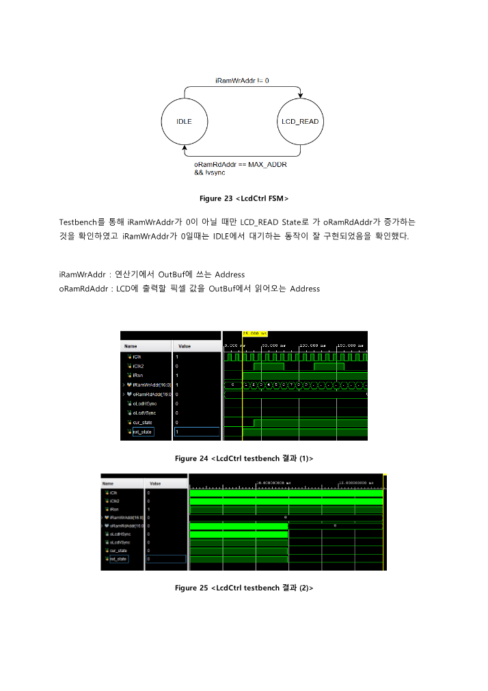
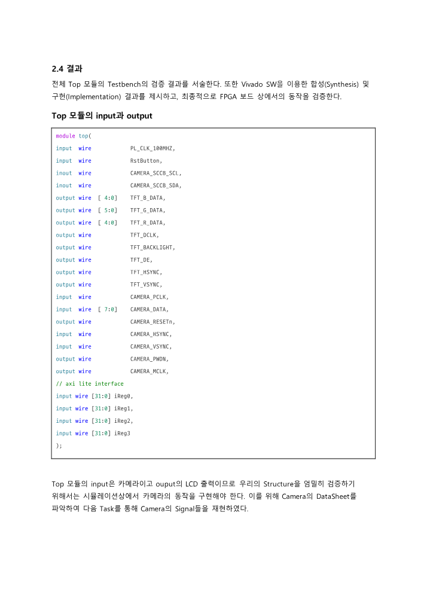
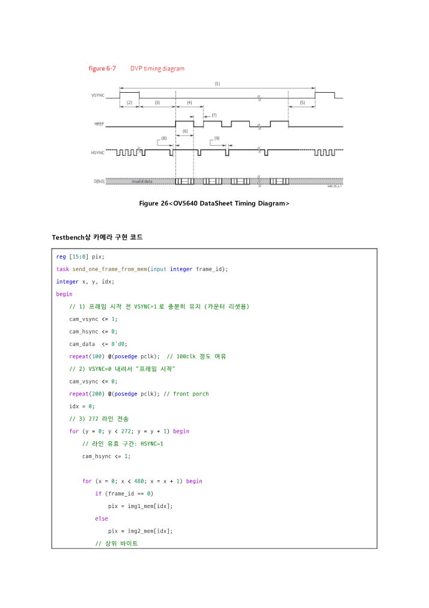

# FPGA Video Filtering (Ultra96-V2)
> OV5640 카메라 입력을 받아 TFT-LCD에 실시간으로 출력하면서, 3x3 영상 필터를 하드웨어로 가속하는 HW/SW Co-design 프로젝트입니다. CPU는 카메라 초기화와 필터 제어를 담당하고, FPGA PL은 픽셀 스트림 처리 파이프라인을 담당합니다.

## Project Info

| 항목 | 내용 |
|---|---|
| 기간 | `2025.09 ~ 2025.11` |
| Platform | `Ultra96-V2` `Zynq UltraScale+ MPSoC` |
| Language | `Verilog HDL` `C` |
| Interface | `AXI4-Lite` `I2C/SCCB` `UART` |
| Display / Camera | `OV5640` `TFT-LCD` |
| Core Keywords | `Window3x3` `Convolution` `Double Buffering` `CDC` `Frame Drop` |

## Summary

- 이 프로젝트는 카메라 영상을 소프트웨어로 처리하지 않고, PL에서 바로 `3x3 convolution -> RGB format conversion -> LCD output` 파이프라인으로 넘기는 구조를 목표로 했습니다.
- PS는 `OV5640` 초기화와 사용자 입력 기반 필터 모드 변경만 담당합니다.
- PL은 카메라 입력 수집, 더블 버퍼 제어, 3x3 window 생성, convolution, RGB888 to RGB565 변환, LCD 타이밍 생성을 담당합니다.
- 최종 보고서 기준 우상욱님의 역할은 다음 네 가지입니다.
- `Window3x3_pixel` 설계 및 검증
- `Lcd_OutBuf control logic` 설계 및 검증
- PS 측 `C` 코드 작성
- Top module 검증

## What Makes This Project Strong

- 단순한 영상 필터 데모가 아니라, `PS-PL 분업`, `실시간 스트리밍`, `메모리 뱅크 스위칭`, `클럭 도메인 동기화`, `사용자 정의 필터 계수 입력`까지 포함한 시스템 프로젝트입니다.
- 초기 구조는 리소스를 줄이기 위해 순차적인 MAC 재사용을 염두에 뒀지만, 최종 구조에서는 LCD 병목을 넘기기 위해 병렬도를 올린 쪽으로 재설계되었습니다.
- 최종 구현은 보고서 기준 `81.97 FPS`, 기존 구조 대비 약 `9.93배` 향상을 달성했습니다.

---

## Demo

  
  
  

## Report Snapshots

  
  
  

  
  
  

---

## Architecture

### PS Side

- `CdriverCode/source_code.c`에서 `OV5640`를 SCCB 방식으로 초기화합니다.
- `AXI_IIC_ADDRESS`, `AXI_GPIO_ADDRESS`, `ADDR`를 통해 I2C, GPIO, AXI-Lite 레지스터를 제어합니다.
- 사용자 인터페이스는 UART 터미널에서 동작합니다.
- `mode 0`: Sharpen
- `mode 1`: Strong Sharpen
- `mode 2`: Bypass
- `mode 3`: Custom 3x3 kernel
- 사용자 정의 모드에서는 9개의 정수를 입력받아 `reg1 ~ reg3`에 packing해서 PL로 전달합니다.

### PL Side

- `RTL/cam_top.v`가 전체 시스템의 top입니다.
- 카메라 입력은 `camera_to_ram.v`에서 RGB565 write stream으로 정리됩니다.
- `in_buf_ctrl.v`는 더블 버퍼 BRAM을 교차 사용하면서 camera write와 window read를 분리합니다.
- `cnn_top.v`는 내부에서 다음 모듈을 직렬 연결합니다.
- `Window3x3_RGB888`
- `Conv3x3_RGB888`
- `RGB888ToRGB565`
- `OutBuf`
- `LcdCtrl_RGB565`
- 최종적으로 `TFT_HSYNC`, `TFT_VSYNC`, `TFT_R/G/B`, `TFT_DCLK`를 생성해 LCD로 출력합니다.

## Dataflow

`OV5640 -> camera_to_ram -> in_buf_ctrl -> Window3x3_RGB888 -> Conv3x3_RGB888 -> RGB888ToRGB565 -> OutBuf -> LcdCtrl_RGB565 -> TFT-LCD`

이 구조에서 중요한 점은 카메라 입력, 100MHz 연산부, LCD 출력부가 서로 다른 타이밍 조건을 가진다는 것입니다. README의 핵심도 바로 이 sync 문제를 어떻게 해결했는지에 있습니다.

---

## Key Modules

### 1. `camera_to_ram.v`

- 카메라의 `PCLK`, `HSYNC`, `VSYNC`에 맞춰 8-bit 데이터 쌍을 조합해 픽셀 write stream을 만듭니다.
- 출력은 `ram_wr_en_o`, `ram_wr_addr_o`, `ram_wr_data_o` 형태로 정리되어 후단 버퍼 모듈이 받기 쉬운 형태입니다.

### 2. `in_buf_ctrl.v`

- 이 프로젝트의 가장 중요한 구조적 개선 포인트입니다.
- 카메라가 쓰는 BRAM과 window generator가 읽는 BRAM을 분리하기 위해 `2-bank double buffering`을 사용합니다.
- `VSYNC edge`를 감지해 write bank를 전환합니다.
- 다만 무조건 전환하지 않고, `i_Lcd_addr == 0`일 때만 스위칭해서 LCD가 이전 프레임을 아직 읽는 중일 때 새 프레임이 덮어써지는 문제를 막습니다.
- 이 로직은 사실상 `frame drop`을 이용해 전체 시스템 sync를 맞추는 방식입니다.
- 또한 `wr_bank_sel` 신호는 48MHz 쪽과 100MHz 쪽을 오가므로, `2-stage synchronizer`를 통해 CDC metastability 리스크를 줄였습니다.
- 출력 시에는 BRAM에 저장된 RGB565를 다시 RGB888로 복원해서 `Window3x3` 모듈에 넘깁니다.

### 3. `Window3x3_RGB888.v`

- 이 모듈은 우상욱님의 주요 담당 영역 중 하나였습니다.
- line buffer와 shift register를 이용해 매 클럭마다 3x3 픽셀 window를 생성합니다.
- 가장자리에서는 zero padding을 수행합니다.
- FSM 기반으로 `FIRST_ROW`, `LAST_ROW` 등 경계 조건을 다루고, 첫 줄을 채운 뒤에는 필요한 픽셀만 추가로 읽으면서 data reuse를 극대화합니다.
- 보고서 기준으로 초기엔 메모리 접근량을 줄이는 쪽에 초점을 맞췄고, 최종 구조에서는 실제 convolution 모듈과 결합해 golden 비교까지 검증했습니다.

### 4. `Conv3x3_RGB888.v`

- 최종 구조의 핵심 연산기입니다.
- 헤더 주석과 실제 구현 기준으로 `27 multipliers`와 `3 parallel ReLU`를 사용합니다.
- `i_reg0[1:0]`으로 preset/custom mode를 선택하고, `i_reg1 ~ i_reg3`로 사용자 정의 커널을 받습니다.
- 기본 제공 커널은 다음과 같습니다.
- standard sharpen
- strong sharpen
- identity / bypass
- custom
- 각 채널 R/G/B에 대해 동시에 MAC를 수행하고, 다음 클럭에 `o_result_valid`와 함께 결과를 냅니다.
- ReLU + clamp 로직으로 결과를 `0~255` 범위에 제한해 색상 왜곡을 막습니다.

### 5. `RGB888ToRGB565.v`

- convolution 결과를 TFT-LCD 출력 포맷에 맞춰 RGB565로 변환합니다.
- 변환은 31/255 같은 정확한 비율 대신 bit shift 중심의 하드웨어 친화적 근사식을 사용합니다.
- valid 기반으로 write address를 증가시키며 output buffer에 연속 저장합니다.

### 6. `LcdCtrl_RGB565.v`

- 이 모듈 역시 우상욱님의 담당 영역과 직접 맞닿아 있습니다.
- `12.5MHz` 픽셀 클럭 기준으로 `HSYNC`, `VSYNC`, RGB 출력을 생성합니다.
- 중요한 점은 LCD가 언제나 무조건 읽는 구조가 아니라, `iRamWrAddr != 0`일 때만 `LCD_READ` 상태로 진입한다는 것입니다.
- 즉, output buffer에 최소한의 유효 데이터가 채워졌을 때만 읽기 시작해, 쓰기와 읽기 충돌을 줄이는 동작을 합니다.

---

## PS Control Code

`CdriverCode/source_code.c`에서 확인되는 포인트는 다음과 같습니다.

- `Initialize_OV5640()`가 `CamConfigData.h`의 레지스터 테이블을 전부 밀어 넣어 카메라를 초기화합니다.
- GPIO를 이용해 `PWDN`과 `RESETn`을 제어합니다.
- UART 메뉴를 통해 사용자가 필터 모드를 바꾸거나 직접 커널 9개를 입력할 수 있습니다.
- `mode 3`에서는 9개 정수를 32-bit register 3개에 packing해 AXI-Lite 레지스터로 씁니다.
- 즉, 소프트웨어는 단순 demo launcher가 아니라 `runtime kernel configuration interface` 역할을 합니다.

---

## Trouble Shooting

### 문제

- 카메라 입력, PL 연산부, LCD 출력단의 클럭 도메인이 다릅니다.
- 초기 설계에서는 다음 문제가 같이 나타났습니다.
- 화면 출렁거림
- 상하 반전
- 색상 반전
- output buffer overwrite
- 낮은 FPS

### 해결

- `in_buf_ctrl`에 더블 버퍼 구조 도입
- LCD 시작 주소를 기준으로 read/write bank switching 타이밍 제어
- frame drop을 통한 global sync 정렬
- bank select 신호에 2-stage synchronizer 적용
- convolution 구조를 순차 MAC 재사용형에서 병렬 MAC 구조로 강화
- LCD output buffer를 dual-port 기반으로 정리

### 결과

- tearing과 sync mismatch를 안정화
- 실시간 camera input과 LCD output 정상 동작 확인
- 최종적으로 `81.97 FPS` 달성

---

## Verification and Result

- 보고서에는 개별 모듈 testbench와 top-level scenario testbench가 모두 정리돼 있습니다.
- `in_buf_ctrl`는 image1/image2를 번갈아 써서 golden RGB888 값과 전체 픽셀을 비교했습니다.
- `Window3x3 + Conv + OutBuf` 조합도 golden memory와 비교해 전 픽셀 일치를 확인했습니다.
- `Conv3x3`는 mode별 expected output을 검증했고, custom filter의 경우 `0x5a5a5a` 같은 기대값 검증 예시가 보고서에 포함돼 있습니다.
- `LcdCtrl`는 `iRamWrAddr`가 유효할 때만 LCD read state로 진입하는지 testbench로 확인했습니다.
- 보고서에는 synthesis, timing, on-chip power 결과와 실제 보드 동작 사진도 함께 정리돼 있습니다.

## My Contribution Focus

- `Window3x3`와 `Lcd/OutBuf control`은 이 프로젝트에서 성능과 sync 모두에 직접 영향을 주는 경계 모듈입니다.
- 그래서 이 포트폴리오에서 우상욱님의 기여는 단순 보조 역할이 아니라, 파이프라인의 앞단 재구성과 뒷단 타이밍 제어를 맡은 쪽에 가깝습니다.
- PS C-code 작성도 같이 담당했기 때문에, 이 프로젝트는 RTL만 한 것이 아니라 SW 제어면까지 연결한 작업으로 볼 수 있습니다.

## Files

- [RTL top](./RTL/cam_top.v)
- [CNN pipeline top](./RTL/cnn_top.v)
- [Double buffer control](./RTL/in_buf_ctrl.v)
- [Window generator](./RTL/Window3x3_RGB888.v)
- [Convolution engine](./RTL/Conv3x3_RGB888.v)
- [LCD controller](./RTL/LcdCtrl_RGB565.v)
- [PS driver code](./CdriverCode/source_code.c)
- [Final report PDF](./고급프로젝트_3조_최종보고서.pdf)
- [Demo video](./3조_FPGA_동작동영상.mp4)

## Wrap-Up

- 이 프로젝트는 "카메라 영상에 필터를 씌웠다"보다, `실시간 영상 스트림을 FPGA 파이프라인에 맞게 재구성하고 제어 경로까지 포함해 시스템으로 완성했다`는 점이 중요합니다.
- 핵심 가치는 세 가지입니다.
- PS에서 필터를 실시간으로 바꿀 수 있는 제어면
- PL에서 매 클럭 유효 결과를 만들 수 있는 병렬 convolution 구조
- LCD 병목과 CDC 문제를 버퍼링과 동기화 로직으로 풀어낸 시스템 통합 능력
