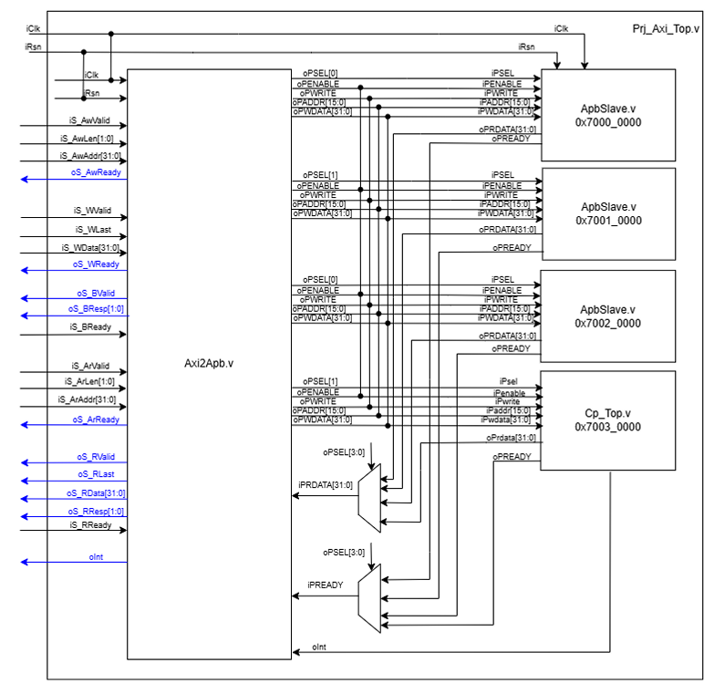
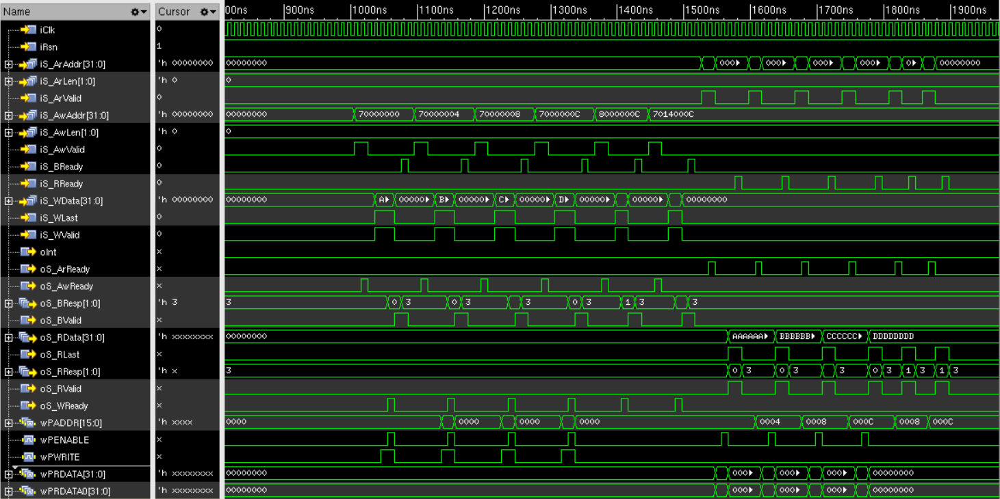

# Undergraduate Internship (AXI2APB)

> AXI4 to APB Bridge Design

## 📅 Project Info

- **Period**: 2026.01
- **Role**: Hardware Design Intern (Winter)
- **Stack**: `Verilog` `AMBA AXI4` `APB`

## 📝 Summary

고속 버스인 **AXI4**와 저속 주변장치 버스인 **APB**를 연결하는 **Bridge IP**를 설계했습니다.
AXI의 Burst 트랜잭션을 APB의 단일 전송(Single Transfer)으로 변환하는 FSM을 구현하고, PREADY 핸드쉐이킹 및 에러 처리를 포함하여 안정적인 버스 프로토콜 변환을 검증했습니다.

## 2. 시스템 아키텍처 및 결과물 (Architecture & Output)

*(위 캡처는 전체 시스템 구조(Top Diagram)를 나타냅니다.)*

*(위 캡처는 `waveform` 테스트 측정 결과 폴더에서 발췌한 파형입니다.)*

## 💡 Key Features

- **Protocol Bridge**: AXI4 Slave ↔ APB Master 변환 로직.
- **Burst Handling**: Sequential Burst를 개별 APB 트랜잭션으로 분할 처리.
- **Slave Decoding**: PSEL 디코딩을 통한 다중 슬레이브(4-Slave) 제어.

## 4. 🛠 핵심 문제 해결 및 트러블슈팅 (Trouble Shooting)

- **[이슈/문제 상황]**: 고속/파이프라인 기반의 AXI4 Burst 트랜잭션 데이터를, 단일 전송 전용의 저속 APB 버스 패킷으로 변환하면서 **데이터 유실 위험 및 타이밍 지연(Wait-state)** 문제가 발생했습니다.
- **[접근 방식 및 해결]**:
  - **독립 FSM 제어**: Read Path와 Write Path를 각각 분리된 FSM(Finite State Machine)으로 구성하여 `Setup Phase(PSEL=1, PENABLE=0)`와 `Enable Phase(PSEL=1, PENABLE=1)`의 타이밍을 엄격히 분할했습니다.
  - **Wait-State 대응**: APB Slave측에서 `PREADY=0`으로 대기 상태를 요구할 경우, Enable Phase를 유지하며 AXI Master쪽 자원이 오버라이트되지 않도록 제어했습니다.
  - **Burst Transfer Mapping**: AXI의 `AWLEN` / `ARLEN` 카운터를 내부에서 계산하여, 연속된 Burst 전송을 정확히 개별 APB Single Transfer의 연속으로 잘게 쪼개어 전달하고 마지막 전송에 `RLAST`/`WLAST`를 맞물려 응답하게 했습니다.
- **[결과]**: 여러 개의 APB Slave 인터페이스가 맞물린 상황에서도, 타이밍 Violation이 발생하지 않는 안정적 상태 머신 동작을 증명하였고, 잘못된 어드레스 접근 시에도 시스템 다운 없이 `BRESP`/`RRESP` Error를 정상 반환하도록 예외 처리를 완료했습니다.

## 📂 Artifacts

- RTL Source Code (`Prj_Axi_Top.v`, `Axi2Apb.v`)
- HDD Report (Design Spec & Waveform Analysis)
