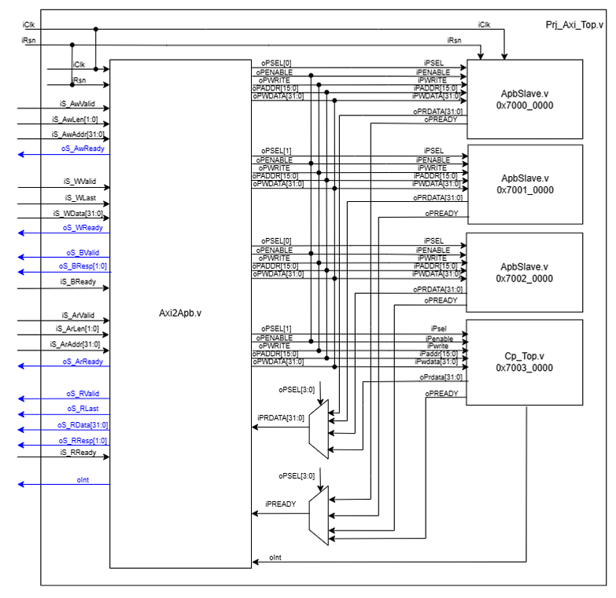
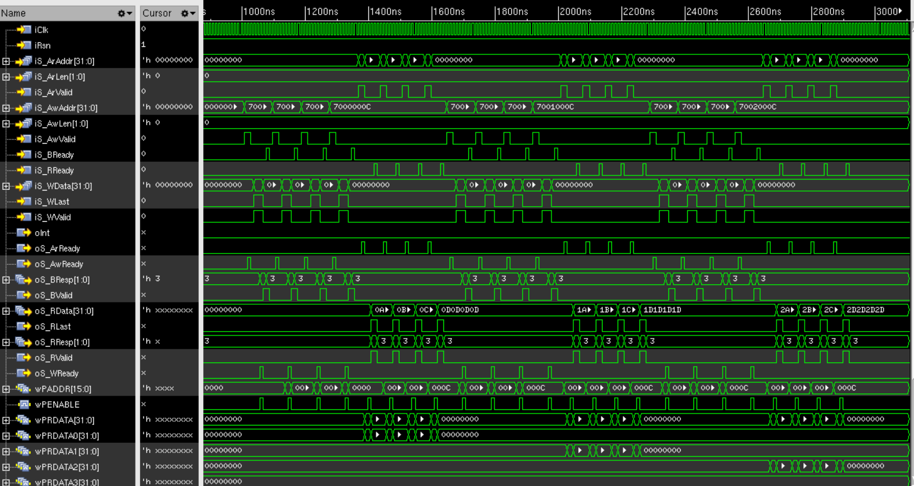
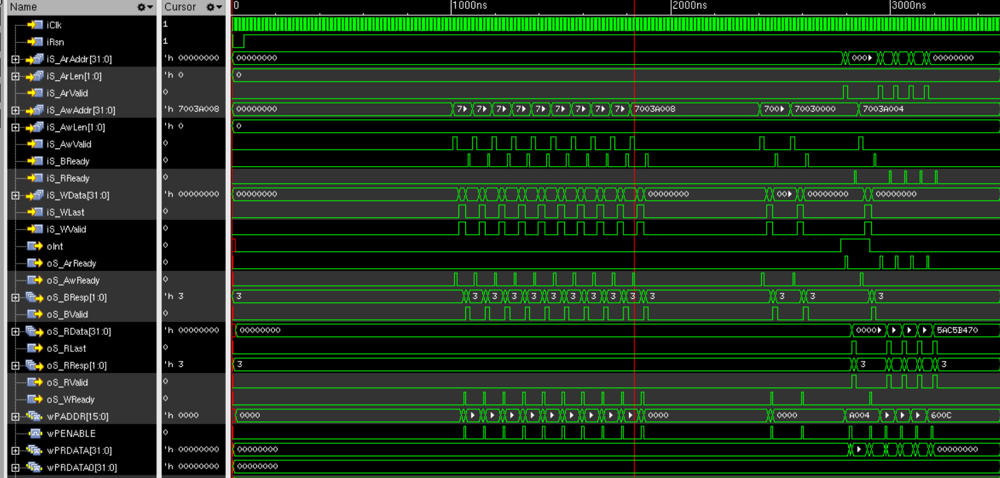

# AXI4 to APB Bridge IP Design
> AXI4 burst transaction을 APB single transfer로 변환하는 AMBA bus bridge RTL 설계 프로젝트입니다. 고속 제어 버스와 저속 peripheral bus 사이의 handshake, wait-state, address decoding, error response를 직접 구현하며 SoC 내부 bus wrapper 관점을 익혔습니다.

## Project Info

| 항목 | 내용 |
|---|---|
| 기간 | `2026.01` |
| 유형 | 개인 설계 프로젝트 / AMBA Bus Interface RTL 설계 |
| 역할 | AXI-to-APB 변환 FSM, burst 처리, address decoding, APB slave selection 설계 및 검증 |
| 언어/도구 | `Verilog-HDL` `SystemVerilog testbench` `Xcelium` |
| Protocol | `AMBA AXI4` `APB` |
| Core Keywords | `Burst-to-Single Transfer` `PREADY Wait-State` `PSEL Decoding` `BRESP/RRESP` |

## Summary

고속 AXI4 bus와 저속 APB peripheral bus를 안정적으로 연결하는 bridge IP를 설계했습니다. AXI의 `AWLEN`/`ARLEN` 기반 burst transaction을 내부 counter로 추적하고, 각 beat를 APB의 `Setup -> Enable` 단일 전송으로 순차 변환했습니다. 4개의 APB slave를 선택하기 위한 address decoding과 `PSEL[3:0]` 생성 로직을 구성했으며, APB slave가 `PREADY=0`으로 wait-state를 요구하는 상황에서도 AXI 측 응답이 깨지지 않도록 FSM을 유지했습니다.

이 프로젝트의 핵심은 단순히 두 protocol 신호를 이어 붙이는 것이 아니라, 서로 다른 전송 단위와 handshake timing을 가진 bus protocol 사이에서 transaction 의미를 보존하는 것입니다.

## Architecture

전체 구조는 AXI4 slave interface와 APB master interface 사이에 write/read path FSM을 두는 방식입니다. RTL 기준 핵심 모듈은 [Axi2Apb.v](./SourceCode/RTL/Src/Axi2Apb.v)이며, 상위 통합은 [Prj_Axi_Top.v](./SourceCode/RTL/Src/Prj_Axi_Top.v)에서 확인할 수 있습니다.

### Write Path

- `xW_Idle -> xW_AwReady -> xW_WValid -> xW_Setup -> xW_Enable -> xW_BValid` 흐름으로 AXI write address/data를 APB write transaction으로 변환합니다.
- APB `Setup` phase에서는 `PSEL=1`, `PENABLE=0`을 만들고, `Enable` phase에서는 `PENABLE=1`로 slave 응답을 기다립니다.
- `iPREADY`가 올라올 때만 다음 beat 또는 response 상태로 전환해 APB wait-state에 대응합니다.
- 잘못된 address 접근은 error path를 통해 AXI `BRESP`로 되돌립니다.

### Read Path

- `xR_Idle -> xR_ArReady -> xR_Setup -> xR_Enable -> xR_RValid` 흐름으로 AXI read request를 APB read transaction으로 분해합니다.
- `ARLEN` 기반으로 burst count를 관리하고, 마지막 beat에서는 AXI `RLAST` 타이밍을 맞춥니다.
- APB read data는 `RVALID`과 함께 AXI master 쪽으로 반환되며, invalid address는 `RRESP` error로 처리합니다.

### Address Decoding

- APB peripheral을 4개 slave 영역으로 나누고 address 상위 bit를 기준으로 `PSEL[3:0]`을 생성합니다.
- 이 구조 덕분에 bridge가 단일 APB slave 전용 변환기가 아니라, 작은 APB subsystem의 entry point처럼 동작할 수 있습니다.

## Verification Scenarios

보고서와 testbench에서는 다음 시나리오를 중심으로 waveform 검증을 수행했습니다.

- Single write / single read transaction
- 4-burst write transaction
- Burst read transaction
- APB wait-state 삽입 상황
- 잘못된 address 접근에 대한 write/read error response

  
  

## Trouble Shooting

### 문제

AXI4는 burst와 독립 address/data channel을 지원하지만, APB는 `Setup/Enable` 2-phase 기반의 단일 전송 bus입니다. 이 차이 때문에 AXI beat를 너무 빠르게 소모하면 APB slave가 아직 준비되지 않은 상태에서 데이터가 덮이거나 response timing이 어긋날 수 있었습니다.

### 해결

- Write/read path를 분리된 FSM으로 설계해 address, data, response 흐름을 명확히 나누었습니다.
- `PREADY=0`인 동안 `Enable` phase를 유지해 APB slave의 wait-state를 보존했습니다.
- `AWLEN`/`ARLEN`을 내부 beat counter와 연결해 burst transaction을 APB single transfer의 연속으로 mapping했습니다.
- address decoding 실패 시 정상 response와 분리된 error response를 반환하도록 예외 흐름을 구성했습니다.

### 배운 점

AXI4와 APB를 직접 연결해 보면서 bus protocol마다 전송 단위, handshake timing, response 처리 방식이 다르다는 점을 체감했습니다. 또한 bus wrapper를 붙이면 단독 module이 SoC 내부 peripheral 제어 경로로 확장될 수 있다는 관점을 얻었습니다. 기능이 확장될수록 구현 난도뿐 아니라 검증 시나리오의 수와 품질도 같이 중요해진다는 점이 이 프로젝트의 가장 큰 학습 포인트였습니다.

## ETRI Portfolio Focus

- RTL 설계 관점: AXI/APB protocol conversion, burst counter, read/write FSM, slave decoding
- 검증 관점: write/read 정상 동작과 error response waveform 확인
- SoC 관점: 이후 APB 기반 AES peripheral IP와 연결 가능한 제어 bus path로 확장

## Artifacts

- [Bridge RTL](./SourceCode/RTL/Src/Axi2Apb.v)
- [Top RTL](./SourceCode/RTL/Src/Prj_Axi_Top.v)
- [APB Slave Model](./SourceCode/RTL/Src/ApbSlave.v)
- [Testbench Top](./SourceCode/TestBench/TbTop/TbTop_Prj_Axi.v)
- [Waveform Captures](./waveform)
- [Design Report PDF](./%5BHDD%5D%20AXI2APB_2025%EB%85%84%20%EB%8F%99%EA%B3%84%20%ED%95%99%EB%B6%80%EC%83%9D%EC%97%B0%EA%B5%AC%EC%9D%B8%ED%84%B4%20%EA%B3%BC%EC%A0%9C_%EC%B0%A8%EC%84%B8%EB%8C%80%EB%B0%98%EB%8F%84%EC%B2%B4%ED%95%99%EA%B3%BC.pdf)

## Future Work

- AXI ID 기반 multiple outstanding transaction 지원
- AXI/APB clock이 분리된 SoC 환경을 위한 CDC 구조 추가
- `PSLVERR`를 포함한 APB error response propagation 정교화
