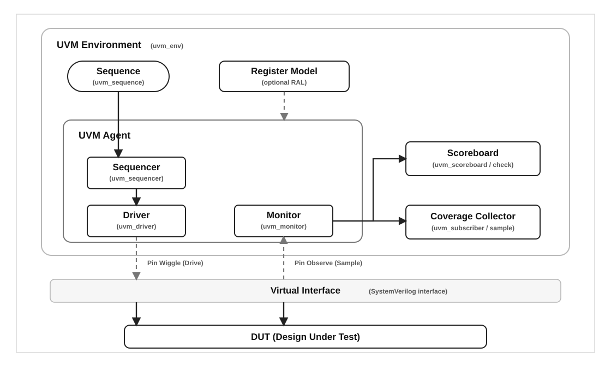
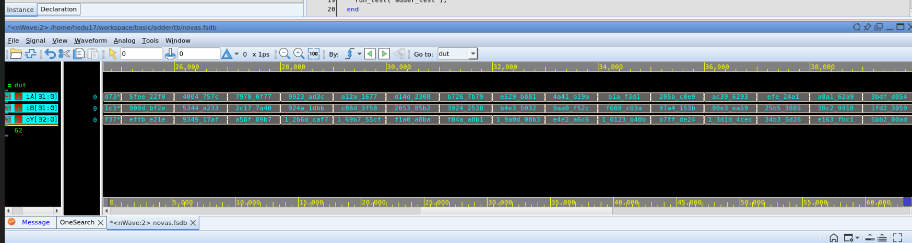
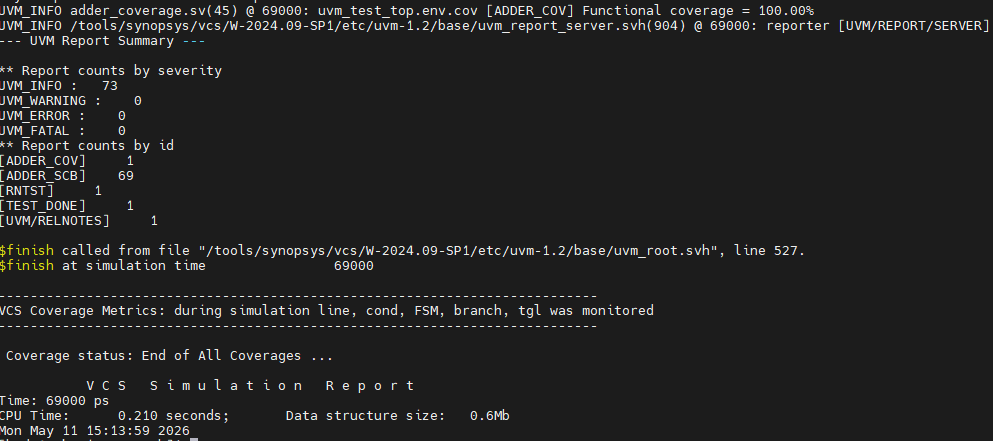
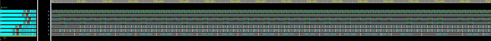
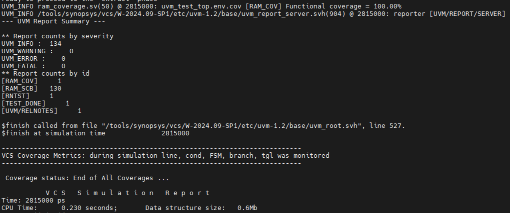
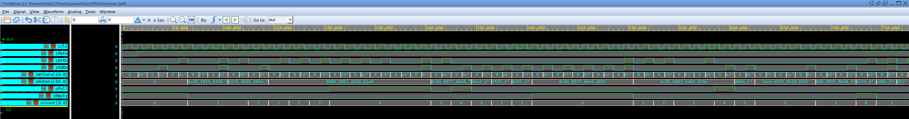
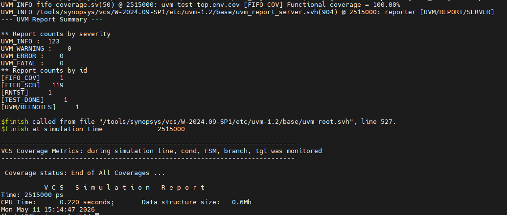

# UVM Basic Verification Lab
> Adder, RAM, FIFO 기본 RTL 블록을 대상으로 한 SystemVerilog UVM 검증 실습

## 📅 프로젝트 정보
- **기간**: 2026.05
- **형태**: RTL/UVM 검증 실습 및 포트폴리오 보고서 정리
- **기술 스택**: `SystemVerilog` `UVM` `VCS` `Verdi` `Functional Coverage` `SVA`
- **검증 대상**: `Adder` `Synchronous RAM` `Synchronous FIFO`

## 📝 개요
기본 RTL 블록 3종(Adder, RAM, FIFO)을 대상으로 UVM testbench 구조를 직접 구성하고, DUT별 timing rule에 맞춘 sequence, driver, monitor, scoreboard, coverage를 정리한 프로젝트입니다.
Adder는 조합회로 corner/carry 검증, RAM은 reference memory 기반 read/write 검증과 SVA, FIFO는 queue model 기반 ordering 및 full/empty 상태 검증에 초점을 맞췄습니다.

## 🧩 공통 UVM 구조


- `test -> env -> agent -> sequencer/driver/monitor`의 기본 UVM 계층을 블록별로 구현했습니다.
- monitor가 수집한 transaction을 scoreboard와 coverage로 전달하는 analysis 구조를 사용했습니다.
- factory 기반 class 생성, virtual interface 전달, sequence 실행 흐름을 Adder/RAM/FIFO에 공통 적용했습니다.

## 💡 핵심 포인트
1. **DUT별 reference model 분리**
   - Adder는 입력 합산 결과를 즉시 계산하고, RAM은 `model_mem`, FIFO는 `model_q`를 유지해 상태 기반 기대값을 비교했습니다.
2. **Coverage / SVA 기반 검증 품질 정리**
   - Adder는 zero/max/carry corner, RAM은 command/address/data, FIFO는 command/full/empty/count 중심으로 functional coverage를 구성했습니다.
   - RAM/FIFO는 interface protocol 성격의 assertion을 함께 두어 timing rule 위반을 잡을 수 있도록 했습니다.
3. **VCS/Verdi 재현 흐름 구성**
   - 상위 `Makefile`에서 `make run BLOCK=adder|ram|fifo`, `make coverage`, `make verdi` 흐름으로 compile/sim/wave/coverage 확인을 묶었습니다.
4. **보고서형 산출물 정리**
   - UVM class map, timing diagram, waveform, UVM result summary, coverage 화면을 PDF 보고서와 README에서 바로 확인할 수 있게 정리했습니다.

## 📊 검증 결과 예시
### Adder



### RAM



### FIFO



## 📂 산출물
- **[UVM Basic Lab Report PDF](./UVM_Basic_Lab_Report.pdf)**: Adder/RAM/FIFO UVM 구조, sequence, scoreboard, coverage, 결과 화면 정리
- **[다이어그램](./assets/diagrams)**: 공통 UVM 구조, transaction 흐름, DUT별 timing/class map SVG
- **[결과 캡처](./assets/captures)**: Verdi waveform, UVM summary, coverage evidence 이미지
- **[소스 코드](./source/basic)**: RTL, UVM testbench, Makefile, VCS/Verdi 실행 스크립트

## 🗂 소스 구조
```text
source/basic
├── adder
│   ├── rtl/adder.sv
│   └── tb/
├── ram
│   ├── rtl/ram.sv
│   └── tb/
├── fifo
│   ├── rtl/sync_fifo.sv
│   └── tb/
├── scripts/run_vcs_verdi_checks.sh
└── Makefile
```

## 🚀 실행 흐름
```sh
cd source/basic
make run BLOCK=adder
make run BLOCK=ram
make run BLOCK=fifo
make coverage BLOCK=adder
make verdi BLOCK=fifo
```

VCS/UVM 1.2 및 Verdi 사용 환경을 기준으로 작성했습니다. 포트폴리오에는 재현에 필요한 RTL/UVM 소스와 보고서용 산출물만 포함하고, 시뮬레이션 생성물과 큰 coverage 설정 파일은 제외했습니다.
