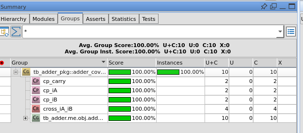
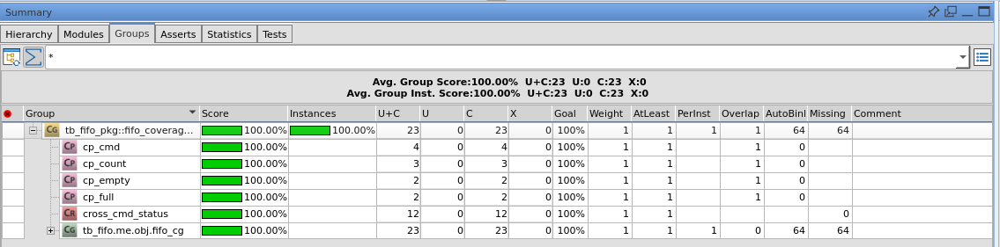
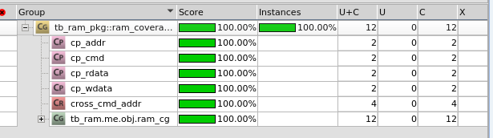

# UVM RTL Verification Portfolio
> Basic RTL 3종과 UART/SPI/I2C 통신 RTL 6종을 대상으로 구성한 SystemVerilog UVM 검증 포트폴리오

## 프로젝트 정보

- **기간**: 2026.05
- **형태**: 개인 RTL/UVM 검증 환경 구축 및 결과 리포트 정리
- **기술 스택**: `SystemVerilog` `UVM 1.2` `Vivado/XSim` `VCS` `Verdi` `Functional Coverage` `SVA`
- **검증 대상**: `Adder` `Synchronous RAM` `Synchronous FIFO` `UART RX/TX` `SPI Master/Slave` `I2C Master/Slave`

## 개요

기존 Basic UVM 실습을 확장해, 단순 UVM component 구조뿐 아니라 protocol DUT에 대한 scenario, scoreboard, assertion, functional coverage, 실행 결과 dashboard까지 한 번에 확인할 수 있도록 정리했습니다.

Basic 파트는 Adder/RAM/FIFO를 통해 UVM testbench의 기본 구조와 reference model을 보여주고, Communication 파트는 UART, SPI, I2C를 master/slave 또는 rx/tx bench로 나누어 protocol-level 검증 흐름을 보여줍니다. 각 bench는 directed, corner, byte sweep, full random, reset/error/timeout 계열 scenario를 포함하고, 결과는 CSV/PNG/PDF 보고서로 남겼습니다.

## 전체 UVM 구조


공통 구조는 `test -> sequence -> sequencer -> driver -> interface -> DUT -> monitor -> scoreboard -> coverage` 흐름입니다. Driver는 expected transaction을 만들고, monitor는 DUT pin/output에서 observed transaction을 복원합니다. Scoreboard는 expected/observed를 비교하며, coverage는 pass 처리된 item을 sample하도록 구성해 stimulus 발생과 check 완료를 구분했습니다.

## 검증 결과 요약

| 그룹 | DUT / Bench | All scenario | Scoreboard pass | Scoreboard fail | UVM_ERROR/FATAL | Functional coverage |
|---|---|---:|---:|---:|---:|---:|
| Basic | ADDER | PASS | 778 | 0 | 0 / 0 | 100% |
| Basic | FIFO | PASS | 754 | 0 | 0 / 0 | 100% |
| Basic | RAM | PASS | 792 | 0 | 0 / 0 | 100% |
| Communication | UART RX | PASS | 292 | 0 | 0 / 0 | 100% |
| Communication | UART TX | PASS | 296 | 0 | 0 / 0 | 100% |
| Communication | SPI MASTER | PASS | 275 | 0 | 0 / 0 | 100% |
| Communication | SPI SLAVE | PASS | 274 | 0 | 0 / 0 | 100% |
| Communication | I2C MASTER | PASS | 529 | 0 | 0 / 0 | 100% |
| Communication | I2C SLAVE | PASS | 528 | 0 | 0 / 0 | 100% |


통신 bench의 최신 요약 CSV 기준으로 scoreboard fail, UVM error/fatal, raw simulator error가 모두 0입니다. Coverage 100%는 각 DUT에 정의한 coverpoint/cross bin이 닫혔다는 의미이며, UART/SPI/I2C는 payload sweep뿐 아니라 reset, abort/error, timeout, tick/jitter mode 같은 protocol condition을 coverage model에 포함했습니다.

## Basic UVM: Adder / RAM / FIFO


| DUT | 검증 초점 | Reference model / check | Coverage / Assertion |
|---|---|---|---|
| Adder | zero, max, carry, random 산술 입력 | `expected = iA + iB` golden sum 비교 | 입력 boundary, carry, input cross |
| RAM | write/read, same-address readback, reset, idle | `model_mem[addr]` 기반 readback 비교 | command/address/data coverage, X check, reset/idle/write-readback SVA |
| FIFO | idle, write, read, simultaneous wr/rd, full/empty boundary | `model_q[$]` queue 기반 ordering 비교 | command/full/empty/count coverage, count/full/empty consistency SVA |

Basic 파트는 UVM 기본기를 보여주는 구간입니다. 단순 smoke에 머물지 않고 byte sweep과 full random을 추가했으며, RAM/FIFO는 interface-level rule을 assertion으로 보강했습니다.

### Basic 실행 캡처

기존 Verdi/VCS 기반 Basic 실습에서 확보한 waveform, UVM summary, coverage 캡처도 함께 보존했습니다. Communication dashboard가 전체 regression 결과를 보여준다면, 아래 이미지는 Basic DUT별 transaction 흐름과 coverage closure를 화면 증거로 보여주는 자료입니다.

#### Adder





#### FIFO





#### RAM





## Communication UVM: UART / SPI / I2C


| Protocol / Bench | 주요 scenario | Scoreboard check | Coverage 핵심 |
|---|---|---|---|
| UART RX | directed, error, reset, timeout, jitter, corner, byte_sweep, full_random | expected queue와 serial decode 결과를 DUT output과 비교 | data pattern, frame result, reset phase, tick/jitter |
| UART TX | directed, reset, timeout, jitter, corner, byte_sweep, full_random | TX frame data, stop bit, done pulse, no-event window 확인 | data pattern, busy/ignored, complete/reset_abort/timeout |
| SPI Master | smoke, corner, byte_sweep, full_random, CPOL/CPHA mode | MOSI observed data, MISO readback, done/reset no-event 확인 | TX/MISO data, CPOL, CPHA, mode cross |
| SPI Slave | smoke, corner, byte_sweep, full_random, CS abort | MOSI RX data, MISO driven data, CS abort/reset no-event 확인 | MOSI/TX data, CPOL/CPHA, CS/reset abort |
| I2C Master | smoke, directed, error, reset, jitter, byte_sweep, full_random | addr/RW, ACK error, write/read data, bus decode 비교 | read/write, address, ACK error, data pattern |
| I2C Slave | smoke, directed, error, reset, jitter, byte_sweep, full_random | bus addr, write/read data, txn_done, no-event window 확인 | addr hit/miss, read/write, data, reset/tick/jitter |


Protocol bench에서는 waveform으로 놓치기 쉬운 rule을 assertion으로 묶었습니다. UART는 one-cycle valid/done pulse와 reset 중 pulse 금지를, SPI는 idle CS/SCLK와 MISO release를, I2C는 open-drain idle release와 done/txn pulse rule을 확인합니다.

## 산출물

| 구분 | 위치 |
|---|---|
| 최종 요약 | [reports/uvm_portfolio_summary.md](./reports/uvm_portfolio_summary.md) |
| 최종 검증 보고서 HTML | [reports/communication/final_report/uvm_verification_status_report.html](./reports/communication/final_report/uvm_verification_status_report.html) |
| 최종 검증 보고서 PDF | [reports/communication/final_report/uvm_verification_status_report.pdf](./reports/communication/final_report/uvm_verification_status_report.pdf) |
| Communication 결과 CSV/PNG | [reports/communication/uvm_results](./reports/communication/uvm_results) |
| Basic 보고서 | [reports/basic](./reports/basic) |
| UVM/Protocol diagrams | [assets/diagrams](./assets/diagrams) |
| Basic source | [source/basic](./source/basic) |
| Communication source | [source/communication](./source/communication) |

## 소스 구조

```text
source/
├── basic/
│   ├── adder/
│   ├── fifo/
│   └── ram/
└── communication/
    ├── uart/
    │   ├── rtl/
    │   ├── tb/rx/
    │   ├── tb/tx/
    │   └── sim/vivado/
    ├── spi/
    │   ├── rtl/
    │   ├── tb/master/
    │   ├── tb/slave/
    │   └── sim/vivado/
    └── i2c/
        ├── rtl/
        ├── tb/master/
        ├── tb/slave/
        └── sim/vivado/
```

## 실행 흐름

Basic은 기존 VCS/Verdi Makefile 흐름을 유지합니다.

```sh
cd source/basic
make run BLOCK=adder
make run BLOCK=ram
make run BLOCK=fifo
make coverage BLOCK=fifo
make verdi BLOCK=ram
```

Communication은 Vivado/XSim 재현성을 위해 `files.f`와 `xsim_args_*.f`를 protocol/bench별로 보존했습니다.

```sh
cd source/communication/uart/tb/rx
xvlog -sv -L uvm -i . -i ./src -f files.f
xelab -L uvm tb_uart_rx -snapshot tb_uart_rx_snap
xsim -f ../../sim/vivado/rx/xsim_args_all.f
```

## 보완 예정

- Assertion 결과를 scoreboard/coverage처럼 별도 CSV로 파싱
- 일부 `all` 내부 scenario를 standalone log로 재생성해 추적성 강화
- UART back-to-back/busy timing, SPI mode별 독립 regression, I2C multi-address/repeated-start/partial-stop corner 확대
- Coverage model을 요구사항 기반 coverage plan 형태로 문서화
