# 프로젝트 경험 목차

1. FPGA Video Filtering 가속기 설계
2. RISC-V Core 기반 AXI-Lite/APB/AXI-Stream Mini MCU RTL 통합 설계
3. AXI to APB Bridge IP Design
4. APB Interface 기반 AES-128 IP 설계
5. Verilog-HDL 기반 79-tap FIR Filter 설계
6. SystemVerilog UVM 기반 RTL 검증 실습
7. STM32F103 기반 Mini Elevator Controller 설계
8. SIC/XE Assembler & Simulator 구현

---

### 프로젝트 1. FPGA Video Filtering 가속기 설계

#### 프로젝트 목표

Zynq SoC 플랫폼에서 OV5640 카메라 입력 영상을 FPGA로 실시간 처리하고 TFT-LCD로 출력하는 HW/SW Co-design 영상처리 시스템 구현을 목표로 했습니다. PS는 C 기반 카메라 초기화와 필터 모드 제어를 담당하고, PL은 Verilog-HDL 기반 영상처리 pipeline과 LCD 출력 로직을 담당하도록 분리했습니다.

#### 프로젝트 정보

| 항목 | 내용 |
| --- | --- |
| 유형 | 팀 프로젝트 / FPGA 기반 HW/SW Co-design |
| 진행 기간 | 2025.09 ~ 2025.11 |
| 사용 언어·도구 | Verilog-HDL, C, Vivado, Ultra96-V2(Zynq) |
| 특징 | OV5640 camera, 3x3 convolution, double buffering, TFT-LCD output |

#### 프로젝트 개요

Ultra96-V2 Zynq 환경에서 OV5640 카메라 입력, PL 기반 영상 필터링 연산부, TFT-LCD 출력부를 연결한 실시간 영상처리 시스템을 구현했습니다. PS에서는 C 코드로 카메라 초기화와 필터 모드 제어를 담당하고, PL에서는 입력 buffer 제어, Window3x3 생성, 3x3 convolution, RGB888/RGB565 변환, LCD output buffer 제어 로직을 Verilog-HDL로 구성했습니다. 카메라 입력, 연산 처리, LCD 출력이 서로 다른 timing으로 동작하기 때문에 double buffering과 frame drop 기반 sync 구조를 적용했습니다.

#### 담당 분야/역할

Window3x3 연산부, LCD/Output Buffer 제어 로직, PS 측 C 코드, top module 통합 검증을 담당했습니다. Line buffer와 shift register로 매 클럭 3x3 pixel window를 생성하고, 독립된 write/read timing을 갖는 LCD output buffer가 유효 frame 기준으로 동작하도록 제어 로직을 구성했습니다.

#### 주요 포인트

보드 검증 중 영상 출력 밀림과 frame 깨짐 문제가 발생했습니다. LCD datasheet의 HSYNC/VSYNC timing 범위를 기준으로 parameter를 조정했고, LCD 출력 속도에 맞춰 frame drop 기반 sync 구조를 적용했습니다. 3x3 convolution은 line buffer 기반 streaming 구조로 구성해 매 클럭 window data를 공급하도록 설계했습니다.

#### 결과물

OV5640 modeling 기반 testbench와 Ultra96-V2 보드에서 동작을 검증했습니다. 산출물은 RTL source, PS 제어 C 코드, testbench, 최종 보고서, 시연 영상입니다.

#### 핵심 이미지

**Figure 1. Video Filtering System Architecture**

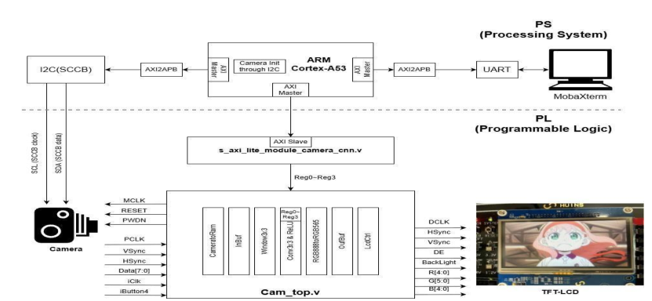

**Figure 2. Double Buffer Processing Diagram**

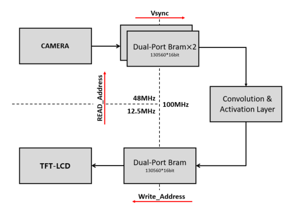

**Figure 3. Line Buffer and Window Generator**

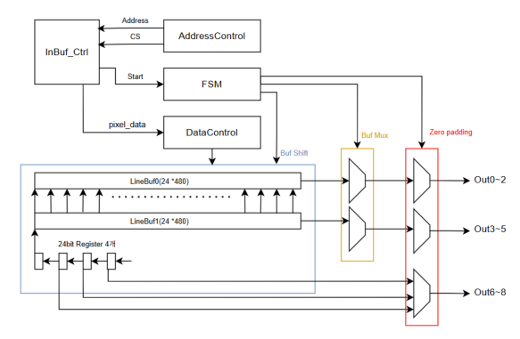

**Figure 4. 성능 및 결과 화면**

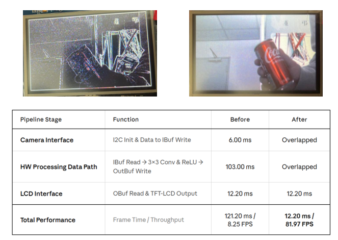

### 프로젝트 2. RISC-V Core 기반 AXI-Lite/APB/AXI-Stream Mini MCU RTL 통합 설계

#### 프로젝트 목표

직접 구현한 RV32I 5-stage pipeline core를 중심으로 AXI-Lite system bus, APB peripheral subsystem, AXI-Stream DMA, PLIC-lite interrupt controller, UART bootloader와 RAM application 실행 구조를 통합한 mini MCU RTL을 설계하는 것이 목표였습니다. Core 단독 testbench 외에 `PC -> UART -> RISC-V SoC -> DMA -> SPI -> Slave FPGA -> UART -> PC`로 이어지는 데이터 이동 시나리오를 포함했습니다.

#### 프로젝트 정보

| 항목 | 내용 |
| --- | --- |
| 유형 | 개인 프로젝트 / RISC-V 기반 SoC RTL 통합 설계 |
| 진행 기간 | 2026.04 ~ |
| 사용 언어·도구 | SystemVerilog, C, Python, Vivado 2025.2, RISC-V GCC |
| 특징 | RV32I 5-stage pipeline, AXI-Lite 1x4 interconnect, APB peripherals, AXI-Stream DMA, PLIC-lite IRQ, UART bootloader |

#### 프로젝트 개요

초기에는 STM32F103 계열 MCU 구조를 참고했지만, SoC 확장성과 byte stream 처리 구조를 다루기 위해 AXI 기반 구조로 재구성했습니다. 최종 구조는 RV32I pipeline core, Boot ROM, I-SRAM/D-SRAM, AXI-Lite 1x4 interconnect, CPU/DMA D-SRAM 접근을 조정하는 arbiter, AXI-Lite to APB bridge, APB Timer/GPIO/SPI/I2C/UART/PLIC-lite, AXI-Stream DMA로 구성했습니다.

메모리 맵은 Boot ROM, RAM application 영역, D-SRAM, APB peripheral 영역으로 분리했습니다. UART로 받은 image payload를 D-SRAM에 저장하고, firmware와 DMA가 같은 memory map을 기준으로 데이터를 다루도록 구성했습니다.

RV32I core는 IF/ID/EX/MEM/WB 5-stage pipeline으로 구성하고, load-use hazard stall, forwarding, bus wait stall, branch redirect, CSR/trap/interrupt 흐름을 포함했습니다. Core는 AXI-Lite/APB peripheral, DMA, interrupt controller와 연결해 memory-mapped SoC 형태로 통합했습니다.

#### 담당 분야/역할

RV32I pipeline core와 SoC top-level integration을 직접 설계했습니다. Core의 hazard/forwarding/branch/CSR/trap 경로를 구성하고, DBus를 AXI-Lite master로 변환해 I-SRAM, D-SRAM, DMA control, APB peripheral window로 접근할 수 있도록 구성했습니다. 또한 AXI-Lite controlled DMA를 작성해 UART RX stream을 D-SRAM에 저장하는 S2MM 경로와 D-SRAM 데이터를 SPI TX stream으로 내보내는 MM2S 경로를 구현했습니다.

Firmware 측은 RISC-V GCC 기반 C source -> ELF -> BIN -> loader packet flow로 구성했습니다. 고정 UART loader ROM은 RAXI packet의 load address, byte count, entry address, checksum을 받아 I-SRAM에 RAM application을 적재한 뒤 entry로 jump합니다. C firmware 수정 시 bitstream 재생성 없이 UART로 RAM app만 내려받아 반복 실행할 수 있도록 했습니다. PC 측에는 Python 기반 image transfer/compare tool을 작성해 master FPGA UART 송신, slave FPGA UART 수신, 이미지 저장, diff 이미지 생성, PASS/FAIL 로그 저장을 자동화했습니다.

#### 주요 포인트

CPU는 제어 흐름을 담당하고, image payload 이동은 DMA와 stream path가 처리하도록 control path와 data path를 분리했습니다.

ROM에 test program을 고정하는 방식 대신 UART bootloader와 RAM application 구조를 적용했습니다. Firmware 수정 시 bitstream 재생성 없이 UART packet으로 RAM application을 적재해 반복 실행할 수 있습니다. Interrupt 처리는 PLIC-lite claim/complete 흐름을 firmware handler와 맞춰 검증했습니다.

#### 결과물

산출물은 RTL source, SystemVerilog testbench, RISC-V C firmware, UART loader packet build flow, Python image transfer/compare tool입니다. UART loader의 RAM application jump, DMA S2MM/MM2S 전송, PLIC interrupt, RGB image payload의 UART-DMA-SPI end-to-end 전달 동작을 검증했습니다.

#### 핵심 이미지

**Figure 1. RISC-V AXI SoC Overall Block Diagram**

**Figure 2. RV32I Core Pipeline**

**Figure 3. PC-UART-DMA-SPI-Slave FPGA End-to-End Image Transfer**

**Figure 4. UART Bootloader and Image Transfer Tool**

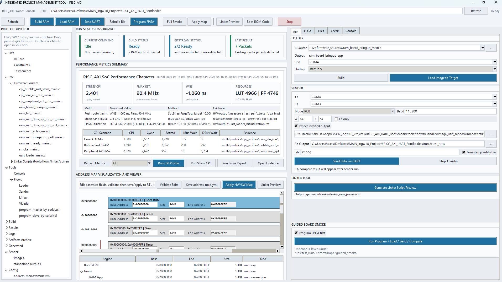

### 프로젝트 3. AXI to APB Bridge IP Design

#### 프로젝트 목표

고속 AXI4 bus와 저속 APB peripheral bus를 연결하는 bridge IP를 Verilog-HDL로 설계하는 것이 목표였습니다. Burst transfer 분해, slave decoding, APB wait-state 대응, error response 처리를 포함한 protocol conversion을 구현했습니다.

#### 프로젝트 정보

| 항목 | 내용 |
| --- | --- |
| 유형 | 개인 설계 프로젝트 / AMBA Bus Interface RTL 설계 |
| 진행 기간 | 2026.01 |
| 사용 언어·도구 | Verilog-HDL, SystemVerilog testbench, Xcelium, AMBA AXI4/APB |
| 특징 | AXI burst-to-APB single transfer, address decoding, error response |

#### 프로젝트 개요

AXI4 Slave와 APB Master 사이의 변환 구조를 설계했습니다. AWLEN/ARLEN 기반으로 burst count를 관리하고, AXI burst transaction을 개별 APB single transfer로 순차 변환했습니다. 4개의 APB slave 선택을 위한 address decoding과 PSEL 생성 로직을 구성하고, APB PREADY wait-state와 PSLVERR response에 대응하도록 Setup/Enable phase와 AXI response를 제어했습니다.

#### 담당 분야/역할

AXI-to-APB 변환 FSM, burst-to-single transfer 처리, address decoding, APB slave selection 로직을 설계했습니다. Read/write 동작과 error response 시나리오를 Verilog testbench로 구성하고 검증했습니다.

#### 주요 포인트

AXI burst transaction을 APB single transfer로 분해하고, APB wait-state와 error response를 포함한 주요 protocol 변환 동작을 검증했습니다. 이후 APB 기반 AES peripheral IP와 연결해 SoC peripheral 제어 경로로 확장했습니다.

#### 결과물

4-burst write, read, error response 등 주요 scenario를 waveform으로 검증했습니다. 산출물은 RTL source, testbench, 설계 보고서(HDD)입니다.

#### 핵심 이미지

**Figure 1. AXI-to-APB Bridge Overall Block Diagram**

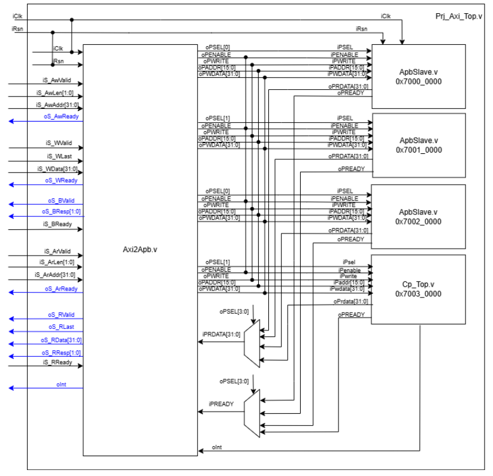

**Figure 2. AXI Write FSM**

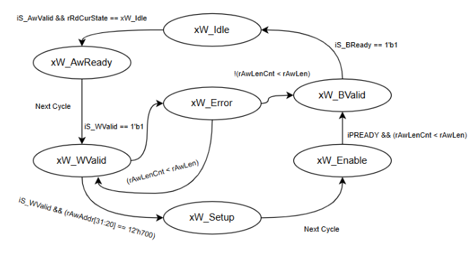

**Figure 3. AXI Read FSM**

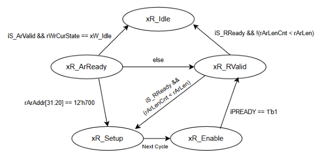

### 프로젝트 4. APB Interface 기반 AES-128 IP 설계

#### 프로젝트 목표

AES-128 block을 RTL로 설계하고, APB interface를 붙여 hardware IP 형태로 구현하는 것이 목표였습니다. 내부 InBuffer/OutBuffer, control register, status/interrupt 흐름을 함께 구성해 APB를 통해 입력, 실행, 결과 확인이 가능하도록 설계했습니다.

#### 프로젝트 정보

| 항목 | 내용 |
| --- | --- |
| 유형 | 개인 설계 프로젝트 / APB 기반 AES-128 IP RTL 설계 |
| 진행 기간 | 2024.11.23 ~ 2025.12.13 |
| 사용 언어·도구 | Verilog-HDL, Xcelium, APB Protocol, AES-128 |
| 특징 | 32-bit APB register interface, 128-bit block packing, memory map |

#### 프로젝트 개요

전체 구조는 APB Slave Interface, Control Register, InBuf/OutBuf, AES Core, interrupt 발생 로직으로 구성했습니다. APB에서 받은 32-bit 데이터를 128-bit block으로 packing해 AES Core로 전달하고, 연산 완료 후 결과 buffer와 interrupt/status flag를 통해 SW가 완료 상태를 읽을 수 있도록 구성했습니다. 또한 AXI4 to APB Bridge 뒤에 APB peripheral 형태로 연결할 수 있는 register interface를 구성했습니다.

#### 담당 분야/역할

AES round 연산 RTL, APB Interface, control path와 data path 구조, Verilog testbench 기반 기능 검증을 담당했습니다. APB 접근, buffer write/read, AES start/done, interrupt 발생 흐름을 함께 검토했습니다.

#### 주요 포인트

Endian 처리 차이로 암호화 결과가 reference 값과 다르게 나오는 문제가 있었습니다. Python 기반 AES reference 값을 golden data로 사용하고, testbench 비교를 통해 byte ordering 문제를 수정했습니다. Register write, AES 연산 시작, done/status 확인, result readback 흐름을 함께 검증했습니다.

#### 결과물

APB Interface 기반 AES-128 IP RTL을 구현했습니다. 산출물은 AES Core, APB Interface, Buffer, Control Block, testbench, 설계보고서(HDD)입니다.

#### 핵심 이미지

**Figure 1. Overall Block Diagram**

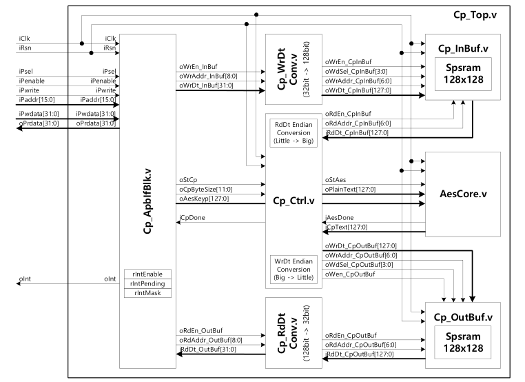

**Figure 2. AES Core Datapath**

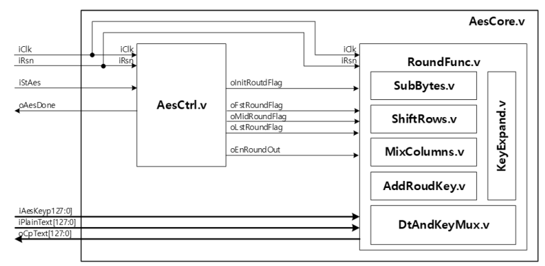

### 프로젝트 5. Verilog-HDL 기반 79-tap FIR Filter 설계

#### 프로젝트 목표

79-tap FIR Filter를 Verilog-HDL로 구현하고, coefficient update와 filtering 동작을 지원하는 synthesizable filter 구조를 만드는 것이 목표였습니다. 대칭 FIR 구조를 활용해 79개 tap을 그대로 연산하지 않고 40개 coefficient 기준으로 folding하는 구조를 설계했습니다.

#### 프로젝트 정보

| 항목 | 내용 |
| --- | --- |
| 유형 | 전공 팀 프로젝트 / Verilog-HDL 기반 FIR Filter 설계 |
| 진행 기간 | 2024.11 |
| 사용 언어·도구 | Verilog-HDL, ModelSim, Vivado |
| 특징 | 79-tap FIR, coefficient folding, delay chain, multiplier/accumulator |

#### 프로젝트 개요

Coefficient storage를 위한 SRAM 구조를 사용하고, 대칭 계수를 활용한 coefficient folding을 적용해 multiplier 사용량을 줄였습니다. Delay chain은 79-depth로 구성하고, x[0]+x[78]처럼 대칭 sample을 먼저 더한 뒤 40개 coefficient와 곱하는 방식으로 연산량을 줄였습니다. 전체 구조는 coefficient RAM, delay chain, pre-adder, multiplier/accumulator 연산부가 controller와 함께 동작하는 형태로 구성했습니다.

#### 담당 분야/역할

Delay chain, multiplier/accumulator 연산부, coefficient RAM 연동 구조를 중심으로 RTL 설계를 담당했습니다. 대칭 sample을 더해 multiplier 입력으로 전달하는 datapath와 4-parallel 연산 구조를 구현하고, testbench와 simulation waveform으로 coefficient update와 filtering 결과를 검증했습니다.

#### 주요 포인트

Coefficient folding으로 연산 구조를 줄이고, coefficient RAM을 통해 외부 coefficient update가 가능한 FIR datapath를 구성했습니다. Testbench와 waveform으로 coefficient update와 filtering 결과를 검증했습니다.

#### 결과물

산출물은 Verilog-HDL RTL source, testbench, ModelSim simulation, Vivado synthesis 결과, 최종 보고서와 발표 자료입니다.

#### 핵심 이미지

**Figure 1. Symmetric Coefficient Folding**

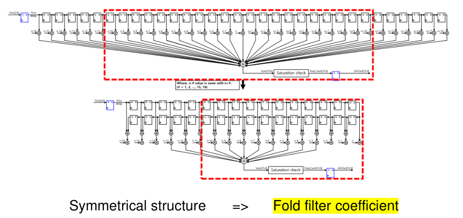

**Figure 2. Overall Block Diagram**

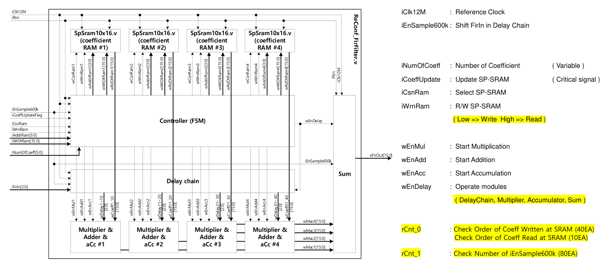

**Figure 3. Simulation Result**

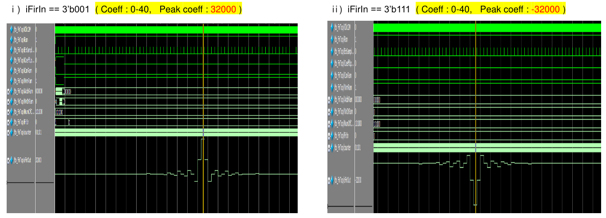

### 프로젝트 6. SystemVerilog UVM 기반 RTL 검증 환경 구성

#### 프로젝트 목표

Adder, RAM, FIFO와 같은 기초 RTL block부터 UART, SPI, I2C 통신 protocol RTL까지 총 9개 DUT를 대상으로 SystemVerilog UVM 검증 환경을 구성했습니다. 각 DUT에 대해 sequence 기반 scenario, assertion, scoreboard, functional coverage를 분리해 검증 항목을 정리하고, Synopsys VCS/Verdi/URG 환경에서 simulation 결과와 coverage/assertion report를 확인하는 것을 목표로 했습니다.

#### 프로젝트 정보

| 항목 | 내용 |
| --- | --- |
| 유형 | 개인 프로젝트 / SystemVerilog UVM 기반 RTL 검증 환경 구성 |
| 진행 기간 | 2026.05 |
| 사용 언어·도구 | SystemVerilog, UVM, Synopsys VCS, Verdi, URG, Makefile |
| 검증 대상 | Adder, RAM, FIFO, UART RX/TX, SPI Master/Slave, I2C Master/Slave |
| 핵심 구성 | sequence, driver, monitor, scoreboard, assertion, functional coverage |

#### 프로젝트 개요

Basic 파트에서는 Adder, RAM, FIFO를 대상으로 UVM testbench의 기본 구조를 구성했습니다. Adder는 산술 결과 비교, RAM은 reference memory model 기반 readback 비교, FIFO는 queue reference model 기반 ordering 및 full/empty/count 상태 비교를 수행하도록 scoreboard를 구성했습니다.

Protocol 파트에서는 UART RX/TX, SPI Master/Slave, I2C Master/Slave를 대상으로 정상 전송뿐 아니라 reset, error, timeout, jitter, mode condition을 포함한 scenario를 작성했습니다. UART는 serial frame과 valid/error pulse, SPI는 CPOL/CPHA mode와 CS/SCLK timing, I2C는 address/RW와 ACK/NACK 조건을 중심으로 검증했습니다.

공통 UVM 흐름은 `sequence -> driver -> interface -> DUT -> monitor -> scoreboard -> coverage` 구조로 구성했습니다. Driver는 sequence item을 pin-level stimulus로 변환하고, monitor는 DUT 출력과 bus event를 transaction으로 복원합니다. Scoreboard는 expected result와 observed result를 비교하고, coverage component는 scenario와 data pattern이 실제로 hit되었는지 확인합니다.

#### 담당 분야/역할

9개 DUT의 UVM testbench 구조를 직접 구성했습니다. DUT별 sequence item, sequence, driver, monitor, scoreboard, coverage component를 작성하고, 각 block 및 protocol 특성에 맞춰 scenario와 check 항목을 분리했습니다.

Basic block에서는 reference model 기반 비교 구조를 만들었습니다. Adder는 expected sum, RAM은 reference memory, FIFO는 queue model을 기준으로 observed transaction과 비교했습니다. Protocol block에서는 driver가 생성하는 timing과 monitor가 관찰하는 event를 분리해, 정상 동작뿐 아니라 reset/error 조건에서도 scoreboard 기준을 유지하도록 구성했습니다.

#### 검증 대상 및 주요 Scenario

| 구분 | 대상 | 주요 sequence / scenario |
| --- | --- | --- |
| Basic | Adder | zero, max, carry, random operand 조합 |
| Basic | RAM | write/read, same-address readback, reset 이후 접근, idle 상태 |
| Basic | FIFO | idle, write, read, simultaneous write/read, full, empty, random stream |
| Protocol | UART RX | directed byte, frame error, false start, timeout, reset phase, jitter, byte sweep |
| Protocol | UART TX | directed byte, busy 상태 검증, timeout, reset phase, jitter, byte sweep |
| Protocol | SPI Master | directed pattern, CPOL/CPHA mode, reset abort, jitter, byte sweep |
| Protocol | SPI Slave | directed pattern, CPOL/CPHA mode, CS abort, reset abort, jitter, byte sweep |
| Protocol | I2C Master | directed read/write, ACK/NACK error, reset abort, jitter, byte sweep |
| Protocol | I2C Slave | address hit/miss, read/write data, reset abort, jitter, byte sweep |

#### Assertion 및 Coverage 구성

Assertion은 waveform 확인만으로 놓치기 쉬운 protocol rule과 reset 안정성을 확인하는 용도로 사용했습니다. 특히 output pulse가 한 cycle만 유지되는지, reset 중 valid/done pulse가 발생하지 않는지, idle 상태에서 bus signal이 기대 상태를 유지하는지를 중심으로 배치했습니다.

Functional coverage는 단순 line coverage가 아니라 검증 의도와 직접 연결되는 항목으로 구성했습니다. Basic block은 operand, address, command, FIFO state를 중심으로 두었고, protocol block은 data pattern, result type, reset phase, tick/jitter condition, protocol mode, address/RW, ACK/NACK 조건을 coverpoint로 분리했습니다.

| 대상 | Assertion / check 관점 | Functional coverage 항목 |
| --- | --- | --- |
| Adder | combinational result를 scoreboard golden model과 비교 | operand range, carry, operand cross |
| RAM | control/address unknown 방지, idle read-data stability, write 후 readback | read/write command, address range, write/read data |
| FIFO | full/count 일치, empty/count 일치, command unknown 방지 | command, full/empty, count state, command x count |
| UART RX/TX | valid/error 또는 done pulse, reset safety, frame/result rule | data pattern, result type, reset phase, timeout/jitter |
| SPI Master/Slave | done/rx_valid pulse, CS/SCLK idle rule, MISO release | CPOL, CPHA, data pattern, mode cross, reset/jitter |
| I2C Master/Slave | done/txn pulse, idle bus release, address/RW rule | address, read/write direction, ACK/NACK, data, reset/jitter |

#### Synopsys URG Report 확인

검증 결과는 Synopsys URG가 생성한 HTML report에서 functional coverage와 assertion 중심으로 확인했습니다. `groups.html`은 covergroup 단위의 coverage summary를 보여주고, `grp0.html`은 coverpoint/bin별 hit 여부를 보여줍니다. `asserts.html`은 assertion 수행 횟수, 통과, 실패, 미완료 여부를 확인하는 데 사용했습니다.

| URG 화면 | 확인 항목 | 본 프로젝트에서 확인한 내용 |
| --- | --- | --- |
| `groups.html` | covergroup 단위 coverage summary | I2C Master covergroup 목표 coverage 달성 |
| `grp0.html` | coverpoint/bin별 hit 여부 | UART RX data pattern, frame result, reset/tick/jitter bin 확인 |
| `asserts.html` | assertion 수행/통과/실패 | SPI Master protocol assertion 통과 및 failure 0 확인 |

#### 검증 결과 요약

| 대상 | Scoreboard 비교 | Assertion | Functional Coverage |
| --- | --- | --- | --- |
| 01_adder | 산술 결과 비교 통과 | scoreboard check 중심 | 100% |
| 02_ram | write/read reference 비교 통과 | 주요 memory rule 확인 | 100% |
| 03_fifo | ordering/depth 비교 통과 | full/empty/count rule 확인 | 100% |
| 04_uart_rx | RX frame/result 비교 통과 | valid/error/reset rule 확인 | 100% |
| 05_uart_tx | TX frame/result 비교 통과 | done/ready/busy rule 확인 | 100% |
| 06_spi_master | SPI transfer/result 비교 통과 | done/busy/idle rule 확인 | 100% |
| 07_spi_slave | SPI slave transaction 비교 통과 | rx_valid/MISO release rule 확인 | 100% |
| 08_i2c_master | I2C master transaction 비교 통과 | done/busy/bus release rule 확인 | 100% |
| 09_i2c_slave | I2C slave transaction 비교 통과 | rx_valid/txn_done rule 확인 | 100% |

9개 DUT 모두 작성한 scenario 기준으로 scoreboard 비교를 통과했으며, 각 testbench의 functional covergroup 기준 100% coverage를 확인했습니다. Verdi waveform에서는 driver가 생성한 timing과 monitor가 복원한 transaction, result pulse, reset/error condition을 함께 확인했습니다.

#### 주요 포인트

UVM component를 형식적으로 구성하는 데서 끝내지 않고, scenario, assertion, coverage의 역할을 분리해 검증 항목을 정리했습니다. Sequence는 어떤 조건을 넣을지 정의하고, assertion은 protocol rule을 즉시 감시하며, coverage는 작성한 scenario와 data space가 실제로 실행되었는지를 확인하는 기준으로 사용했습니다.

Driver와 monitor는 간단하게 역할을 나누었습니다. Driver는 sequence item을 interface signal로 변환해 DUT를 구동하고, monitor는 DUT output과 bus event를 transaction 단위로 복원합니다. Scoreboard는 driver/sequence에서 기대한 결과와 monitor가 관찰한 결과를 비교해 pass/fail 기준을 제공합니다.

#### 결과물

산출물은 9개 DUT의 RTL source, SystemVerilog UVM testbench, Makefile 기반 simulation flow, Verdi waveform database, URG coverage/assertion report, module별 검증 요약 자료입니다. 이를 통해 기초 block부터 UART/SPI/I2C protocol까지 scenario 작성, assertion check, scoreboard 비교, coverage 확인으로 이어지는 UVM 검증 흐름을 정리했습니다.

#### 핵심 이미지

**Figure 1. UART RX UVM Sequence Diagram**

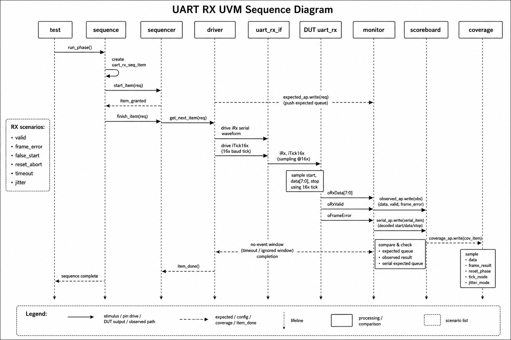

UART RX sequence는 serial input frame을 driver가 `iRx`와 tick 기준으로 구동하고, monitor가 DUT output과 serial event를 transaction으로 복원한 뒤 scoreboard와 coverage로 전달하는 흐름을 보여줍니다. Frame error, false start, timeout, reset abort 같은 scenario가 sequence 단계에서 분리됩니다.

**Figure 2. FIFO UVM Sequence and Queue Reference Model**

FIFO sequence diagram은 Basic block에서 reference model을 어떻게 사용하는지 보여주는 예시입니다. Driver가 write/read command를 구동하고, monitor가 FIFO status와 read data를 관찰하며, scoreboard는 queue model을 기준으로 ordering, full/empty, count 상태를 비교합니다.

**Figure 3. Synopsys URG - UART RX Functional Coverage Bins**

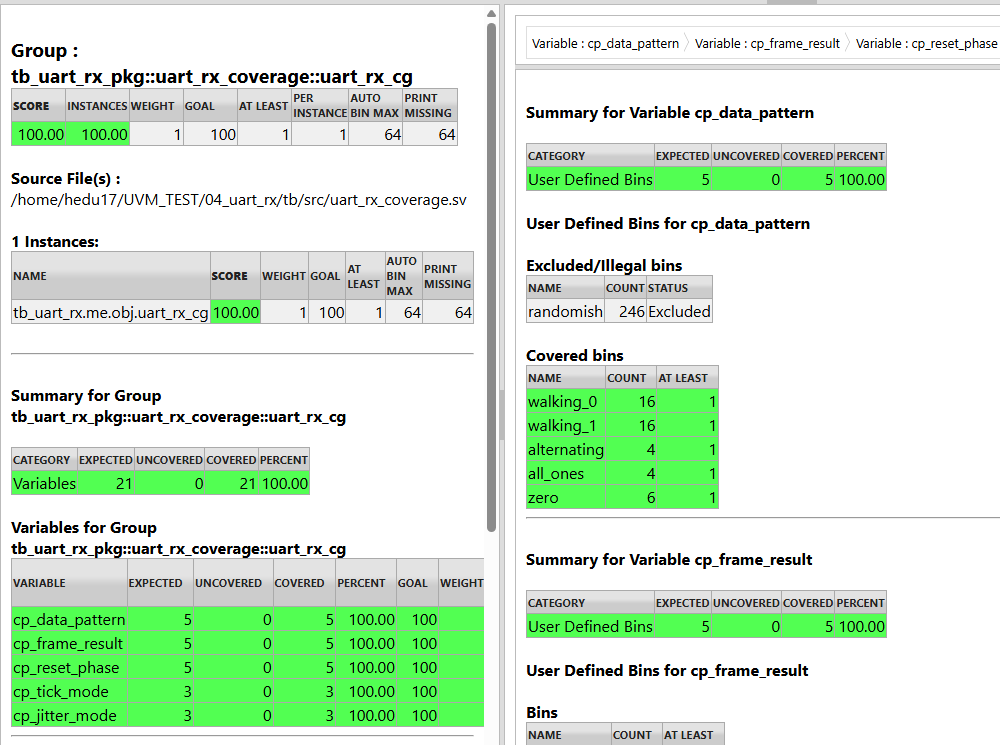

UART RX coverage report에서는 `cp_data_pattern`, `cp_frame_result`, `cp_reset_phase`, `cp_tick_mode`, `cp_jitter_mode` coverpoint가 모두 100%로 채워진 것을 확인했습니다.

**Figure 4. Synopsys URG - SPI Master Assertion Success**

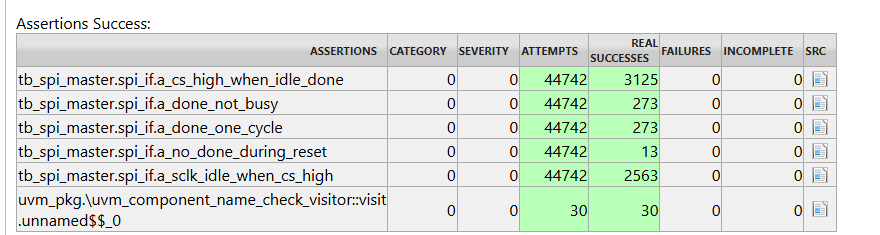

SPI Master assertion report에서는 `CS high when idle/done`, `done not busy`, `done one-cycle`, `no done during reset`, `SCLK idle when CS high`와 같은 protocol rule이 시뮬레이션 중 검증되었고, 실패 없이 통과된 것을 확인했습니다.

**Figure 5. Synopsys URG - I2C Master Covergroup Summary**

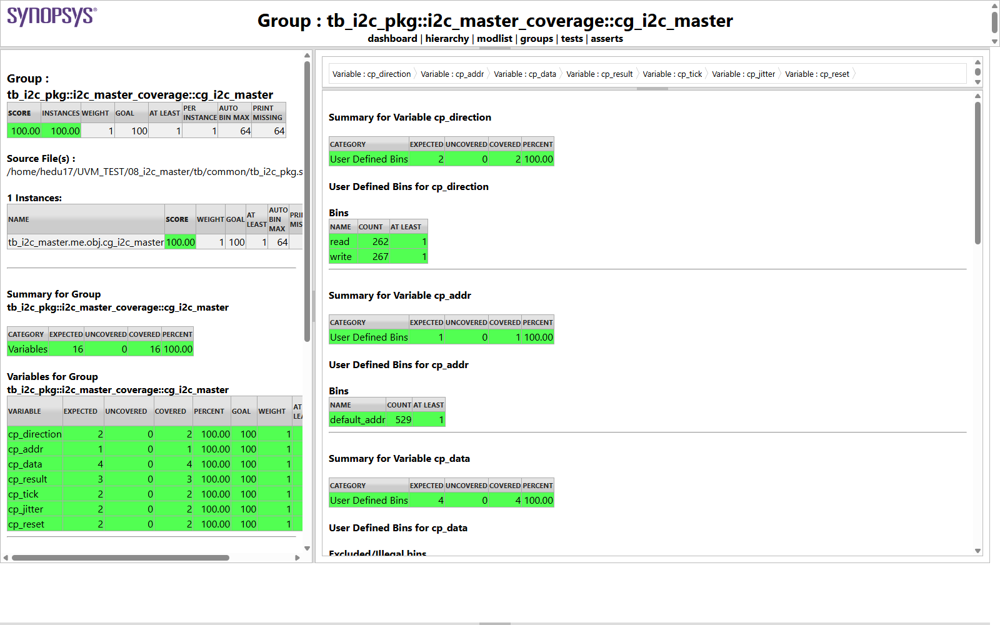

I2C Master coverage report에서는 address/RW, ACK/NACK, data, reset/jitter 관련 coverpoint가 목표 coverage를 달성한 것을 확인했습니다. I2C protocol은 open-drain SCL/SDA bus 특성과 ACK/NACK 결과를 coverage 항목에 반영했습니다.

### 프로젝트 7. STM32F103 기반 Mini Elevator Controller 설계

#### 프로젝트 목표

STM32 Nucleo 보드에서 3층 엘리베이터를 모사하고, 외부 Hall 버튼, 내부 층 선택 버튼, 요청 LED, Step Motor, 7-Segment 표시기를 하나의 상태 기반 제어 흐름으로 구현하는 것이 목표였습니다.

#### 프로젝트 정보

| 항목 | 내용 |
| --- | --- |
| 유형 | 팀 프로젝트 / STM32 기반 MCU 제어 시스템 설계 |
| 진행 기간 | 2024.08 ~ 2024.11 |
| 사용 언어·도구 | C, STM32CubeIDE, STM32F103, GPIO, Timer, Step Motor |
| 특징 | 3층 elevator logic, motor control, 7-segment, system integration |

#### 프로젝트 개요

STM32F103 환경에서 GPIO 입력, 요청 LED 출력, 4상 Step Motor 구동, 7-Segment 층 표시를 C firmware로 구현한 팀 프로젝트입니다. 외부/내부 요청을 상태로 저장하고, 현재 층과 이동 방향을 기준으로 다음 목적지를 선택하는 FSM 기반 제어 흐름을 구성했습니다.

#### 담당 분야/역할

팀장으로서 Step Motor 제어, 엘리베이터 동작 로직, 전체 시스템 통합을 맡았습니다. 각 팀원이 구현한 GPIO 입력부, 요청 LED, 7-Segment 표시부가 모터 구동 및 층 이동 로직과 맞물리도록 동작 순서를 조율하고, 최종 시연이 가능한 형태로 기능을 통합했습니다.

#### 주요 포인트

팀장으로서 Step Motor 제어, 층 이동 로직, 입력/표시부 통합을 담당했습니다. STM32 datasheet와 header file을 기준으로 GPIO, Timer, MMIO register를 확인하고, firmware 제어 값이 실제 모터 및 표시 장치 동작으로 이어지도록 통합했습니다.

#### 결과물

팀 산출물은 STM32F103 기반 mini elevator control firmware, CubeIDE 프로젝트, 발표 자료, 시연 영상입니다.

#### 핵심 이미지

**Figure 1. Mini Elevator 구현 사진**

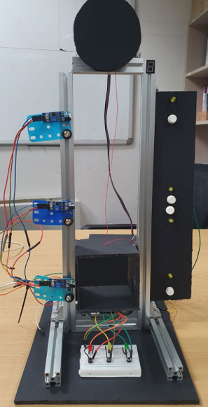

**Figure 2. STM32F103 Pin Map**

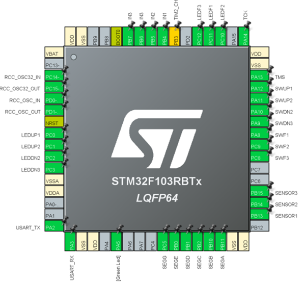

### 프로젝트 8. SIC/XE Assembler & Simulator 구현

#### 프로젝트 목표

SIC/XE 가상 아키텍처를 대상으로 assembly source가 object code로 변환되고, 여러 object program이 link/load 과정을 거쳐 memory에 적재된 뒤 simulator에서 실행되는 흐름을 직접 구현하는 것이 목표였습니다. 시스템 소프트웨어의 기본 동작을 이해하기 위해 assembler, linking loader, instruction simulator를 단계적으로 구성했습니다.

#### 프로젝트 정보

| 항목 | 내용 |
| --- | --- |
| 유형 | 전공 개인 프로젝트 / System Programming |
| 진행 기간 | 2025.03 ~ 2025.06 |
| 사용 언어·도구 | C, Java, SIC/XE Assembly, Visual Studio, Eclipse/Java |
| 구현 범위 | Two-pass assembler, symbol/literal table, object code generation, linking loader, instruction simulator |
| Java 구현 | 프로젝트1b: Java 기반 assembler / 프로젝트2: Java 기반 loader 및 simulator |

#### 프로젝트 개요

SIC/XE instruction set과 assembly source를 입력으로 받아 object program을 생성하고, 생성된 object program을 memory에 적재해 instruction 단위로 실행하는 구조를 구현했습니다. 초기 프로젝트에서는 C 기반 assembler를 작성했고, 이후 프로젝트1b에서는 Java로 assembler 구조를 확장했습니다. 프로젝트2에서는 Java 기반 linking loader와 simulator를 구성해 object code load, external symbol resolution, modification record 처리, register/memory 상태 갱신 흐름을 구현했습니다.

Assembler는 Pass 1에서 LOCCTR 기반 주소 할당, symbol table, literal table, control section 정보를 구성하고, Pass 2에서 instruction format과 addressing mode를 해석해 object code를 생성하도록 작성했습니다. Loader는 H/T/D/M record를 해석해 program section별 시작 주소와 external symbol을 정리하고, modification record를 반영해 relocation을 수행한 뒤 memory image를 구성했습니다. Simulator는 loaded program을 대상으로 fetch-decode-execute 흐름에 따라 instruction을 실행하고 register, memory, program counter 상태 변화를 확인할 수 있도록 했습니다.

#### 담당 분야/역할

Java assembler에서는 `Assembler`, `TokenTable`, `SymbolTable`, `LiteralTable`, `Section`, `InstTable` 클래스를 중심으로 source parsing, symbol/literal 관리, object code 생성 흐름을 구현했습니다. Java loader/simulator에서는 `SicLoader`, `SicSimulator`, `ResourceManager`, `SymbolTable`, `ModifyRecord`, `VisualSimulator` 클래스를 분리해 object program loading, memory/register resource 관리, instruction 실행 및 상태 표시 기능을 구성했습니다.

#### 주요 포인트

단순 알고리즘 구현이 아니라 소스 코드가 기계어로 변환되고, link/load 과정을 거쳐 실행 가능한 memory image가 되는 전체 흐름을 직접 다룬 프로젝트입니다. Java 버전에서는 기능을 클래스 단위로 분리해 assembler와 simulator의 책임을 나눴고, symbol table, literal table, ESTAB, modification record처럼 시스템 소프트웨어에서 중요한 자료구조를 직접 구현했습니다.

이 경험을 통해 instruction format, addressing mode, program counter, register file, memory map, relocation의 의미를 코드 수준에서 이해했습니다. 이후 RISC-V core, bus protocol, UART bootloader, firmware load flow를 다룰 때도 instruction 실행 흐름과 system software 관점을 함께 연결해 생각하는 데 도움이 되었습니다.

#### 결과물

산출물은 C 기반 assembler, Java 기반 assembler, Java 기반 linking loader/simulator source, object code 출력 파일, symbol/literal table 출력 파일, 실행 결과 보고서입니다. 포트폴리오에는 실행 GUI, assembler-loader-simulator 처리 흐름, object code 출력 예시를 핵심 이미지로 정리했습니다.

#### 핵심 이미지

**Figure 1. SIC/XE Simulator Execution GUI**

**Figure 2. Assembler-Loader-Simulator Architecture Flow**

**Figure 3. Object Code Generation Output**

