# UVM 검증 현황 최종 보고서

프로젝트: `C:\Users\user\Desktop\MAIN_ing\10_Projects\uvm_ttt`  
작성 기준: 2026-05-24, Vivado/XSim 결과 산출물 기준  
대상 DUT: ADDER, FIFO, RAM, UART RX, UART TX, SPI MASTER, SPI SLAVE, I2C MASTER, I2C SLAVE

## 1. Executive Summary

본 프로젝트는 Basic UVM 예제 3종과 통신 IP 6종에 대해 Vivado/XSim 기반 UVM 검증 환경을 구성하고, scenario별 simulation log, scoreboard summary, functional coverage report, CSV/PNG 시각화 자료를 생성한 상태다.

| 그룹 | DUT | 최신 상태 | Coverage | Scoreboard 기준 |
| --- | --- | --- | ---: | --- |
| Basic | ADDER | PASS | 100% | all 778 pass / 0 fail |
| Basic | FIFO | PASS | 100% | all 754 pass / 0 fail |
| Basic | RAM | PASS | 100% | all 792 pass / 0 fail |
| Comm | UART RX | PASS | 100% | all 292 pass / 0 fail |
| Comm | UART TX | PASS | 100% | all 296 pass / 0 fail |
| Comm | SPI MASTER | PASS | 100% | all 275 pass / 0 fail |
| Comm | SPI SLAVE | PASS | 100% | all 274 pass / 0 fail |
| Comm | I2C MASTER | PASS | 100% | all 529 pass / 0 fail |
| Comm | I2C SLAVE | PASS | 100% | all 528 pass / 0 fail |

판단 근거는 단순한 PASS 문자열이 아니다. 최신 요약 CSV 기준으로 scoreboard fail=0, UVM_ERROR=0, UVM_FATAL=0, raw simulator error=0이며, 각 DUT의 coverage model에 정의된 coverpoint/cross bin이 100% 닫힌 상태다.

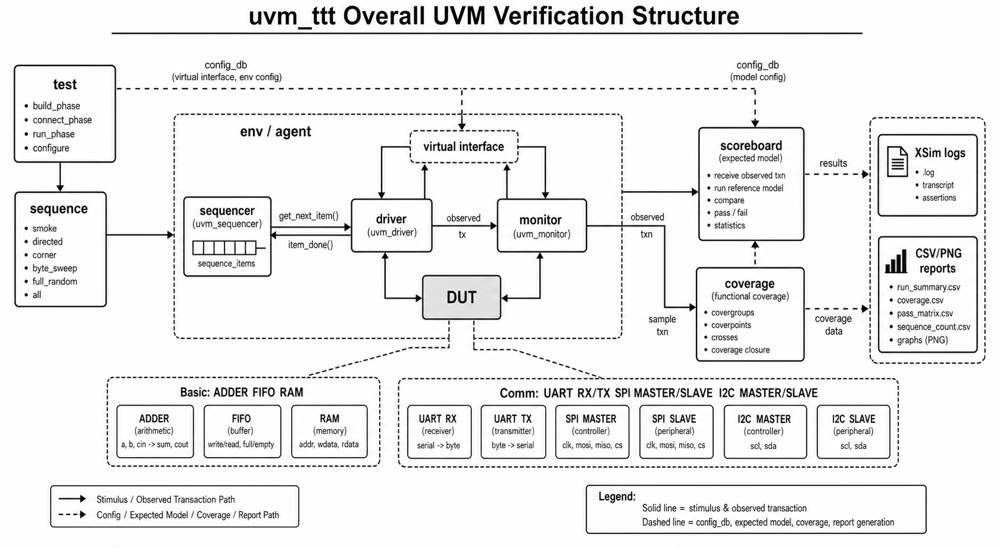

## 2. 결과 Dashboard

아래 dashboard는 통신 모듈 6종의 scenario PASS matrix와 coverage closure를 한 화면에 요약한다. 녹색 PASS cell은 해당 scenario log에서 scoreboard fail, UVM_ERROR, UVM_FATAL, raw simulator error가 모두 0임을 의미한다.

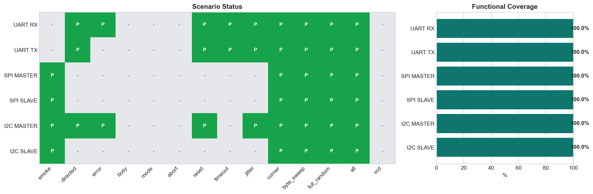

Basic 3종은 smoke, directed, byte_sweep, full_random, all이 모두 PASS다. FIFO/RAM은 driven item 수보다 checked pass 수가 작을 수 있는데, 이는 idle, blocked read/write, status-probing cycle처럼 데이터 비교 이벤트가 발생하지 않는 stimulus가 포함되기 때문이다.

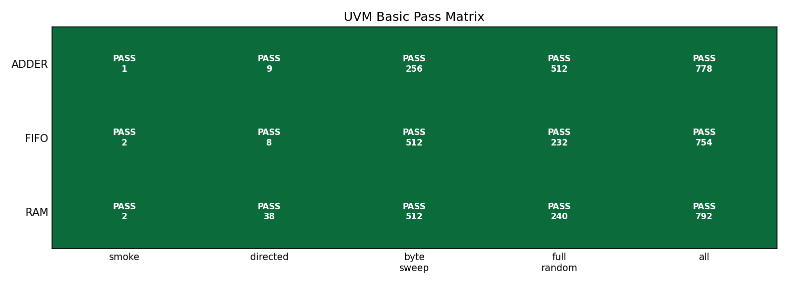

## 3. UVM Testbench 구조

공통 구조는 `test -> sequence -> sequencer -> driver -> interface -> DUT -> monitor -> scoreboard -> coverage` 흐름이다. driver는 pin stimulus를 넣는 동시에 expected transaction을 scoreboard로 publish하고, monitor는 DUT pin/output을 관찰하여 observed transaction을 publish한다. coverage는 raw monitor item이 아니라 scoreboard가 pass 처리한 expected item을 sample하도록 구성되어 있어, coverage 100%가 단순 stimulus 발생이 아니라 check 완료 조건과 연결된다.

| 구성 요소 | 역할 | 본 프로젝트 적용 |
| --- | --- | --- |
| RTL DUT | 검증 대상 | `basic/*/rtl`, `RTL/UART`, `RTL/SPI`, `RTL/I2C` |
| interface | pin drive/sample, clocking block, SVA | `*_if.sv`, SPI/I2C는 `COMMON/*_if.sv` |
| sequence item | transaction 필드 | data, addr, mode, reset phase, jitter, expected result |
| sequence | scenario 생성 | smoke, directed, corner, byte_sweep, full_random, all |
| driver | transaction을 pin-level stimulus로 변환 | expected_ap로 reference item publish |
| monitor | DUT output/bus 관찰 | observed_ap 또는 serial_ap publish |
| scoreboard | expected/observed 비교 | queue, reference FIFO, reference memory, protocol predictor |
| coverage | pass item 기반 covergroup sample | coverpoint/cross closure 확인 |

기준 경로는 `C:\Users\user\Desktop\MAIN_ing\10_Projects\uvm_ttt`이며, 주요 source layout은 다음과 같다.

| DUT/그룹 | RTL 경로 | UVM TB 경로 |
| --- | --- | --- |
| ADDER | `basic/adder/rtl` | `basic/adder/tb` |
| FIFO | `basic/fifo/rtl` | `basic/fifo/tb` |
| RAM | `basic/ram/rtl` | `basic/ram/tb` |
| UART RX | `RTL/UART` | `TB/UART/RX` |
| UART TX | `RTL/UART` | `TB/UART/TX` |
| SPI MASTER | `RTL/SPI` | `TB/SPI/MASTER`, common: `TB/SPI/COMMON` |
| SPI SLAVE | `RTL/SPI` | `TB/SPI/SLAVE`, common: `TB/SPI/COMMON` |
| I2C MASTER | `RTL/I2C` | `TB/I2C/MASTER`, common: `TB/I2C/COMMON` |
| I2C SLAVE | `RTL/I2C` | `TB/I2C/SLAVE`, common: `TB/I2C/COMMON` |

## 4. Basic UVM: ADDER, FIFO, RAM

Basic 3종은 학습용 구조지만 단순 smoke에 머물지 않고 directed, byte_sweep, full_random까지 확장되어 있다. ADDER는 조합 expected sum, FIFO는 queue reference model, RAM은 reference memory model로 검증한다.

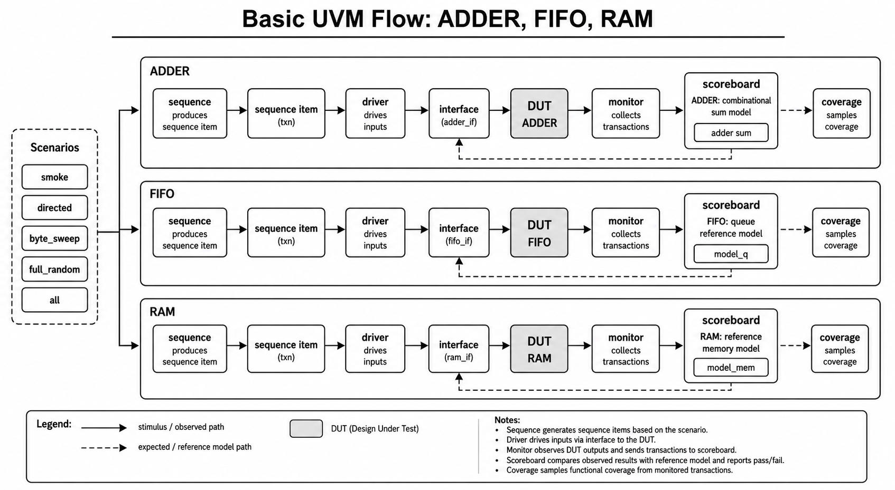

| DUT | 주요 scenario/input | Coverage closure 의미 | Scoreboard model | Assertion |
| --- | --- | --- | --- | --- |
| ADDER | smoke 1건, zero/misc/max 3x3, 8-bit sweep 256, random 512 | 입력 zero/max/misc, carry/no-carry, input cross hit | `expected = iA + iB` | 명시 SVA 없음 |
| FIFO | write/read smoke, idle/empty/full/wr_rd directed, 0x00~0xFF write/read, random | command, full/empty, count zero/mid/full, cmd x count cross hit | `model_q[$]` push/pop | count/full/empty 일치, unknown command 방지 |
| RAM | addr0 write/read, first/last/mid, 전체 addr, 0x00~0xFF write/read, random | read/write, first/last/misc addr, zero/ones/misc data, cmd x addr hit | `model_mem[addr]` | control known, reset low, addr stable, write-readback |

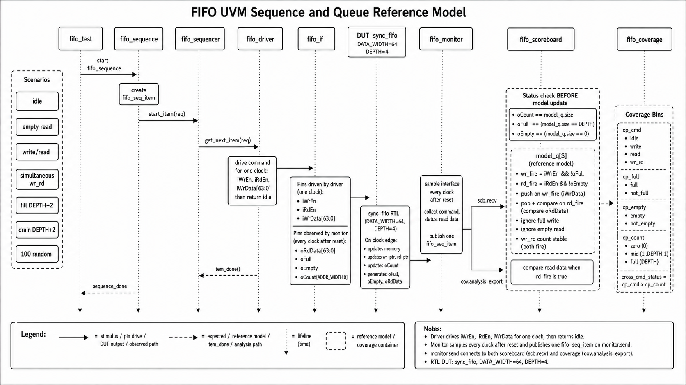

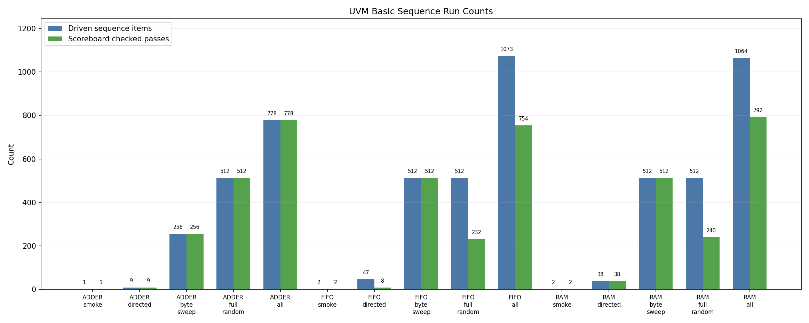

## 5. UART RX/TX 검증

UART는 RX와 TX가 분리된 UVM bench를 가진다. RX는 serial input을 DUT에 주입하고, monitor가 DUT result와 serial frame decode를 모두 scoreboard로 전달한다. TX는 DUT serial output frame을 monitor가 decode하여 data, stop bit, done pulse를 검증한다.

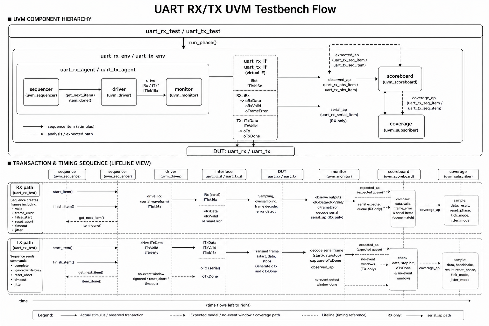

| DUT | sequence/input scenario | Coverage closure 의미 | Scoreboard check |
| --- | --- | --- | --- |
| UART RX | directed 20, error 2, reset 4, timeout 1, jitter 3, corner 5, byte_sweep 256, full_random 512, all 292 pass | data pattern, valid/frame_error/false_start/reset_abort/timeout, reset phase, tick mode, jitter mode hit | expected queue + serial expected queue. DUT result/data와 serial decode result를 함께 비교 |
| UART TX | directed 20, reset 4, timeout 1, jitter 3, corner 9, byte_sweep 256, full_random 512, all 296 pass | data pattern, busy attempt, complete/ignored/reset_abort/timeout, reset phase, tick/jitter mode hit | expected queue. TX frame data, stop bit, done pulse, no-event window 확인 |

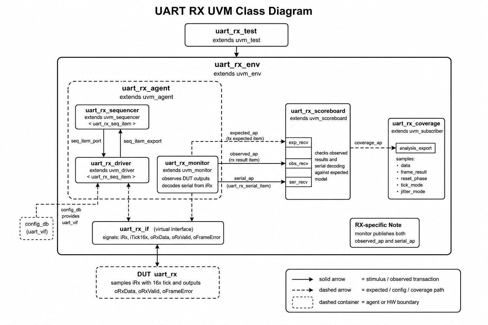

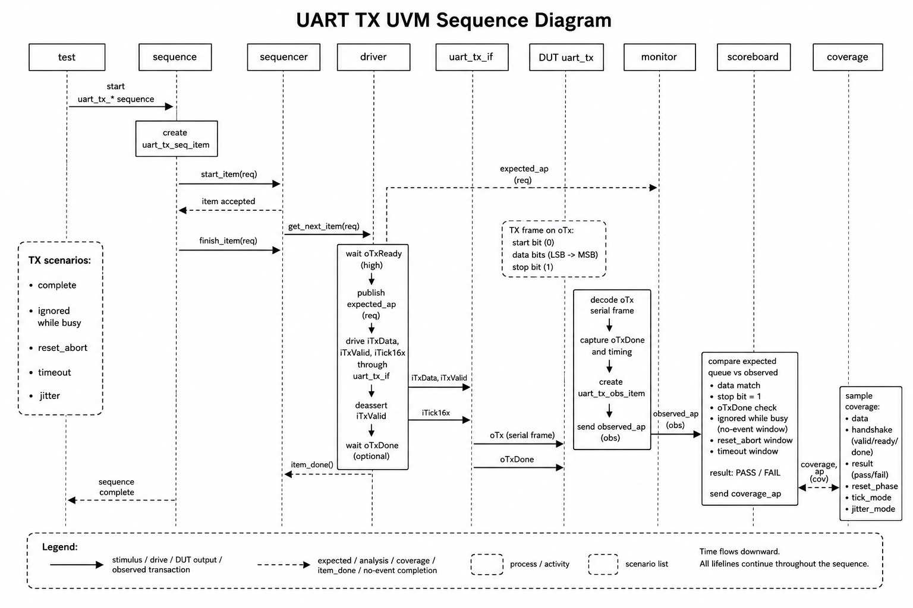

UART RX/TX의 standalone smoke sequence class는 존재하지만 최신 통합 matrix에는 독립 smoke log가 표시되지 않는다. 이 항목은 `all` 내부 smoke 실행으로 검증된 것으로 해석하며, 리뷰용 추적성을 높이려면 smoke standalone log를 재생성하는 것이 좋다.

## 6. SPI MASTER/SLAVE 검증

SPI는 MASTER와 SLAVE bench 모두 `COMMON/tb_spi_pkg.sv`를 공유하되, XSim elaboration 안정성을 위해 role별 define으로 반대 role class를 제외한다. MASTER는 MOSI를 구동하고 MISO를 읽으며, SLAVE는 MOSI를 수신하고 MISO를 구동한다.

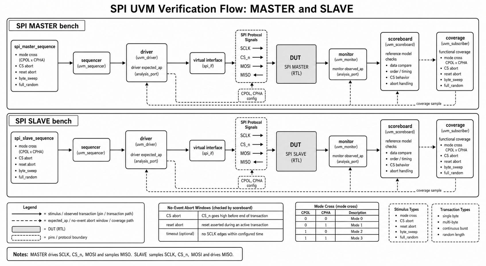

| DUT | sequence/input scenario | Coverage closure 의미 | Scoreboard check |
| --- | --- | --- | --- |
| SPI MASTER | smoke 1, corner 6, byte_sweep 256, full_random 512, all 275 pass. all 내부에 directed/mode/reset/jitter 포함 | TX/MISO data pattern, CPOL, CPHA, CPOL x CPHA mode cross, reset abort, tick/jitter hit | MOSI observed data, MISO readback, done pulse, reset no-event 확인 |
| SPI SLAVE | smoke 1, corner 6, byte_sweep 256, full_random 512, all 274 pass. all 내부에 directed/mode/abort/reset/jitter 포함 | MOSI/TX data pattern, CPOL, CPHA, mode cross, CS abort, reset abort, tick/jitter hit | MOSI RX data, MISO driven data, CS abort/reset no-event 확인 |

SPI assertion은 MASTER에서 done pulse, reset 중 done 금지, done/busy 관계, idle CS/SCLK를 확인한다. SLAVE에서는 CS high 시 MISO release, rx_valid 1-cycle pulse, reset 중 rx_valid 금지를 확인한다.

## 7. I2C MASTER/SLAVE 검증

I2C는 open-drain SCL/SDA bus timing을 기준으로 MASTER/SLAVE 각각을 검증한다. 현재 주소 coverage는 주로 `0x42` 중심이며, SLAVE는 address hit/miss를 별도 coverage로 둔다.

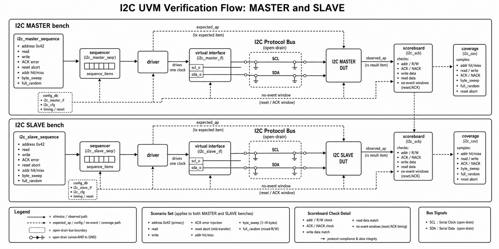

| DUT | sequence/input scenario | Coverage closure 의미 | Scoreboard check |
| --- | --- | --- | --- |
| I2C MASTER | smoke 1, directed 4, error 2, reset 1, jitter 1, corner 8, byte_sweep 512, full_random 512, all 529 pass | addr, read/write direction, data pattern, ACK error, reset abort, tick/jitter hit | addr/RW, ACK error, write data, read data, bus decode 결과 비교 |
| I2C SLAVE | smoke 1, corner 7, byte_sweep 512, full_random 512, all 528 pass. all 내부에 directed/error/reset/jitter 포함 | addr hit/miss, read/write, data pattern, ACK/reset result, tick/jitter hit | bus addr, write data, read data, txn_done, no-event window 확인 |

I2C assertion은 MASTER에서 done pulse, reset 중 done 금지, done/busy 관계, idle bus release를 확인한다. SLAVE에서는 rx_valid/txn_done 1-cycle pulse, reset 중 pulse 금지, read transaction에서 rx_valid 금지를 확인한다.

## 8. Scoreboard와 Coverage 신뢰성

scoreboard는 단순 로그 카운터가 아니라 expected model과 observed transaction의 일치 여부를 판단하는 핵심 check point다. coverage는 scoreboard가 pass 처리한 item을 sample하므로, coverage closure는 “stimulus를 넣었다”가 아니라 “검증 완료된 item이 coverage bin을 닫았다”는 의미에 가깝다.

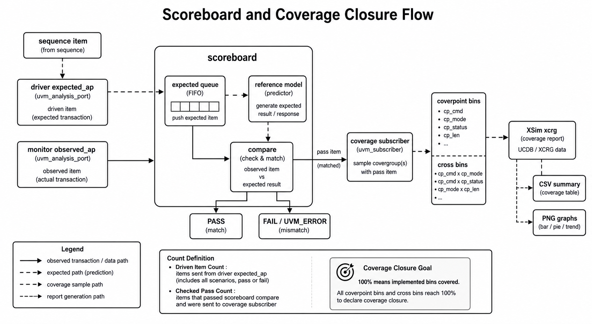

| 구분 | 설명 |
| --- | --- |
| expected model | ADDER sum, FIFO queue, RAM reference memory, UART/SPI/I2C expected queue와 protocol-specific predictor |
| pass 조건 | observed data/result/timing이 expected와 일치하거나, reset/timeout/abort처럼 no-event가 기대되는 window에서 실제 event가 없어야 함 |
| fail 조건 | mismatch, unexpected observed event, missing done/pulse, unmatched expected item, bus decode 실패 |
| driven vs checked 차이 | idle, blocked read/write, reset abort, timeout, false-start, ignored transfer 등은 driven item이지만 data compare pass와 1:1 대응하지 않을 수 있음 |
| 100% coverage 의미 | 구현된 coverpoint/cross bin이 모두 hit되었음. 모든 protocol interleaving의 formal proof를 의미하지는 않음 |

### Coverage 선정 기준과 100% 달성 의미

coverage는 “많이 돌렸다”를 보여주기 위한 숫자가 아니라, DUT별로 반드시 닫아야 하는 기능 조건을 명시한 checklist 역할을 한다. 따라서 각 coverpoint는 data boundary, protocol result, reset/abort/error, timing mode, status state처럼 scoreboard만으로는 한눈에 보이지 않는 검증 의도를 드러내도록 선정했다. 최신 XSim coverage report 기준으로 아래 항목은 모두 100% 달성했다.

| DUT | Coverage 선정 이유 | 닫힌 조건 |
| --- | --- | --- |
| ADDER | 조합 산술 DUT이므로 입력 boundary와 carry 발생 여부가 핵심 | `iA/iB` zero/max/misc, carry/no-carry, 입력 조합 cross 100% |
| FIFO | FIFO는 data보다 상태 전이가 중요하므로 command와 occupancy 상태를 함께 봐야 함 | idle/write/read/wr_rd, empty/mid/full count, full/empty status, command x count cross 100% |
| RAM | memory는 address boundary, read/write 방향, 저장 data pattern이 핵심 | read/write, first/last/misc address, zero/ones/misc write/read data, cmd x addr cross 100% |
| UART RX | RX는 payload뿐 아니라 frame result와 sampling 조건이 중요 | data pattern, valid/frame_error/false_start/reset_abort/timeout, reset phase, tick mode, jitter mode 100% |
| UART TX | TX는 송신 frame 정상성, busy/ignored 처리, 종료 pulse가 중요 | data pattern, busy attempt, complete/ignored/reset_abort/timeout, reset phase, tick/jitter mode 100% |
| SPI MASTER | SPI는 mode별 edge semantics가 핵심이므로 CPOL/CPHA cross를 포함 | MOSI/MISO data pattern, CPOL, CPHA, CPOL x CPHA 4 mode, reset abort, tick/jitter 100% |
| SPI SLAVE | slave는 master 입력에 대한 수신/응답과 CS abort 처리가 중요 | MOSI/TX data pattern, CPOL/CPHA mode cross, CS abort, reset abort, tick/jitter 100% |
| I2C MASTER | I2C master는 address/RW, ACK/NACK, read/write data path가 핵심 | address 0x42, read/write direction, data pattern, ACK error, reset abort, tick/jitter 100% |
| I2C SLAVE | slave는 address hit/miss와 read/write 응답 path가 중요 | addr hit/miss, read/write direction, data pattern, ACK/reset result, tick/jitter 100% |

즉 “coverage 100%”는 각 DUT에서 위와 같이 정의한 기능 bin과 cross bin이 모두 hit되었다는 의미다. 특히 통신 모듈의 경우 payload sweep만으로 100%라고 보지 않고, reset/abort/error/no-event/timing mode까지 coverage model에 포함했다는 점이 핵심이다.

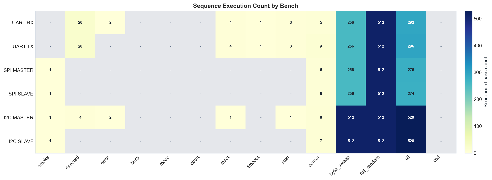

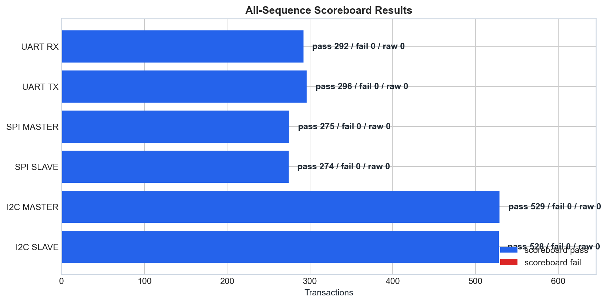

## 9. Vivado/XSim 실행 및 산출물 구조

현재 통신 모듈 flow는 Makefile이 아니라 `files.f`와 `xsim_args_*.f` 중심이다. Basic 폴더에는 legacy Makefile이 남아 있으나, 본 보고서 증적은 XSim log/CSV/report 기준으로 정리했다.

| 단계 | 설명 | 예시 |
| --- | --- | --- |
| Compile | `files.f`로 interface, package, top TB, RTL compile 순서 관리 | `xvlog -sv -L uvm -i . -i ./src -f files.f` |
| Elaborate | UVM library와 top TB를 연결해 snapshot 생성 | `xelab -L uvm ... -snapshot tb_uart_rx_snap` |
| Scenario run | `xsim_args_*.f`로 plusarg, log, snapshot 지정 | `xsim -f xsim_args_all.f` |
| Coverage report | XSim coverage DB를 text report로 변환 | `xcrg ... -report_format text` |
| Visualization | CSV/PNG/SVG dashboard 생성 | `scripts/uvm_result_visualize.py`, `basic/scripts/basic_result_visualize.py` |

| 자료 | 원본 위치 |
| --- | --- |
| Basic summary CSV | `basic/reports/basic_run_summary.csv`, `basic/reports/basic_all_summary.csv` |
| Basic graphs | `basic/reports/basic_pass_matrix.png`, `basic_sequence_counts.png`; coverage 수치는 `basic_run_summary.csv`와 XCRG text report 기준 |
| Comm summary CSV | `reports/uvm_results/uvm_run_summary.csv`, `uvm_all_summary.csv`, `uvm_coverage_summary.csv` |
| Comm coverpoint CSV | `reports/uvm_results/uvm_coverpoint_coverage.csv` |
| Comm graphs | `reports/uvm_results/uvm_dashboard.png`, `uvm_status_matrix.png`, `uvm_sequence_counts.png`, `uvm_scoreboard_bars.png`; coverage 세부 근거는 CSV/XCRG text report 기준 |
| 최종 보고서 asset copy | `reports/final_report/assets/*.png` |

주요 DUT별 최신 `all` log와 coverage report 위치는 다음과 같다.

| DUT | all log | coverage text report |
| --- | --- | --- |
| ADDER | `basic/adder/tb/xsim_all.log` | `basic/adder/tb/xsim_coverage_report/functionalCoverageReport/xcrg_func_cov_report.txt` |
| FIFO | `basic/fifo/tb/xsim_all.log` | `basic/fifo/tb/xsim_coverage_report/functionalCoverageReport/xcrg_func_cov_report.txt` |
| RAM | `basic/ram/tb/xsim_all.log` | `basic/ram/tb/xsim_coverage_report/functionalCoverageReport/xcrg_func_cov_report.txt` |
| UART RX | `TB/UART/RX/xsim_all.log` | `TB/UART/RX/xsim_coverage_report/functionalCoverageReport/xcrg_func_cov_report.txt` |
| UART TX | `TB/UART/TX/xsim_all.log` | `TB/UART/TX/xsim_coverage_report/functionalCoverageReport/xcrg_func_cov_report.txt` |
| SPI MASTER | `TB/SPI/MASTER/xsim_all.log` | `TB/SPI/MASTER/xsim_coverage_report/functionalCoverageReport/xcrg_func_cov_report.txt` |
| SPI SLAVE | `TB/SPI/SLAVE/xsim_all.log` | `TB/SPI/SLAVE/xsim_coverage_report/functionalCoverageReport/xcrg_func_cov_report.txt` |
| I2C MASTER | `TB/I2C/MASTER/xsim_all.log` | `TB/I2C/MASTER/xsim_coverage_report/functionalCoverageReport/xcrg_func_cov_report.txt` |
| I2C SLAVE | `TB/I2C/SLAVE/xsim_all.log` | `TB/I2C/SLAVE/xsim_coverage_report/functionalCoverageReport/xcrg_func_cov_report.txt` |

본 보고서에 삽입된 새 다이어그램은 `diagram-draw` 스킬의 style3 UVM 문서 스타일을 기준으로 생성한 PNG이다. SVG, Mermaid, Graphviz 출력이 아니라 최종 PNG 산출물이며, 파일명은 `reports/final_report/assets/style3_*.png` 형식이다.

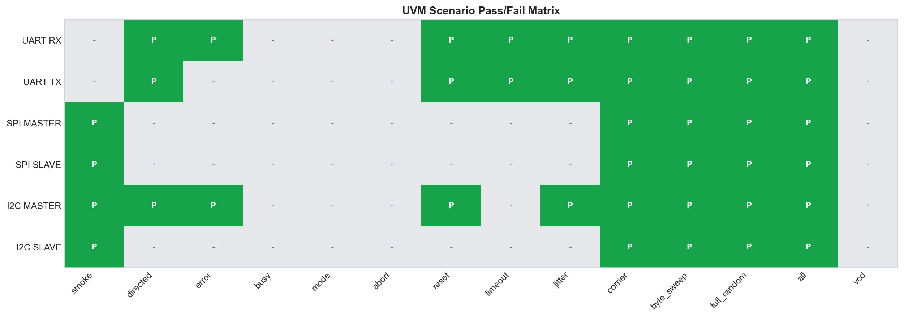

## 10. 코드 리뷰 점수

| DUT | 점수 | 잘 된 점 | 부족한 점 | 개선 방향 |
| --- | ---: | --- | --- | --- |
| ADDER | 8.0/10 | 구조가 단순하고 scoreboard/coverage가 명확함 | SVA 없음, 32-bit high-bit/carry corner가 제한적 | carry/overflow directed와 assertion 추가 |
| FIFO | 7.5/10 | queue reference model과 full/empty/count check가 적절함 | driven/check 차이가 세부 counter로 분리되지 않음 | write/read/blocked/idle counter 분리 |
| RAM | 8.0/10 | reference memory와 SVA가 포함됨 | random item 중 CS-off/idle 의미가 summary에서 약함 | transaction type별 coverage/summary 추가 |
| UART RX | 8.5/10 | DUT output과 serial decode를 모두 확인함 | standalone smoke matrix가 비어 있어 추적성이 약함 | smoke log 재생성, baud/tick negative 확대 |
| UART TX | 8.5/10 | stop bit, done, no-event window 검증이 명확함 | busy/timeout corner가 더 세분화될 수 있음 | back-to-back start와 busy-window timing 확대 |
| SPI MASTER | 8.3/10 | CPOL/CPHA mode cross와 MOSI/MISO check가 좋음 | directed/mode standalone log가 matrix에 없음 | mode별 독립 regression args 추가 |
| SPI SLAVE | 8.2/10 | CS abort와 MISO release assertion 포함 | 과거 backup 실패 log가 남아 혼동 가능 | 최신 PASS log archive 분리, abort timing 확대 |
| I2C MASTER | 8.4/10 | ACK error, read/write, reset/jitter check가 안정적 | address coverage가 0x42 중심 | multi-address, repeated-start, arbitration-like corner 추가 |
| I2C SLAVE | 8.3/10 | address hit/miss와 read/write data check 포함 | full_random은 addr hit 위주 | miss/random 비율 확대, partial-stop scenario 강화 |

## 11. 최종 결론

현재 완료된 것은 9개 DUT의 UVM bench 정리, Vivado/XSim 실행, scenario별 PASS 확인, scoreboard fail=0 확인, functional coverage 100% 확인, CSV/PNG dashboard 생성이다. 특히 byte_sweep과 full_random이 추가되어 단순 smoke 수준을 넘어 8-bit payload 전체 범위와 random stimulus를 포함한다.

아직 보완하면 좋은 점은 명확하다. 첫째, assertion 결과를 scoreboard/coverage처럼 별도 CSV로 파싱해야 한다. 둘째, 일부 scenario가 `all` 내부에서만 확인되어 standalone log 추적성이 약하다. 셋째, protocol-specific corner가 더 필요하다. 예를 들어 UART back-to-back/busy timing, SPI mode별 독립 regression, I2C multi-address/repeated-start/partial-stop이 다음 개선 대상이다.

다음 작업 우선순위는 다음과 같다.

1. assertion summary 자동 파싱 및 보고서 표 추가
2. standalone smoke/directed/mode/abort scenario log 보강
3. UART/SPI/I2C protocol corner 확대
4. backup 실패 로그와 최신 PASS 로그 분리 보관
5. coverage model을 요구사항 기반 coverage plan 형태로 문서화
