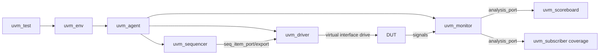
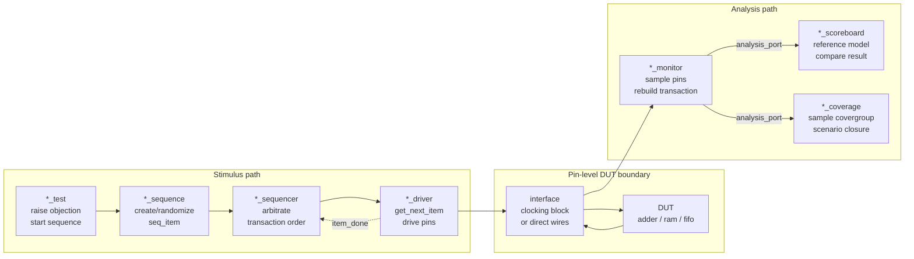
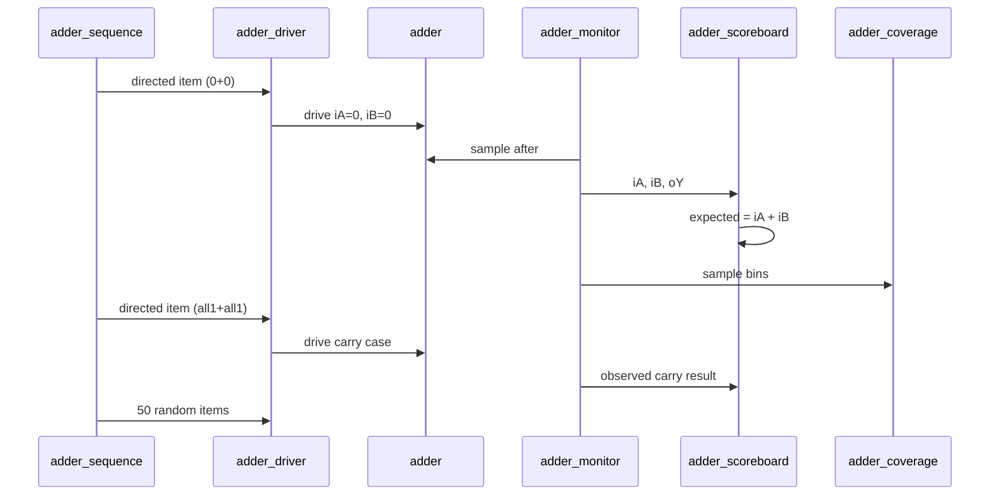
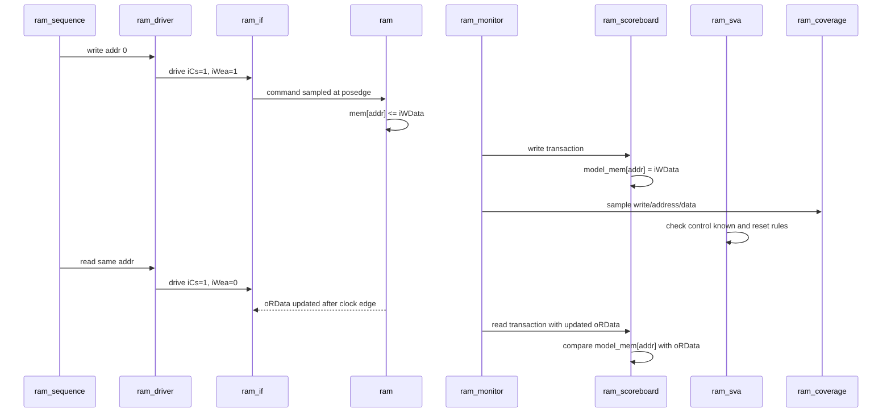
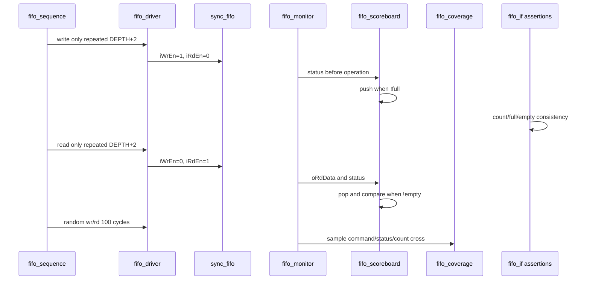

# Basic RTL/UVM 검증 보고서

## 1. 프로젝트 개요

본 프로젝트는 디지털 설계의 기본 블록인 `Adder`, `RAM`, `FIFO`를 SystemVerilog RTL로 구현하고, 각 블록을 UVM 기반 self-checking testbench로 검증한 포트폴리오용 실습 프로젝트이다. 단순히 파형을 보고 수동 확인하는 방식이 아니라, sequence가 stimulus를 만들고, driver가 DUT에 구동하며, monitor가 transaction을 수집하고, scoreboard와 coverage가 결과를 자동 검증하는 구조로 작성했다.

검증 대상은 다음 세 가지이다.

| 구분 | DUT | 주요 검증 목표 |
| --- | --- | --- |
| Adder | `adder/rtl/adder.sv` | 조합 덧셈 결과와 carry bit 검증 |
| RAM | `ram/rtl/ram.sv` | synchronous write/read, reset, chip-select 동작 검증 |
| FIFO | `fifo/rtl/sync_fifo.sv` | write/read, full/empty/count, overflow/underflow 방지 검증 |

## 2. 전체 검증 아키텍처

세 testbench 모두 같은 UVM 골격을 사용한다. 차이는 transaction 필드, DUT timing, scoreboard reference model, coverage bin이다.



공통 class 역할은 다음과 같다.

| Class | 역할 | 본 프로젝트에서의 의미 |
| --- | --- | --- |
| `*_seq_item` | transaction 데이터 모델 | DUT 입력과 관측 출력을 하나의 객체로 묶음 |
| `*_sequence` | stimulus 생성 | directed scenario와 random scenario 생성 |
| `*_sequencer` | sequence와 driver 중재 | driver에 transaction을 순서대로 전달 |
| `*_driver` | pin-level 구동 | virtual interface를 통해 DUT 입력 신호 구동 |
| `*_monitor` | pin-level 관측 | DUT 입출력을 transaction으로 복원 |
| `*_scoreboard` | 자동 결과 비교 | reference model과 DUT 결과 비교 |
| `*_coverage` | functional coverage | command, data, status corner case 수집 |
| `*_agent` | sequencer/driver/monitor 묶음 | active agent 구조 |
| `*_env` | agent/scoreboard/coverage 연결 | analysis path 구성 |
| `*_test` | top-level scenario 실행 | sequence 시작과 objection 제어 |

공통 transaction 흐름은 아래처럼 transaction lifecycle 관점으로 보는 편이 더 명확하다. 왼쪽은 stimulus 생성 경로이고, 오른쪽은 DUT 관측 이후 검증/coverage로 갈라지는 analysis 경로이다.



## 3. Adder 검증

### 3.1 DUT 동작

`adder.sv`는 `DATA_WIDTH` parameter를 갖는 조합 논리 덧셈기이다.

| Signal | 방향 | 설명 |
| --- | --- | --- |
| `iA` | input | 첫 번째 피연산자 |
| `iB` | input | 두 번째 피연산자 |
| `oY` | output | `DATA_WIDTH+1` bit 결과, MSB는 carry |

핵심 동작은 다음 한 줄이다.

```systemverilog
assign oY = iA + iB;
```

출력 폭이 `DATA_WIDTH:0`이므로 `32'hFFFF_FFFF + 32'hFFFF_FFFF` 같은 overflow case에서도 carry bit를 관측할 수 있다.

### 3.2 Adder UVM class 역할

| 파일 | Class | 역할 |
| --- | --- | --- |
| `adder_seq_item.sv` | `adder_seq_item` | `iA`, `iB`, `oY`를 transaction으로 정의 |
| `adder_sequence.sv` | `adder_sequence` | zero/max/carry directed case와 random 50개 생성 |
| `adder_driver.sv` | `adder_driver` | `iA`, `iB`를 interface에 즉시 구동 |
| `adder_monitor.sv` | `adder_monitor` | `#1` delay 후 `iA`, `iB`, `oY`를 샘플링 |
| `adder_scoreboard.sv` | `adder_scoreboard` | `expected = iA + iB` 계산 후 `oY`와 비교 |
| `adder_coverage.sv` | `adder_coverage` | 입력 zero/max/misc, carry 발생 여부 coverage |
| `adder_agent.sv` | `adder_agent` | sequencer, driver, monitor 생성 및 연결 |
| `adder_env.sv` | `adder_env` | monitor output을 scoreboard와 coverage에 broadcast |
| `adder_test.sv` | `adder_test` | `adder_sequence`를 시작하고 simulation objection 관리 |

### 3.3 Adder 타이밍

Adder는 clock이 없는 조합 회로이므로 driver가 입력을 바꾸면 delta cycle 이후 출력이 결정된다. testbench에서는 driver와 monitor가 모두 `#1` delay를 사용해 조합 출력이 안정화된 뒤 transaction을 수집한다.

```text
time       T        T+delta       T+1
driver     iA/iB drive
DUT                 oY = iA+iB
monitor                            sample iA/iB/oY
scoreboard                         compare expected vs actual
```

이 구조는 조합 회로 검증에 적합하다. clocking block은 없지만, monitor가 입력 구동 직후가 아니라 `#1` 뒤에 샘플링하므로 output settle time을 확보한다.

### 3.4 Adder sequence diagram



### 3.5 Adder 검증 시나리오

| Scenario | 목적 | 기대 결과 |
| --- | --- | --- |
| `0 + 0` | reset 없는 조합 기본값 확인 | `oY == 0` |
| `all1 + 0` | max operand pass-through 확인 | `oY == all1` |
| `all1 + all1` | carry 발생 확인 | `oY[DATA_WIDTH] == 1` |
| random 50회 | 일반 입력 조합 검증 | 모든 case에서 `oY == iA+iB` |

### 3.6 Adder scoreboard와 coverage

Scoreboard는 별도 상태 모델이 필요 없다. transaction마다 `logic [DATA_WIDTH:0] expected`를 만들고 DUT 출력과 즉시 비교한다.

Coverage 항목은 다음과 같다.

| Coverpoint | Bin | 의미 |
| --- | --- | --- |
| `cp_iA` | `zero`, `max`, `misc` | A 입력 corner/random 분포 |
| `cp_iB` | `zero`, `max`, `misc` | B 입력 corner/random 분포 |
| `cp_carry` | `no_carry`, `carry` | overflow/carry 발생 여부 |
| `cross_iA_iB` | cross | A/B corner 조합 확인 |

Adder 검증의 포인트는 조합식 자체는 단순하지만 출력 폭이 `DATA_WIDTH+1`이라는 점이다. 따라서 carry bit가 빠지거나 truncation되는 실수를 scoreboard와 coverage가 잡을 수 있다.

## 4. RAM 검증

### 4.1 DUT 동작

`ram.sv`는 active-low reset을 갖는 synchronous single-port RAM이다.

| Signal | 방향 | 설명 |
| --- | --- | --- |
| `iClk` | input | synchronous write/read 기준 clock |
| `iRstn` | input | active-low reset |
| `iCs` | input | chip-select, 1일 때만 접근 |
| `iWea` | input | write enable, 1이면 write, 0이면 read |
| `iAddr` | input | RAM address |
| `iWData` | input | write data |
| `oRData` | output | registered read data |

동작 규칙은 다음과 같다.

| 조건 | 동작 |
| --- | --- |
| `iRstn == 0` | `oRData`와 전체 memory를 0으로 초기화 |
| `iCs == 0` | memory와 `oRData` 유지 |
| `iCs == 1 && iWea == 1` | `mem[iAddr] <= iWData` |
| `iCs == 1 && iWea == 0` | `oRData <= mem[iAddr]` |

### 4.2 RAM UVM class 역할

| 파일 | Class | 역할 |
| --- | --- | --- |
| `ram_seq_item.sv` | `ram_seq_item` | `iCs`, `iWea`, `iAddr`, `iWData`, `oRData` transaction 정의 |
| `ram_sequence.sv` | `ram_sequence` | 전체 address write/read directed sweep 후 random 100회 |
| `ram_driver.sv` | `ram_driver` | clocking block으로 한 cycle 동안 RAM command 구동 |
| `ram_monitor.sv` | `ram_monitor` | active transaction만 수집, read data는 NBA 이후 샘플 |
| `ram_scoreboard.sv` | `ram_scoreboard` | `model_mem[DEPTH]` reference memory 유지 |
| `ram_coverage.sv` | `ram_coverage` | read/write, first/last address, data corner coverage |
| `ram_if.sv` | `ram_if` | clocking block과 interface-level SVA 포함 |
| `ram_sva.sv` | `ram_sva` | RAM protocol/data behavior assertion |
| `ram_agent.sv` | `ram_agent` | sequencer, driver, monitor 구성 |
| `ram_env.sv` | `ram_env` | monitor transaction을 scoreboard/coverage로 연결 |
| `ram_test.sv` | `ram_test` | `ram_sequence` 실행 |

### 4.3 RAM clocking/timing

RAM testbench는 interface clocking block을 사용한다.

```systemverilog
clocking drv_cb @(posedge iClk);
  default input #1step output #1;
endclocking

clocking mon_cb @(posedge iClk);
  default input #1step output #1;
endclocking
```

중요한 의미는 다음과 같다.

| 항목 | 의미 |
| --- | --- |
| driver output `#1` | posedge 이후 1 time unit에 command를 구동 |
| DUT sample | 다음 posedge에서 driver가 유지한 command를 샘플 |
| monitor input `#1step` | posedge 직전 값을 샘플해 DUT가 본 command와 같은 값을 관측 |
| RAM read data | posedge 이후 NBA로 갱신되므로 monitor가 read transaction에서 `#1` 뒤 `oRData`를 재샘플 |

RAM write timing은 다음과 같다.

```text
posedge N       N+1                 posedge N+1
driver          iCs/iWea/iAddr/iWData drive
DUT                                  mem[iAddr] <= iWData
monitor                              sample command before edge
scoreboard                           model_mem[iAddr] = iWData
```

RAM read timing은 다음과 같다.

```text
posedge N       N+1                 posedge N+1        N+1 + #1
driver          iCs=1, iWea=0 drive
DUT                                  oRData <= mem[iAddr]
monitor                              sample read command
monitor                                                sample updated oRData
scoreboard                                             compare model_mem vs oRData
```

이 타이밍 처리를 하지 않으면 monitor가 synchronous read의 이전 `oRData`를 scoreboard에 넘길 수 있다. 그래서 `ram_monitor.sv`에서는 read transaction일 때 `#1` 뒤 실제 `ram_vif.oRData`를 샘플하도록 보강했다.

### 4.4 RAM sequence diagram



### 4.5 RAM 검증 시나리오

| Scenario | 목적 | 기대 결과 |
| --- | --- | --- |
| reset | memory와 read data 초기화 | `oRData == 0`, model memory 초기값 0 |
| full address write/read sweep | 모든 address 접근 가능성 확인 | write 후 read data가 동일 |
| first address | address decode lower boundary | address 0 정상 write/read |
| last address | address decode upper boundary | address `DEPTH-1` 정상 write/read |
| random access 100회 | chip-select, read/write random 조합 검증 | scoreboard model과 항상 일치 |
| idle cycle | `iCs == 0` 유지 동작 확인 | `oRData` stable, memory 변경 없음 |

### 4.6 RAM scoreboard

RAM scoreboard는 DUT와 같은 depth의 reference memory를 갖는다.

```text
write transaction:
  model_mem[item.iAddr] = item.iWData

read transaction:
  expected = model_mem[item.iAddr]
  compare expected with item.oRData
```

`iCs == 0` transaction은 monitor에서 제외한다. 따라서 scoreboard는 실제 RAM access만 모델링한다.

### 4.7 RAM coverage

| Coverpoint | Bin | 검증 의도 |
| --- | --- | --- |
| `cp_cmd` | `write`, `read` | write/read 명령 모두 발생했는지 확인 |
| `cp_addr` | `first`, `last`, `misc` | boundary address와 일반 address 확인 |
| `cp_wdata` | `zero`, `ones`, `misc` | write data corner case |
| `cp_rdata` | `zero`, `ones`, `misc` | read data corner case |
| `cross_cmd_addr` | command x address | 각 address 영역에서 read/write가 모두 나왔는지 확인 |

### 4.8 RAM SVA

RAM에는 interface-level assertion과 module-level assertion을 함께 둔다.

| Assertion | 위치 | 의미 |
| --- | --- | --- |
| `p_no_unknown_ctrl_when_selected` | `ram_if_sva.svh` | `iCs`가 1일 때 `iWea`, `iAddr`가 X/Z가 아니어야 함 |
| `p_no_unknown_write_data_on_write` | `ram_if_sva.svh` | write transaction에서 `iWData`가 known이어야 함 |
| `p_ctrl_low_during_reset` | `ram_if_sva.svh` | reset 중 command가 idle이어야 함 |
| `p_addr_stable_while_selected` | `ram_if_sva.svh` | 연속 active transaction 동안 address 안정성 확인 |
| `p_idle_holds_read_data` | `ram_sva.sv` | `iCs == 0`일 때 `oRData` 유지 |
| `p_write_then_next_read_same_addr` | `ram_sva.sv` | write 후 같은 address read 시 data 일치 |

SVA는 scoreboard와 역할이 다르다. scoreboard는 transaction 단위 기능 정합성을 보고, SVA는 pin-level protocol 위반과 timing rule 위반을 빠르게 잡는다.

## 5. FIFO 검증

### 5.1 DUT 동작

`sync_fifo.sv`는 synchronous FIFO이다. 내부에는 memory, write pointer, read pointer, count가 있다.

| Signal | 방향 | 설명 |
| --- | --- | --- |
| `iClk` | input | synchronous 동작 clock |
| `iRstn` | input | active-low reset |
| `iWrEn` | input | write request |
| `iRdEn` | input | read request |
| `iWrData` | input | write data |
| `oRdData` | output | 현재 read pointer가 가리키는 data |
| `oFull` | output | `oCount == DEPTH` |
| `oEmpty` | output | `oCount == 0` |
| `oCount` | output | FIFO에 저장된 item 수 |

동작 case는 다음과 같다.

| Effective command | 조건 | 동작 |
| --- | --- | --- |
| write only | `iWrEn && !oFull`, read fire 없음 | memory write, `wr_ptr++`, `oCount++` |
| read only | `iRdEn && !oEmpty`, write fire 없음 | `rd_ptr++`, `oCount--` |
| write and read | 둘 다 fire | memory write, `wr_ptr++`, `rd_ptr++`, count 유지 |
| idle/blocked | full write 또는 empty read 등 | 상태 유지 |

### 5.2 FIFO UVM class 역할

| 파일 | Class | 역할 |
| --- | --- | --- |
| `fifo_seq_item.sv` | `fifo_seq_item` | `iWrEn`, `iRdEn`, `iWrData`, `oRdData`, status transaction 정의 |
| `fifo_sequence.sv` | `fifo_sequence` | fill, drain, random 100회 scenario 생성 |
| `fifo_driver.sv` | `fifo_driver` | clocking block으로 1-cycle command 구동 |
| `fifo_monitor.sv` | `fifo_monitor` | 매 clock FIFO command/status/data 수집 |
| `fifo_scoreboard.sv` | `fifo_scoreboard` | queue model로 read data/count/full/empty 비교 |
| `fifo_coverage.sv` | `fifo_coverage` | command, full, empty, count, cross coverage |
| `fifo_if.sv` | `fifo_if` | clocking block과 FIFO status assertion 포함 |
| `fifo_agent.sv` | `fifo_agent` | sequencer, driver, monitor 구성 |
| `fifo_env.sv` | `fifo_env` | monitor transaction을 scoreboard/coverage로 연결 |
| `fifo_test.sv` | `fifo_test` | `fifo_sequence` 실행 |

### 5.3 FIFO clocking/timing

FIFO도 RAM과 같이 clocking block을 사용한다.

| 단계 | 설명 |
| --- | --- |
| driver | posedge 이후 command를 구동하고 다음 posedge까지 유지 |
| DUT | posedge에서 `iWrEn`, `iRdEn`, `iWrData` 샘플 |
| monitor | posedge 직전 command/status/data를 샘플 |
| scoreboard | 샘플된 pre-state status 기준으로 fire 여부 계산 |

FIFO의 `oRdData`는 `assign oRdData = mem[rd_ptr]`로 구현되어 있다. read가 fire되는 clock edge 직전에는 `rd_ptr`가 아직 증가하기 전이므로 `oRdData`는 pop될 front data를 가리킨다. 따라서 monitor가 edge 직전 sampled data를 scoreboard에 전달하는 구조가 FIFO read 검증에 맞다.

```text
posedge N       N+1                 posedge N+1
driver          iRdEn=1 drive
oRdData                              mem[old rd_ptr] visible before edge
monitor                              sample oRdData and status before edge
DUT                                  rd_ptr <= next, count--
scoreboard                           pop expected and compare sampled oRdData
```

### 5.4 FIFO sequence diagram



### 5.5 FIFO 검증 시나리오

| Scenario | 목적 | 기대 결과 |
| --- | --- | --- |
| reset | pointer/count/memory 초기화 | `oCount == 0`, `oEmpty == 1`, `oFull == 0` |
| fill to full | write 반복으로 full 도달 | count 증가, full 상태 도달 |
| write while full | overflow 방지 | full 상태에서 추가 write 무시 |
| drain to empty | read 반복으로 empty 도달 | read order 유지, count 감소 |
| read while empty | underflow 방지 | empty 상태에서 추가 read 무시 |
| simultaneous write/read | throughput 동작 확인 | count 유지, push/pop 동시 수행 |
| random wr/rd 100회 | 일반 traffic 검증 | queue model과 DUT 상태 일치 |

### 5.6 FIFO scoreboard

FIFO scoreboard는 SystemVerilog queue를 reference model로 사용한다.

```text
pre-state check:
  exp_count = model_q.size()
  exp_full  = exp_count == DEPTH
  exp_empty = exp_count == 0

fire decision:
  wr_fire = item.iWrEn && !item.oFull
  rd_fire = item.iRdEn && !item.oEmpty

read:
  expected = model_q.pop_front()
  compare expected with item.oRdData

write:
  model_q.push_back(item.iWrData)
```

중요한 점은 scoreboard가 DUT status인 `oFull`, `oEmpty`를 이용해 실제 fire 여부를 계산한다는 것이다. full 상태 write, empty 상태 read처럼 request는 들어왔지만 DUT가 막아야 하는 case를 명확히 모델링한다.

### 5.7 FIFO coverage

| Coverpoint | Bin | 검증 의도 |
| --- | --- | --- |
| `cp_cmd` | `idle`, `write`, `read`, `wr_rd` | 모든 command 조합 발생 확인 |
| `cp_full` | `not_full`, `full` | full 상태 도달 확인 |
| `cp_empty` | `not_empty`, `empty` | empty 상태 도달 확인 |
| `cp_count` | `zero`, `mid`, `full` | occupancy 변화 확인 |
| `cross_cmd_status` | command x count state | empty/mid/full 상태에서 command가 어떻게 들어오는지 확인 |

### 5.8 FIFO SVA

FIFO interface에는 status consistency assertion이 들어 있다.

| Assertion | 의미 |
| --- | --- |
| `p_count_empty_match` | `oCount == 0`이면 `oEmpty == 1`이어야 함 |
| `p_count_full_match` | `oCount == DEPTH`이면 `oFull == 1`이어야 함 |
| `p_no_unknown_cmd` | reset 해제 후 `iWrEn`, `iRdEn`에 X/Z가 없어야 함 |

FIFO의 핵심 위험은 pointer와 count 불일치이다. 위 assertion과 scoreboard의 queue model을 함께 사용해 status와 data ordering을 모두 확인한다.

## 6. 실행 방법

`basic` 디렉터리의 루트 Makefile에서 실행한다.

```sh
make run BLOCK=adder
make run BLOCK=ram
make run BLOCK=fifo
```

자주 쓰는 단축 target은 다음과 같다.

```sh
make adder          # adder compile + simulation
make ram            # ram compile + simulation
make fifo           # fifo compile + simulation
make run-all        # adder, ram, fifo 전체 실행
make clean-all      # 전체 시뮬레이션 산출물 삭제
make wave BLOCK=adder
make coverage BLOCK=adder
make verdi BLOCK=adder
make verdi_cov BLOCK=adder
make verdi_all BLOCK=adder
make urg BLOCK=adder
```

Makefile은 `BLOCK` 변수로 검증 대상을 선택하고, `adder`, `ram`, `fifo` 중 하나를 하위 `tb/Makefile`에 전달한다. 따라서 루트에서 실행해도 되고, 각 블록의 `tb` 디렉터리에서 직접 같은 target을 실행해도 된다.

```sh
cd basic
make run BLOCK=ram

cd ram/tb
make run
```

### 6.1 VCS 사용법

사용 환경은 VCS/UVM 1.2 기준이다. 각 `tb/Makefile`의 주요 설정은 다음과 같다.

| Makefile 변수 | 기본값 | 의미 |
| --- | --- | --- |
| `VCS` | `vcs` | VCS compile/elaboration 실행 파일 |
| `VLOGAN` | `vlogan` | syntax/lint 목적의 SystemVerilog compile 실행 파일 |
| `SIMV` | `./simv` | VCS가 생성한 simulation 실행 파일 |
| `UVM_HOME` | `/tools/synopsys/vcs/W-2024.09-SP1/etc/uvm-1.2` | Synopsys VCS에 포함된 UVM 1.2 경로 |
| `UVM_OPTS` | `-ntb_opts uvm-1.2` | VCS UVM 1.2 compile option |
| `COV_METRICS` | `line+cond+fsm+tgl+branch+assert` | 수집할 coverage metric |
| `COV_DIR` | `simv.vdb` | VCS coverage database 출력 디렉터리 |

VCS 관련 target 흐름은 다음과 같다.

| Target | 실행 내용 | 주요 산출물 |
| --- | --- | --- |
| `make lint BLOCK=<name>` | `vlogan`으로 syntax/compile check | `AN.DB` 등 compile DB |
| `make compile BLOCK=<name>` | `vcs -full64 -sverilog -ntb_opts uvm-1.2 -debug_access+all -kdb`로 compile | `simv`, `simv.daidir` |
| `make run BLOCK=<name>` | compile 후 `./simv -cm ... -cm_dir simv.vdb` 실행 | `novas.fsdb`, `simv.vdb`, simulation log |
| `make coverage BLOCK=<name>` | simulation 후 `urg -dir simv.vdb -report urgReport` 실행 | `urgReport/` |
| `make urg BLOCK=<name>` | 기존 `simv.vdb`에서 URG report만 재생성 | `urgReport/` |

기본 확인 순서는 아래처럼 잡으면 된다.

```sh
cd basic
make clean-block BLOCK=adder
make lint BLOCK=adder
make run BLOCK=adder
make coverage BLOCK=adder
```

`make run`이 성공하면 terminal log에서 `UVM_ERROR : 0`, `UVM_FATAL : 0`을 확인하고, `adder/tb/novas.fsdb`와 `adder/tb/simv.vdb`가 생성되었는지 본다. coverage HTML은 `adder/tb/urgReport/dashboard.html`에서 확인한다.

### 6.2 Verdi 사용법

Verdi는 VCS compile 때 생성한 `simv.daidir` design database와 simulation 중 생성된 `novas.fsdb` waveform을 함께 열도록 Makefile에 연결되어 있다.

| Target | 실행 내용 | 사용 상황 |
| --- | --- | --- |
| `make wave BLOCK=<name>` | `make run` 후 `verdi -full64 -dbdir simv.daidir -ssf novas.fsdb -top <tb_top>` 실행 | simulation 직후 waveform 확인 |
| `make verdi BLOCK=<name>` | `wave`와 동일한 alias | Verdi waveform view를 바로 열 때 |
| `make verdi_cov BLOCK=<name>` | coverage 생성 후 `verdi -full64 -cov -covdir simv.vdb` 실행 | coverage GUI만 볼 때 |
| `make verdi_all BLOCK=<name>` | waveform DB와 coverage DB를 함께 열기 | waveform과 coverage를 같이 추적할 때 |

예시는 다음과 같다.

```sh
cd basic
make verdi BLOCK=adder
make verdi_cov BLOCK=ram
make verdi_all BLOCK=fifo
```

Verdi에서 주로 확인할 signal은 블록별로 다르다.

| BLOCK | Top | 파형 확인 포인트 |
| --- | --- | --- |
| `adder` | `tb_adder` | `iA`, `iB`, `oY`, carry bit |
| `ram` | `tb_ram` | `iClk`, `iRstn`, `iCs`, `iWea`, `iAddr`, `iWData`, `oRData` |
| `fifo` | `tb_fifo` | `iWrEn`, `iRdEn`, `iWData`, `oRData`, `oCount`, `oFull`, `oEmpty` |

GUI가 열리지 않을 때는 먼저 license와 display 환경을 확인한다.

```sh
which vcs
which verdi
echo "$DISPLAY"
echo "$SNPSLMD_LICENSE_FILE"
echo "$LM_LICENSE_FILE"
lmutil lmstat -a -c "$SNPSLMD_LICENSE_FILE" | grep -E "Verdi|Apex|Elite|VCS"
```

| 항목 | 상태 |
| --- | --- |
| Makefile dry-run | adder/ram/fifo 모두 명령 경로 확인 |
| 실제 VCS compile/run | adder/ram/fifo compile/run 및 functional coverage 100% 확인 |
| 산출물 관리 | `.gitignore`로 `simv`, `csrc`, `*.vdb`, `*.fsdb`, log 제외 |

라이선스가 정상화되면 위 `make run BLOCK=<adder|ram|fifo>`으로 compile, simulation, scoreboard/coverage log를 확인할 수 있다. 파형 캡처는 `make wave BLOCK=<adder|ram|fifo>`로 `simv.daidir` design DB와 `novas.fsdb`를 Verdi에서 함께 열어 주요 DUT/interface signal을 추가한 뒤 저장하고, coverage는 `make coverage BLOCK=<adder|ram|fifo>`로 생성되는 `urgReport` HTML을 확인한다.

실제 tool 실행 시도 로그와 환경 진단은 `docs/tool_evidence_ko.md` 및 `docs/tool_runs/`에 정리했다.

## 7. 포트폴리오 어필 포인트

이 프로젝트는 단순 RTL 예제가 아니라 검증 관점에서 다음 역량을 보여준다.

- 조합 회로와 순차 회로의 timing 차이를 testbench에 반영했다.
- UVM component를 역할별로 분리해 재사용 가능한 구조로 작성했다.
- Adder는 즉시 비교형 scoreboard, RAM은 memory model, FIFO는 queue model을 사용해 DUT 특성에 맞는 reference model을 구성했다.
- RAM/FIFO에는 functional coverage와 SVA를 함께 넣어 scenario coverage와 protocol rule을 모두 점검했다.
- 시뮬레이션 산출물을 제외하고 RTL, TB, 문서 중심으로 정리해 GitHub 포트폴리오에 올리기 좋은 형태로 구성했다.
