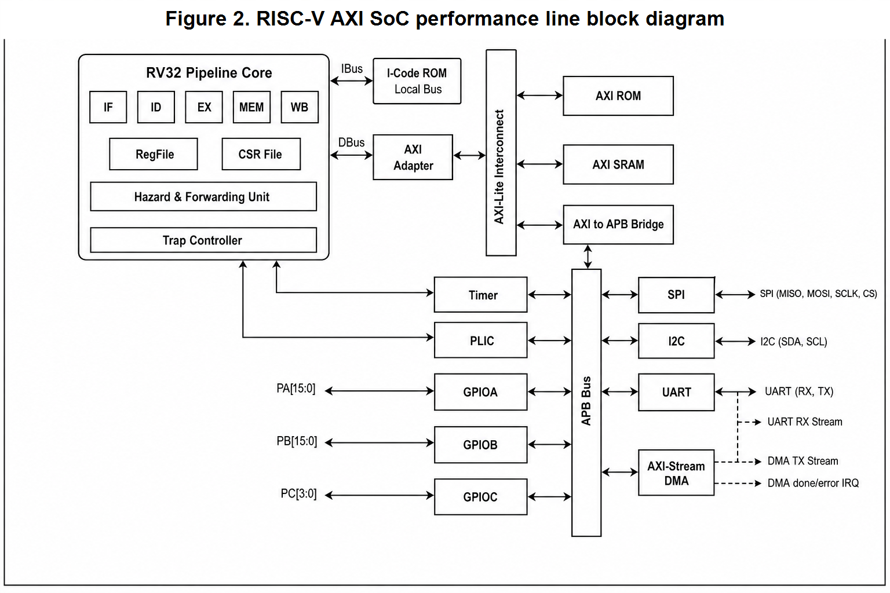
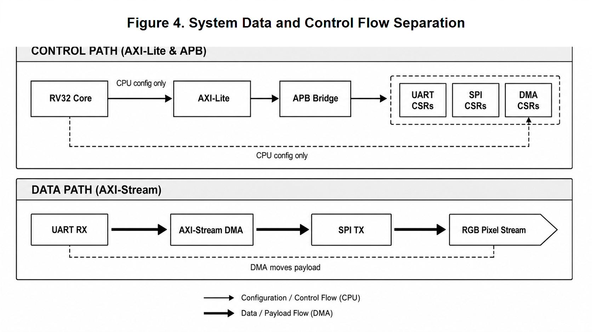
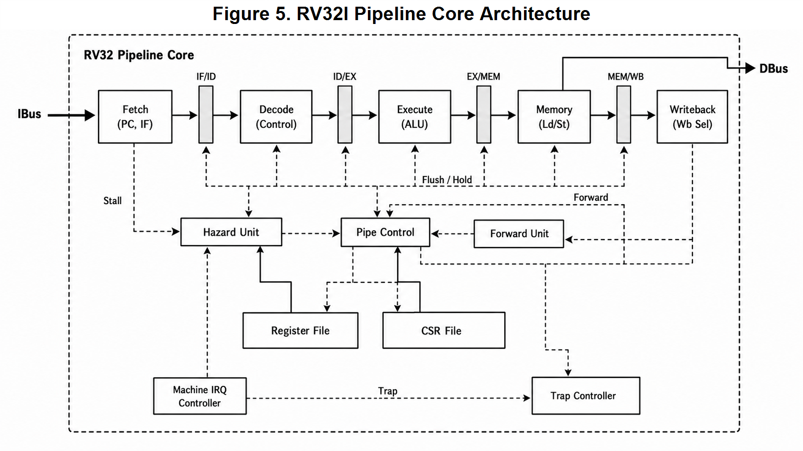
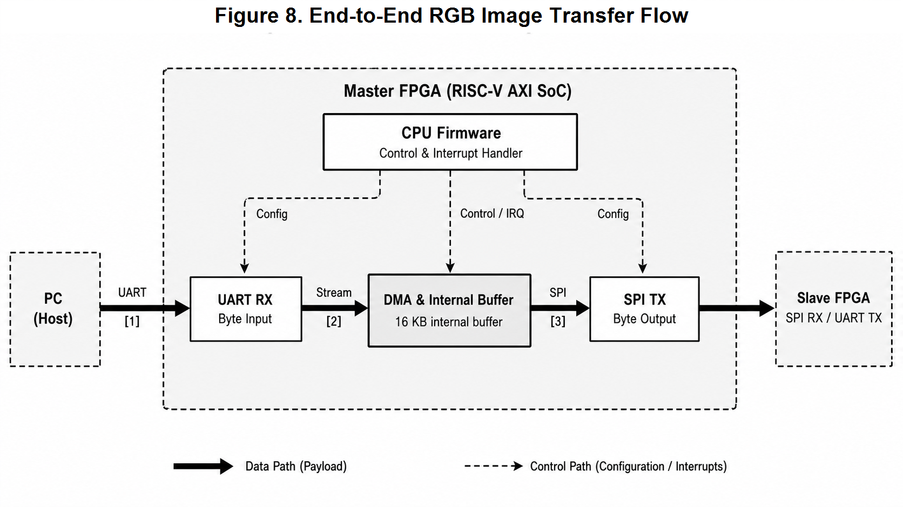
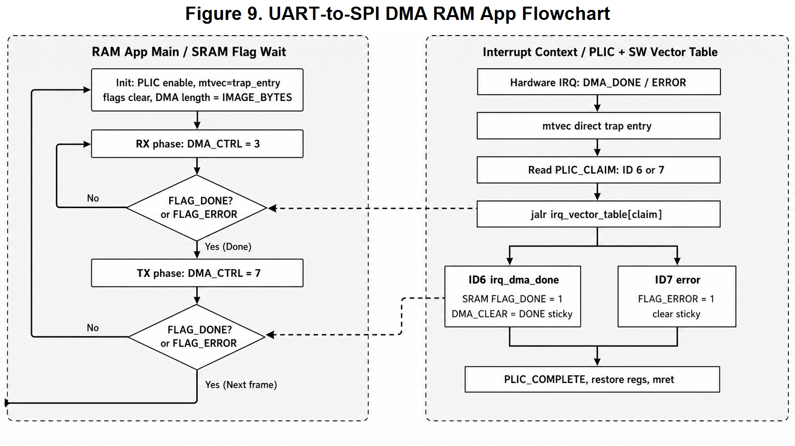

# Technical Details

이 문서는 `README.md`보다 한 단계 깊게, RISC-V AXI UART Bootloader MCU의 구조, 구현 의도, 검증 근거, 주요 코드 위치를 정리한 문서입니다.

## 1. 왜 AXI-Lite/APB/AXI-Stream으로 바꿨나

초기 목표는 STM32F103 같은 MCU 구조를 참고해, 직접 만든 RV32I core가 ROM과 peripheral을 제어하는 작은 SoC를 만드는 것이었습니다. 처음에는 AHB/APB 계열 구조를 참고했지만, RGB image byte stream을 다루면서 register access와 payload movement의 성격이 다르다는 점이 분명해졌습니다.

정리한 역할은 다음과 같습니다.

| 경로 | 역할 |
|---|---|
| IBus | ROM instruction fetch, SRAM instruction fetch |
| DBus | load/store 기반 memory-mapped access |
| AXI-Lite | CPU가 memory/peripheral window에 접근하는 control fabric |
| APB | UART/SPI/GPIO/I2C/Timer/PLIC/DMA register access |
| AXI-Stream | UART RX byte stream과 SPI TX byte stream 사이 payload movement |

핵심은 bus 이름을 바꾸는 것이 아니라, CPU가 담당할 control transaction과 DMA가 담당할 streaming data movement를 분리한 것입니다.

## 2. Top-Level Architecture



`SocTop`은 core, ROM, SRAM, AXI-Lite fabric, APB peripheral subsystem, stream DMA path를 통합하는 SoC 본체입니다.

```text
hw/rtl/soc/SocTop.sv
├── Rv32Core
├── IcodeLocalRom
├── AxiLiteInterconnect1x3
├── AxiLiteRom
├── AxiLiteSram
├── AxiLiteToApbBridge
└── APB peripheral subsystem
    ├── UART
    ├── SPI
    ├── GPIO
    ├── I2C
    ├── Timer
    ├── PLIC-lite
    └── AXI-Stream DMA
```



### Memory Map Concept

```text
0x00000000 : ROM boot / fixed firmware region
0x20000000 : SRAM base
0x20001000 : default RAM application load and entry address
0x20004000 : default stack top for RAM application
```

SRAM app을 `0x20001000`부터 배치한 이유는 SRAM 하위 영역을 debug scratch와 여유 공간으로 남기기 위해서입니다. C app이 SRAM base 근처에 상태값을 기록하더라도 instruction 영역을 덮지 않도록 분리했습니다.

## 3. RV32I Core And Interrupt Path



core는 RV32I pipeline 구조를 기반으로 하며, CSR file, trap controller, machine interrupt controller를 포함합니다. PLIC-lite는 DMA done/error와 같은 external event를 machine external interrupt로 전달하고, firmware는 trap entry에서 claim ID를 읽어 handler로 dispatch합니다.

중요한 정정 포인트는 PLIC이 handler 주소를 직접 주는 구조가 아니라는 점입니다. PLIC은 interrupt ID를 claim으로 제공하고, 실제 handler 선택은 software vector table 또는 C handler dispatch logic이 담당합니다.

주요 파일:

```text
hw/rtl/core/pipeline/Rv32Core.sv
hw/rtl/core/pipeline/CsrFile.sv
hw/rtl/core/pipeline/TrapController.sv
hw/rtl/core/pipeline/MachineInterruptController.sv
hw/rtl/bus/apb/ApbPlicLite.sv
sw/firmware_sources/startup_irq.S
sw/firmware_sources/ram_uart_dma_spi_rgb_irq_main.c
```

## 4. UART-to-SPI DMA Scenario



RGB transfer scenario는 아래 흐름으로 정리할 수 있습니다.

```text
PC
-> UART RX
-> AXI-Stream DMA internal 16 KB buffer
-> SPI TX
-> peer/slave board or return path
```

CPU는 payload byte를 직접 복사하지 않습니다. CPU firmware는 UART/SPI/DMA/PLIC register를 설정하고, DMA phase 완료는 PLIC interrupt 또는 status flag로 처리합니다. 이 구조는 CPU polling만으로 data를 옮기는 방식보다, control path와 data path의 책임이 분명합니다.

관련 RTL:

```text
hw/rtl/bus/apb/ApbAxiStreamDma.sv
hw/rtl/bus/apb/ApbUart.sv
hw/rtl/bus/apb/ApbSpi.sv
hw/rtl/stream/StreamFifo.sv
```

## 5. UART Bootloader And RAM Execution

가장 큰 개선점은 firmware 개발 루프입니다. 기존 ROM firmware 방식에서는 application을 바꿀 때마다 `.mem`을 다시 만들고 bitstream을 다시 생성해야 했습니다. 이 프로젝트에서는 ROM에는 UART loader만 고정하고, PC에서 빌드한 C application을 UART packet으로 SRAM에 다운로드한 뒤 SRAM entry로 jump합니다.



### Build And Download Flow

```text
C source
startup.S or startup_irq.S
linker_ram.ld
-> riscv64-unknown-elf-gcc
-> ELF
-> objcopy -O binary
-> BIN
-> RAXI loader packet
-> Python UART sender
-> ROM UART loader
-> SRAM write
-> jump to RAM app
```

### RAXI Packet Format

All integer fields are little-endian.

```text
magic       4 bytes  "RAXI"
load_addr   4 bytes
byte_count  4 bytes
entry_addr  4 bytes
checksum    4 bytes  additive byte checksum over payload
payload     N bytes  word-padded raw binary
```

주요 파일:

```text
sw/firmware_sources/uart_loader_main.c
sw/firmware_sources/ram_led_main.c
sw/firmware_sources/ram_uart_echo_main.c
sw/firmware_sources/ram_uart_dma_spi_rgb_poll_main.c
sw/firmware_sources/ram_uart_dma_spi_rgb_irq_main.c
sw/linker_scripts/linker_ram.ld
sw/build_scripts/build_ram_app.ps1
sw/build_scripts/download_ram_app.ps1
sw/loader_tools/make_loader_packet.py
sw/loader_tools/send_loader_packet.py
sw/loader_tools/loader_gui.py
```

## 6. Freestanding C Runtime

custom SoC에는 OS, libc, default startup이 없기 때문에 C runtime을 직접 구성했습니다.

```text
_start
-> initialize stack pointer
-> copy .data
-> clear .bss
-> set trap vector if needed
-> call main()
-> park loop
```

빌드 옵션의 핵심은 다음과 같습니다.

```text
-march=rv32i_zicsr
-mabi=ilp32
-nostdlib
-nostartfiles
-ffreestanding
-fno-builtin
-Wl,-T,sw/linker_scripts/linker_ram.ld
```

`rv32i_zicsr`는 `mtvec`, `mie`, `mstatus`, `mret` 같은 CSR/interrupt 흐름 때문에 필요합니다. `nostdlib`, `nostartfiles`, `ffreestanding`은 `_start`, stack, section initialization을 사용자가 직접 책임진다는 의미입니다.

## 7. Debug Note: APB Write And Redirect Timing

보드 bring-up 중 `RGB DMA IRQ C` app이 LED `0xA0D6`에서 멈추는 문제가 있었습니다. 이 값은 C interrupt handler가 DMA DONE interrupt ID 6을 처리하고 `PLIC_COMPLETE` write까지 수행한 뒤, assembly trap wrapper로 돌아오지 못했다는 의미였습니다.

의심 지점은 APB write가 bus wait 중인데 `ret`, `mret`, trap redirect 같은 PC redirect가 너무 이르게 latch되는 경우였습니다. `PipelineControl.sv`에서 trap/ex redirect latch 조건에 `!oBusWaitStall`을 반영해, bus transaction이 끝나기 전에 redirect가 앞서가지 않도록 수정했습니다.

관련 파일:

```text
hw/rtl/core/pipeline/PipelineControl.sv
sw/firmware_sources/startup_irq.S
sw/firmware_sources/ram_uart_dma_spi_rgb_irq_main.c
```

이 문제는 RTL, APB handshake, firmware return sequence가 함께 얽힌 hardware/software boundary 이슈였고, 단순히 C handler만 보거나 DMA block만 보는 방식으로는 원인을 좁히기 어려웠습니다.

## 8. Verification Evidence

### C Smoke Firmware

```text
SOC_C_SMOKE_PASS cycle=106 retired=51 pc=0x0000015c gpio=0x00c6
sram0=0xc0de0001 sram1=0x11112222 sram2=0x00000000 sram3=0xc0def00d
```

검증 의미:

- C startup 실행
- `.data` copy
- `.bss` clear
- GPIO MMIO write
- SRAM write

### UART Loader Simulation

```text
SOC_UART_LOADER_PASS cycle=1610041 retired=405384
pc=0x20001158 gpio=0x00a5
sram0=0xa5500001 sram1=0x20001000 sram2=0xabcd1234 sram3=0x00000000
```

검증 의미:

- UART receive path 동작
- loader packet parser 동작
- SRAM write path 동작
- IBus SRAM executable fetch 동작
- RAM application jump and execution 확인

### Timing

```text
Bitgen Completed Successfully
UART_LOADER_IMPL_TIMING WNS_NS=2.100 REQUIREMENT_NS=20.000 ACHIEVED_PERIOD_NS=17.900 FMAX_EST_MHZ=55.866
```

50 MHz SoC clock target에서 loader-capable bitstream이 timing closure를 만족했습니다.

## 9. Folder Layout

```text
18_risc-axi-uart-bootloader/
├── README.md
├── DETAILS.md
├── RISC_AXI_UART_Bootloader_slides.pdf
├── hw/
│   ├── rtl/
│   ├── tb/
│   ├── constraints/
│   └── rom_mem/
├── sw/
│   ├── firmware_sources/
│   ├── linker_scripts/
│   ├── build_scripts/
│   ├── loader_tools/
│   └── image_uart_sender/
└── docs/
    └── images/
        ├── png/
        ├── svg/
        └── drawio/
```

포트폴리오에서 바로 읽을 문서는 루트의 `README.md`와 `DETAILS.md` 두 개입니다. 더 긴 개발 기록, 발표 대본, debug note는 원본 작업 폴더의 `docs/` 아래에서 관리합니다.
