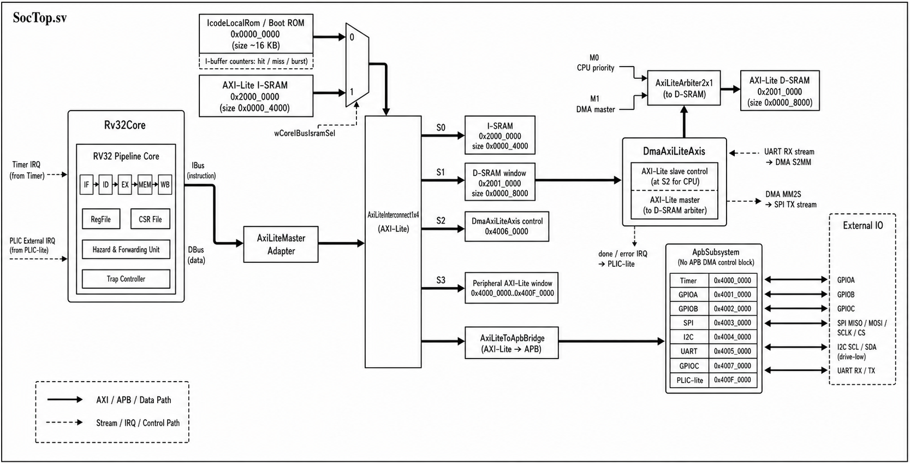
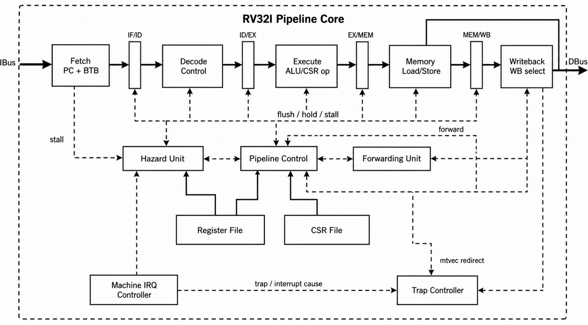
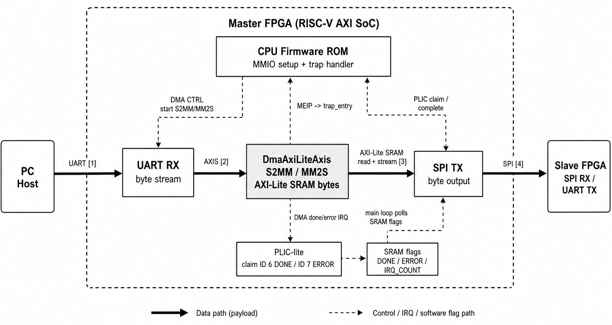

# RISC-V Core 기반 AXI-Lite/APB/AXI-Stream Mini MCU RTL 통합 설계

## 프로젝트 목표

직접 구현한 RV32I pipeline core를 중심으로 AXI-Lite system bus, APB peripheral subsystem, AXI-Stream DMA, PLIC-lite interrupt controller, UART bootloader와 RAM application 실행 구조를 통합한 mini MCU RTL을 설계하는 것이 목표였습니다. 단순히 core 단독 동작을 확인하는 수준을 넘어서, `PC -> UART -> RISC-V SoC -> DMA -> SPI -> Slave FPGA -> UART -> PC`로 이어지는 실제 데이터 이동 시나리오까지 검증 가능한 구조로 확장했습니다.

## 프로젝트 양식

| 항목 | 내용 |
| --- | --- |
| 유형 | 개인 프로젝트 / RISC-V 기반 SoC RTL 통합 설계 |
| 진행 기간 | 2026.04 ~ 2026.05 |
| 사용 언어·도구 | SystemVerilog, C, Python, Vivado 2025.2, RISC-V GCC |
| 특징 | RV32I 5-stage pipeline, AXI-Lite 1x4 interconnect, APB peripherals, AXI-Stream DMA, PLIC-lite IRQ, UART bootloader |

## 프로젝트 개요

초기에는 STM32F103 계열 MCU 구조를 참고해 AHB/APB 중심 구조로 출발했지만, SoC 확장성과 대용량 byte stream 처리 구조를 더 명확히 이해하기 위해 AXI 기반 구조로 재구성했습니다. 최종 구조는 `SocTop.sv`를 기준으로 RV32I pipeline core, local Boot ROM, application 실행용 I-SRAM, 데이터 저장용 D-SRAM, AXI-Lite Master Adapter, AXI-Lite 1x4 Interconnect, CPU/DMA D-SRAM 접근을 조정하는 2x1 Arbiter, AXI-Lite to APB Bridge, APB Timer/GPIO/SPI/I2C/UART/PLIC-lite, AXI-Lite controlled AXI-Stream DMA로 구성했습니다.

메모리 맵은 Boot ROM `0x0000_0000` 16 KB, I-SRAM/RAM application `0x2000_0000` 16 KB, D-SRAM `0x2001_0000` 32 KB로 분리했습니다. 주변장치는 `0x4000_0000` 영역에 배치했으며 Timer, GPIOA/B/C, SPI, I2C, UART, DMA, PLIC-lite가 각각 4 KB window를 갖도록 정리했습니다. 특히 image staging 영역은 D-SRAM 내부 `0x2001_4000`부터 배치해 UART로 들어온 이미지 payload, 18-byte `IMGF` header, CRC 검증 결과를 firmware와 DMA가 함께 다룰 수 있도록 했습니다.

RV32I core는 IF/ID/EX/MEM/WB 5-stage pipeline으로 구성하고, load-use hazard stall, EX/MEM 및 MEM/WB forwarding, bus wait stall, ID-stage early branch/JAL redirect, 16-entry BTB, CSR file, trap controller, machine interrupt controller를 포함했습니다. 이를 통해 단순 산술 명령뿐 아니라 `mstatus`, `mie`, `mtvec`, `mepc`, `mcause`, `mret` 기반의 machine-mode interrupt 흐름까지 SoC 내부 peripheral과 연결했습니다.

## 담당 분야/역할

RV32I pipeline core와 SoC top-level integration을 직접 설계했습니다. Core의 hazard/forwarding/branch/CSR/trap 경로를 정리하고, DBus를 AXI-Lite master로 변환해 I-SRAM, D-SRAM, DMA control, APB peripheral window로 접근할 수 있도록 구성했습니다. 또한 AXI-Lite controlled DMA를 작성해 UART RX stream을 D-SRAM에 저장하는 S2MM 경로와 D-SRAM 데이터를 SPI TX stream으로 내보내는 MM2S 경로를 구현했습니다.

Firmware 측에서는 RISC-V GCC 기반 `C source -> ELF -> BIN -> loader packet` flow를 정리했습니다. 고정 UART loader ROM은 `RAXI` packet에서 load address, byte count, entry address, checksum을 받아 I-SRAM에 RAM application을 적재한 뒤 entry로 jump합니다. 따라서 C firmware를 수정할 때마다 bitstream을 다시 생성하지 않고, UART로 RAM app만 내려받아 반복 실행할 수 있도록 했습니다. PC 측에는 Python 기반 image transfer/compare tool을 작성해 master FPGA UART 송신, slave FPGA UART 수신, 이미지 저장, diff 이미지 생성, PASS/FAIL 로그 저장까지 자동화했습니다.

## 프로젝트를 통해 느낀 점/해결방법

처음에는 STM32F103 데이터시트의 bus/peripheral 구조를 참고했지만, 실제로 RTL을 구성해 보니 control path와 data path를 분리하는 것이 중요했습니다. CPU가 모든 byte를 직접 옮기면 UART/SPI 전송이 firmware polling에 종속되므로, UART RX는 stream FIFO를 거쳐 DMA S2MM으로 D-SRAM에 저장하고, 처리된 payload는 DMA MM2S가 SPI TX stream으로 보내도록 구조를 나누었습니다. CPU는 DMA register 설정, PLIC claim/complete, CRC 검증, 이미지 반전 처리, 상태 flag 기록을 담당하게 해 HW/SW 경계를 명확히 했습니다.

Interrupt 구조에서는 일반 PLIC처럼 claim read와 pending clear를 같은 동작으로 처리하면, AXI-Lite/APB read data가 CPU로 돌아오기 전에 pending source가 사라질 수 있는 timing 문제가 있었습니다. 이를 해결하기 위해 PLIC-lite의 claim read는 ID 조회만 수행하고, handler가 `PLIC_COMPLETE`에 claim ID를 write할 때 pending/gateway 상태를 정리하도록 설계했습니다. 이 구조에 맞춰 C firmware의 vector table, DMA done/error IRQ 처리, `mret` 복귀 흐름을 함께 검증했습니다.

또한 초기에는 ROM에 assembly test program을 고정해 기능을 확인했지만, 프로젝트가 커질수록 firmware 수정마다 bitstream을 다시 만드는 비용이 커졌습니다. 이를 UART bootloader와 I-SRAM 기반 RAM application 구조로 개선하면서, RTL은 고정한 채 C firmware만 빠르게 교체할 수 있었습니다. 이 과정을 통해 core 설계뿐 아니라 linker script, startup code, boot protocol, MMIO address map, board transfer tool까지 SoC 개발에 필요한 흐름을 함께 경험했습니다.

## 결과물

RTL source, SystemVerilog testbench, RISC-V C firmware, UART loader packet build flow, Python image transfer tool, Vivado bitstream/report를 정리했습니다. 단위 검증에서는 DMA S2MM/MM2S aligned/unaligned transfer, address range error, UART-to-DMA stream, DMA-to-SPI stream, PLIC external IRQ 전달을 확인했습니다. SoC 검증에서는 UART loader가 RAM application으로 jump하는 흐름, trap/interrupt handler 진입, RGB image payload가 DMA와 PLIC interrupt를 거쳐 SPI로 나가는 흐름을 확인했습니다.

최근 구현 결과 기준으로 UART loader bitstream은 Vivado implementation에서 timing을 만족했습니다. `wSocClk` 50 MHz 기준 WNS는 `3.030 ns`, route error는 0개였고, resource 사용량은 LUT 4,966개, FF 4,749개, BRAM 16 tile, DSP 0개였습니다. 실제 end-to-end 전송 로그에서는 64x64 RGB 이미지 payload 12,288 byte를 `IMGF` header 포함 12,306 byte로 전송했고, slave FPGA에서 돌아온 결과를 PC에서 비교했을 때 byte mismatch 0, pixel mismatch 0으로 PASS를 확인했습니다.

## 핵심 이미지

**Figure 1. RISC-V AXI SoC Overall Block Diagram**



**Figure 2. RV32I Core Pipeline**



**Figure 3. PC-UART-DMA-SPI-Slave FPGA End-to-End Image Transfer**



**Figure 4. Integrated Project Management Tool**


## 핵심 코드

```text
hw/rtl/src/soc/SocTop.sv
hw/rtl/src/soc/SocFpgaTop.sv
hw/rtl/src/core/pipeline/Rv32Core.sv
hw/rtl/src/core/pipeline/PipelineControl.sv
hw/rtl/src/bus/apb/DmaAxiLiteAxis.sv
hw/rtl/src/bus/axi/AxiLiteArbiter2x1.sv
hw/rtl/src/bus/apb/ApbPlicLite.sv
sw/firmware_sources/uart_loader_main.c
sw/firmware_sources/ram_uart_dma_spi_rgb_poll_main.c
sw/firmware_sources/ram_uart_dma_spi_rgb_irq_main.c
sw/firmware_sources/startup_irq.S
tools/loader_tools/make_loader_packet.py
tools/loader_tools/send_loader_packet.py
tools/image_uart_sender/src/send_image.py
tools/image_uart_sender/src/transfer_compare.py
```

## 폴더 구성

```text
18_risc-axi-uart-bootloader/
├── README.md
├── hw/
│   ├── rtl/src/
│   ├── tb/
│   └── constraints/
├── sw/
│   └── firmware_sources/
├── tools/
│   ├── build_scripts/
│   ├── loader_tools/
│   ├── linker_scripts/
│   └── image_uart_sender/
├── config/
│   └── address_map.yml
├── generated/
│   └── include/address_map.h
├── image/
│   └── 01_riscv/
└── diagram_image/
```
