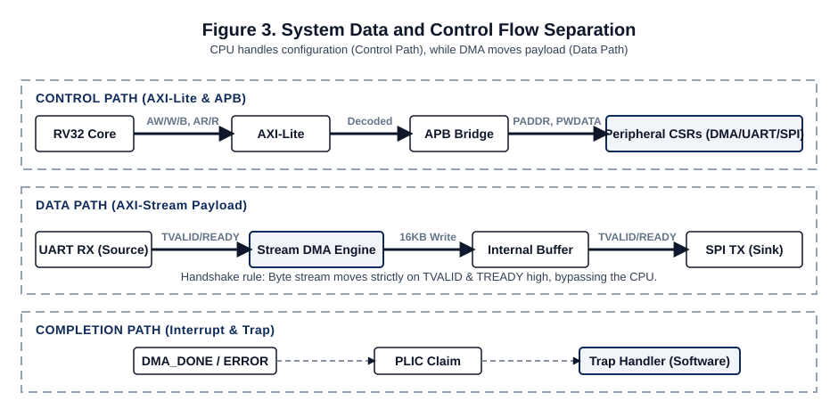
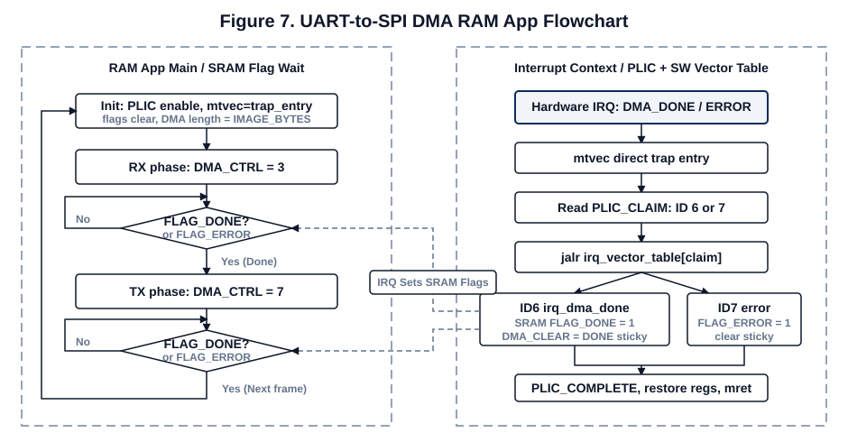

# RISC-V AXI UART Bootloader MCU
> Custom RV32I SoC, AXI-Lite/APB peripheral system, UART bootloader, SRAM-loaded C firmware workflow

## 📅 프로젝트 정보
- **기간**: 2026.05
- **형태**: FPGA 기반 custom MCU / HW-SW co-design / bootloader bring-up
- **기술 스택**: `SystemVerilog` `RV32I` `AXI-Lite` `APB` `AXI-Stream DMA` `UART` `SPI` `PLIC-lite` `RISC-V GCC` `Vivado`
- **주요 산출물**: RTL source, firmware source, UART loader tools, diagrams, verification notes, presentation PDF

## 📝 개요
직접 설계한 RV32I 기반 SoC를 AXI-Lite/APB/AXI-Stream 구조로 재구성하고, ROM 고정 UART bootloader를 통해 PC에서 컴파일한 RISC-V C application을 SRAM에 다운로드해 실행하는 개발 루프를 구현한 프로젝트입니다.

기존에는 firmware 변경 시 `.mem` 생성과 bitstream 재생성이 반복됐지만, 이 구조에서는 ROM에는 loader만 고정하고 RAM application은 UART packet으로 적재합니다. 이를 위해 executable SRAM instruction path, custom linker script, freestanding startup code, UART packet protocol, Python downloader를 함께 구성했습니다.

## 🧩 시스템 구조


- **CPU**: custom RV32I pipeline core
- **Instruction path**: ROM fetch plus executable SRAM fetch
- **Control path**: core DBus -> AXI-Lite master adapter -> interconnect -> AXI-Lite-to-APB bridge
- **Peripheral path**: APB UART/SPI/GPIO/I2C/Timer/PLIC-lite/DMA
- **Streaming path**: UART RX stream -> AXI-Stream DMA buffer -> SPI TX stream

## 🚀 UART Bootloader Flow


```text
C source
-> riscv64-unknown-elf-gcc
-> ELF/BIN
-> RAXI loader packet
-> PC UART send
-> ROM UART loader
-> SRAM write at 0x20001000
-> jump to RAM app entry
```

- Loader packet magic: `RAXI`
- Default RAM app address: `0x20001000`
- Default SRAM stack top: `0x20004000`
- External interrupt path: APB PLIC-lite -> machine external interrupt `mcause=0x8000000B`

## 💡 핵심 포인트
1. **Bitstream 재생성 없는 firmware 반복 개발**
   - ROM에는 bootloader만 고정하고, PC에서 빌드한 C firmware를 UART로 SRAM에 다운로드해 실행하도록 구성했습니다.
2. **AXI-Lite/APB/AXI-Stream 역할 분리**
   - register/MMIO 제어는 AXI-Lite/APB, bulk image stream은 AXI-Stream DMA로 분리해 control path와 data path를 명확히 나눴습니다.
3. **Bare-metal C runtime 직접 구성**
   - `_start`, stack 초기화, `.data` copy, `.bss` clear, `main()` 진입, RAM linker script를 custom SoC memory map에 맞춰 작성했습니다.
4. **Interrupt bring-up**
   - PLIC claim/complete, trap wrapper, `mret` return, DMA done interrupt path를 C/assembly/RTL 경계에서 검증했습니다.
5. **Simulation + routed timing evidence**
   - UART loader simulation과 C smoke simulation을 통과했고, UART loader bitstream timing closure도 확인했습니다.

## ✅ 검증 결과
```text
SOC_C_SMOKE_PASS gpio=0x00c6
SOC_UART_LOADER_PASS pc=0x20001158 gpio=0x00a5
UART_LOADER_IMPL_TIMING WNS_NS=2.100 REQUIREMENT_NS=20.000 FMAX_EST_MHZ=55.866
```

## 📂 산출물
- **[Presentation PDF](./docs/presentation/RISC_AXI_UART_Bootloader_slides.pdf)**: 전체 구조와 bring-up 흐름 발표 자료
- **[Project Summary](./docs/guides/PROJECT_SUMMARY_KO.md)**: 시스템 구조와 loader workflow 요약
- **[RAM Loader / Linker / IRQ Debug Notes](./docs/guides/RAM_LOADER_LINKER_IRQ_DEBUG_KO.md)**: linker, C runtime, trap/interrupt bring-up 기록
- **[Verification Summary](./docs/guides/VERIFICATION_SUMMARY.md)**: C smoke, UART loader, timing 결과
- **[Source File Index](./docs/guides/FILE_INDEX.md)**: 주요 RTL/SW/TB 파일 위치

## 🗂 소스 구조
```text
source
├── rtl
│   ├── core/pipeline       # RV32I pipeline, CSR, trap, interrupt controller
│   ├── bus/axi             # AXI-Lite master/interconnect/ROM/SRAM/APB bridge
│   ├── bus/apb             # UART, SPI, GPIO, I2C, DMA, PLIC-lite
│   ├── soc                 # SocTop, FPGA wrapper
│   └── stream              # stream FIFO
├── sw
│   ├── firmware_sources    # bootloader, RAM apps, startup/trap assembly
│   ├── linker_scripts      # ROM/RAM linker scripts
│   ├── build_scripts       # RISC-V GCC build/download scripts
│   └── loader_tools        # packet builder, UART sender, loader GUI
├── tb                      # focused SystemVerilog testbenches
└── image_uart_sender       # PC-side image transfer tools
```

## 🔗 주요 파일
- `source/rtl/soc/SocTop.sv`
- `source/rtl/core/pipeline/Rv32Core.sv`
- `source/rtl/core/pipeline/CsrFile.sv`
- `source/rtl/core/pipeline/TrapController.sv`
- `source/rtl/bus/apb/ApbPlicLite.sv`
- `source/rtl/bus/apb/ApbAxiStreamDma.sv`
- `source/sw/firmware_sources/uart_loader_main.c`
- `source/sw/firmware_sources/ram_uart_dma_spi_rgb_irq_main.c`
- `source/sw/firmware_sources/startup_irq.S`
- `source/sw/linker_scripts/linker_ram.ld`

## 📌 참고
GitHub 포트폴리오에는 핵심 source, docs, diagrams, ROM `.mem`만 포함했습니다. `artifacts/bitstreams_optional/*.bit`와 Vivado Tcl 실행 스크립트는 원본 패키지에 있었지만, 포트폴리오 가독성을 위해 제외했습니다.
