# RGB 기준 SocTop 다이어그램 정리

작성 기준: `Project/risc_axi` 최신 RTL/ROM 상태.

이 문서는 PPT에서 `SocTop` 구조를 그림 중심으로 설명하기 위한 자료다. 발표 기준 데모는 `RGB IRQ forward`로 둔다. 기존 `RGB forward`는 DMA status polling baseline으로만 비교한다.

## 1. RGB 데모 기준

### 기준 ROM / bitstream

| 항목 | 기준 |
|---|---|
| ROM source | `Project/risc_axi/C/runtime/uart_dma_spi_rgb_irq_forward.S` |
| RGB ROM build | `Project/risc_axi/C/build_uart_dma_spi_rgb_irq_forward.ps1` |
| RGB image bytes | build parameter `-ImageBytes`, default `12288` bytes |
| 의미 | `64 x 64 x 3` RGB888 byte stream |
| RGB ROM mem | `Project/risc_axi/src/timing_programs/uart_dma_spi_rgb_irq_forward.mem` |
| bit build | `Project/risc_axi/tools/build_master_rgb_irq_forward_bit.tcl` |
| output bitstream | `Project/risc_axi/output/master_rgb_irq_forward_bit/master_risc_axi_rgb_irq_forward.bit` |
| interrupt source | PLIC claim `6` DMA done, claim `7` DMA error |
| dispatch | `mtvec=0x80` direct trap entry + software `irq_vector_table` |
| mini sim harness | `tb_SocTopRgbIrqMini.sv`, `run_rgb_irq_mini_sim.tcl`, 4-byte smoke scenario |

### 발표용 한 줄

> RGB IRQ forward 데모는 PC에서 들어온 12,288-byte RGB stream을 UART RX -> DMA internal buffer -> SPI TX 경로로 전달하고, DMA phase 완료는 PLIC interrupt로 처리한다.

### RGB forward data path

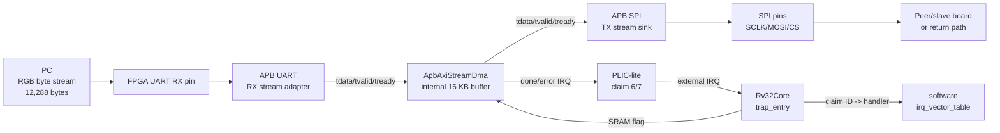

### CPU의 역할

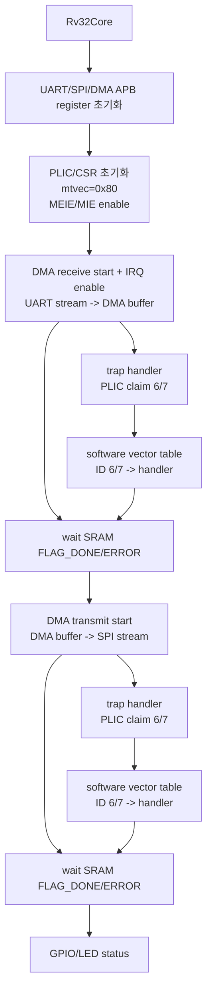

발표 멘트:

> RGB 데이터는 CPU register를 통해 한 byte씩 옮기지 않습니다. CPU는 APB register로 DMA 방향과 길이와 IRQ enable을 설정하고, 실제 RGB payload는 AXI-Stream handshake로 이동합니다. DMA 완료 시점은 PLIC interrupt로 들어오고, trap handler가 software vector table로 DMA done/error handler를 골라 SRAM flag를 set합니다.

## 2. SocTop 최상위 구조

### SocTop 역할

`SocTop`은 FPGA board wrapper가 아니라 내부 SoC 통합 top이다.

- `Rv32Core`를 포함한다.
- IBus는 `IcodeLocalRom`으로 직접 연결한다.
- DBus는 `AxiLiteMasterAdapter`를 통해 AXI-Lite로 변환한다.
- AXI-Lite interconnect가 ROM/SRAM/APB window를 decode한다.
- Peripheral window는 `AxiLiteToApbBridge`를 거쳐 `ApbSubsystem`으로 들어간다.
- UART RX stream과 SPI TX stream은 `ApbSubsystem` 내부에서 DMA와 직접 연결된다.

### SocTop big picture

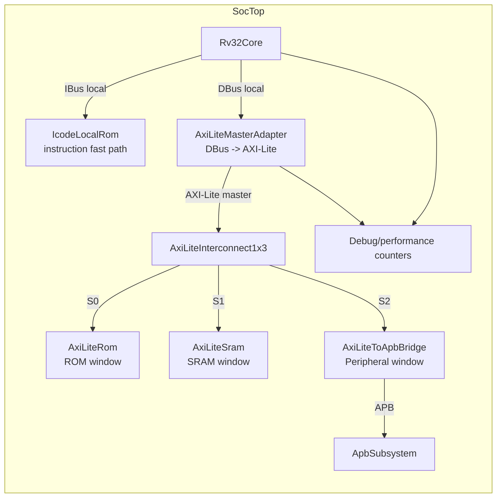

### 발표 멘트

> `SocTop` 안에서는 instruction fetch와 data/control access를 분리했습니다. IBus는 local ROM으로 빠르게 처리하고, DBus만 AXI-Lite fabric으로 보냅니다.

## 3. Core 중심 연결도

### Core input/output 관점

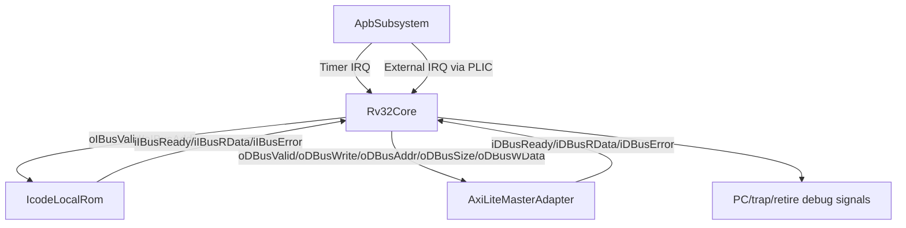

### PPT 핵심 문장

```text
IBus = instruction fetch 안정화와 CPI 회복
DBus = AXI-Lite memory-mapped control
IRQ  = Timer + PLIC external interrupt
```

### 성능 포인트

| 항목 | 최신 stress 결과 |
|---|---:|
| cycle | 539 |
| retired | 221 |
| CPI | 2.438914 |
| IBus wait | 32 |
| DBus wait | 192 |
| DBus AR/R/AW/W/B wait | 44 / 24 / 0 / 0 / 42 |

## 4. AXI-Lite 경로 다이어그램

### DBus -> AXI-Lite

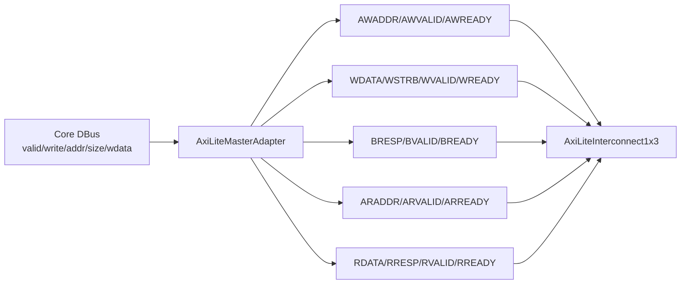

### AXI-Lite address window

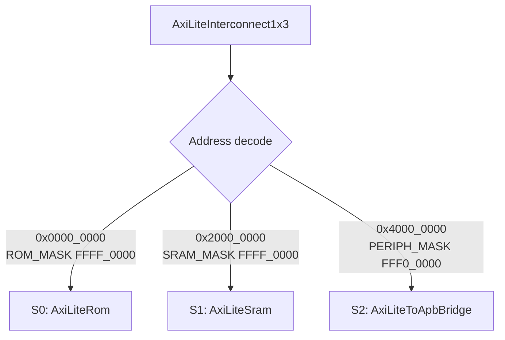

### 주소 표

| Window | Base | Module |
|---|---:|---|
| ROM | `0x0000_0000` | `AxiLiteRom` |
| SRAM | `0x2000_0000` | `AxiLiteSram` |
| Peripheral | `0x4000_0000` | `AxiLiteToApbBridge` -> `ApbSubsystem` |

## 5. APB subsystem decode 다이어그램

### APB register map

`ApbSubsystem`은 `iPADDR[19:16]`으로 peripheral을 고른다.

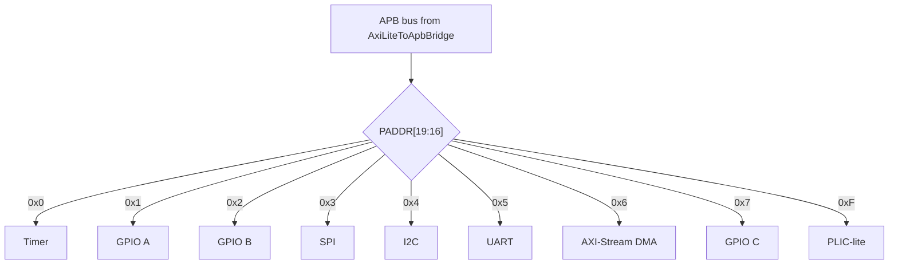

### CPU address view

| Peripheral | CPU address | Decode nibble |
|---|---:|---:|
| Timer | `0x4000_0000` | `0x0` |
| GPIO A | `0x4001_0000` | `0x1` |
| GPIO B | `0x4002_0000` | `0x2` |
| SPI | `0x4003_0000` | `0x3` |
| I2C | `0x4004_0000` | `0x4` |
| UART | `0x4005_0000` | `0x5` |
| DMA | `0x4006_0000` | `0x6` |
| GPIO C | `0x4007_0000` | `0x7` |
| PLIC-lite | `0x400F_0000` | `0xF` |

## 6. RGB stream path inside ApbSubsystem

### UART RX -> DMA -> SPI TX

```mermaid
flowchart LR
  UARTPIN["iUartRx"] --> UART["ApbUart"]
  UART -->|oRxM_TDATA[7:0]\noRxM_TVALID| DMA["ApbAxiStreamDma"]
  DMA -->|oS_TREADY| UART
  DMA -->|oM_TDATA[7:0]\noM_TVALID| SPI["ApbSpi"]
  SPI -->|oTxS_TREADY| DMA
  SPI --> SPIPINS["oSpiSclk/oSpiMosi/oSpiCsN"]
```

### 왜 RGB에 적합한가

```text
RGB888 stream = byte sequence
64 x 64 x 3 = 12,288 bytes
AXI-Stream handshake = byte valid/ready
DMA internal buffer = 16 KB
12,288 bytes < 16 KB
```

발표 멘트:

> RGB888은 결국 byte stream입니다. DMA buffer가 16 KB이므로 64x64 RGB888의 12,288 bytes를 한 번에 담을 수 있고, UART RX와 SPI TX는 valid/ready stream으로 연결됩니다.

## 7. DMA 내부 상태/레지스터 그림

### DMA control/status

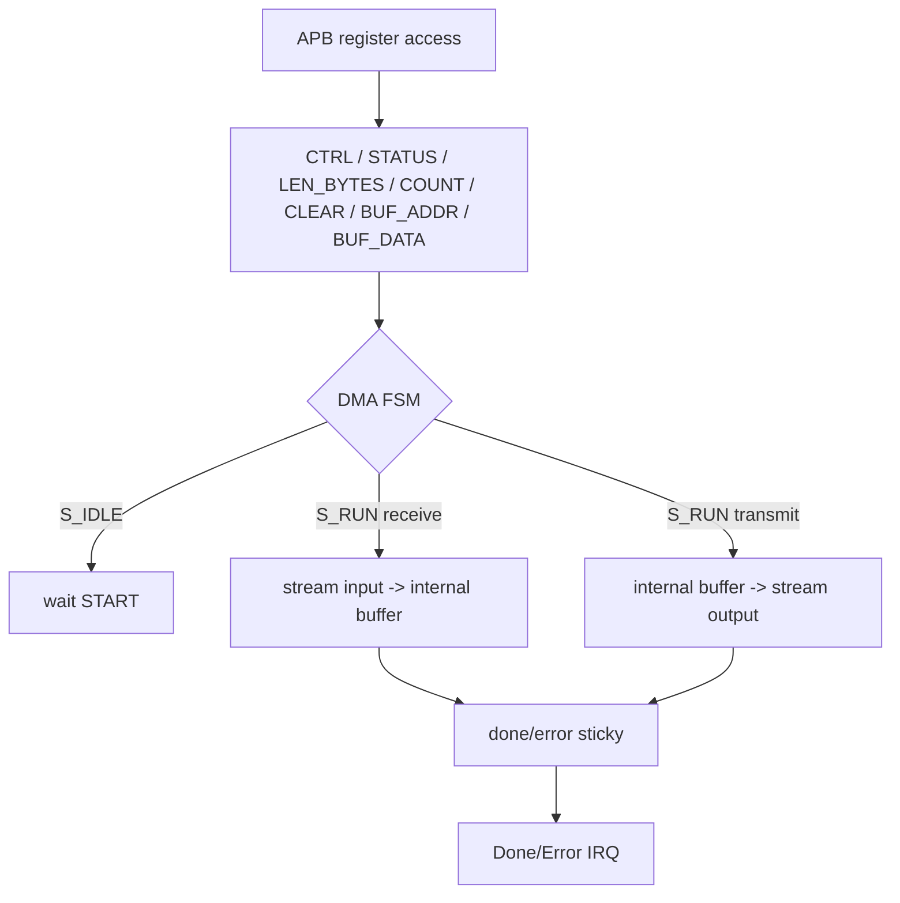

### DMA register table

| Offset | Register | RGB IRQ forward에서 쓰는 역할 |
|---:|---|---|
| `0x00` | CTRL | start, direction, IRQ enable |
| `0x04` | STATUS | busy/done/error 확인용, 메인 흐름은 SRAM flag wait |
| `0x08` | LEN_BYTES | `12288` 설정 |
| `0x10` | CLEAR | done/error sticky clear |
| `0x14` | BUF_ADDR | buffer 시작 주소 0 |
| `0x18` | BUF_DATA | debug access, RGB forward에서는 주 흐름 아님 |

## 8. Interrupt path 다이어그램

### IRQ aggregation

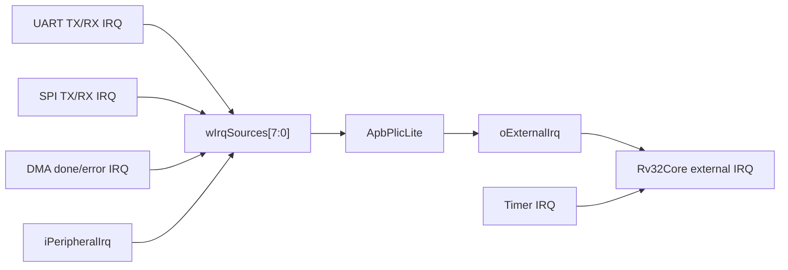

### 발표 포인트

- Timer IRQ는 core의 timer interrupt input으로 직접 간다.
- UART/SPI/DMA 등 external source는 PLIC-lite로 모아서 core external IRQ로 들어간다.
- 최신 RGB IRQ forward ROM은 DMA done/error를 PLIC claim ID `6/7`로 처리한다.
- claim ID `6/7`은 ROM 내부 `irq_vector_table`에서 `irq_dma_done` / `irq_dma_error` handler address로 dispatch된다.
- 최신 PLIC-lite는 `CLAIM` read만으로 pending을 지우지 않고, handler가 `COMPLETE`에 같은 claim ID를 쓸 때 pending과 gateway block을 해제한다.
- 기존 RGB forward ROM은 polling baseline이며, 발표에서는 최신 IRQ ROM과 구분한다.

## 9. SocFpgaTop과 SocTop의 관계

`SocFpgaTop`은 board wrapper이고, `SocTop`은 SoC 본체다.

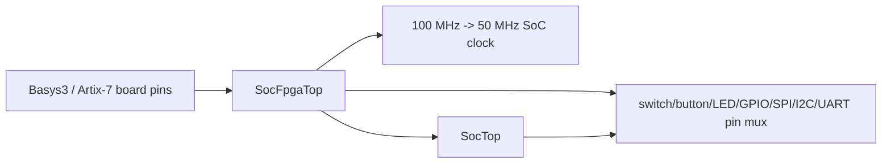

### 발표에서 구분하기

| 구분 | 역할 |
|---|---|
| `SocFpgaTop` | FPGA pin, clock, reset, board I/O wrapper |
| `SocTop` | RISC-V core, AXI-Lite fabric, APB subsystem, DMA 통합 |

## 10. RGB IRQ forward ROM 흐름

### ROM build-time 기준

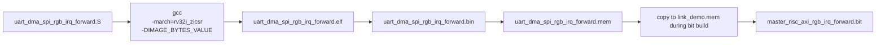

### ROM runtime 기준

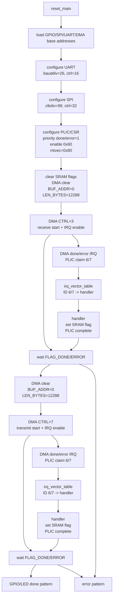

### 발표 멘트

> 최신 RGB IRQ ROM은 build-time image byte 길이로 DMA receive/transmit을 수행하고, 완료를 PLIC interrupt로 받습니다. bit build script는 이 IRQ `.mem`을 active ROM인 `link_demo.mem`으로 복사한 뒤 bitstream을 생성합니다.

정확히는 build script가 `-ImageBytes` 파라미터를 받고, 발표 메인 빌드는 기본값 `12288`을 쓴다. 새 mini sim은 같은 ROM을 `ImageBytes=4`로 줄여 UART 4 byte와 SPI frame 4개를 빠르게 확인하기 위한 smoke scenario로 쓰기 좋다.

## 11. PPT용 SocTop 설명 순서

발표에서 한 장에 모든 것을 넣지 말고 아래 4장으로 나누면 좋다.

| Slide | 제목 | 그림 |
|---:|---|---|
| 1 | SocTop 전체 구조 | `SocTop big picture` |
| 2 | AXI-Lite control path | `DBus -> AXI-Lite`, `address window` |
| 3 | APB peripheral map | `APB register map` |
| 4 | RGB stream path | `UART RX -> DMA -> SPI TX` |

## 12. 발표용 짧은 문장 모음

- `SocTop`은 core, bus fabric, APB peripheral, stream DMA를 묶는 SoC 본체다.
- RGB IRQ forward 기준 payload는 12,288 bytes이며, DMA internal buffer 16 KB 안에 들어간다.
- CPU는 RGB byte를 직접 처리하지 않고 DMA 제어 register만 설정한다.
- DMA 완료는 PLIC claim `6/7`, software `irq_vector_table`, SRAM flag 순서로 main loop에 전달된다.
- AXI-Lite는 memory-mapped control path이고, AXI-Stream은 byte payload path다.
- APB peripheral은 재작성하지 않고 AXI-Lite-to-APB bridge 뒤에서 유지했다.
- RGB IRQ forward bitstream은 50 MHz SoC clock timing constraint를 만족했다.

## 13. 파형 캡처용 최소 시나리오

### 발표용 파형 목표

전체 AXI-Lite channel을 모두 자세히 보여주기보다, "ROM code가 control register를 설정하고, RGB byte가 stream으로 slave 방향에 나간다"를 한 장으로 보여주는 것이 좋다.

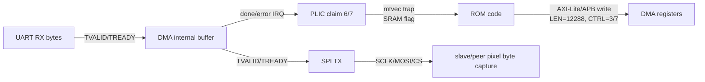

### Waveform checklist

| Step | 신호 | 확인 |
|---:|---|---|
| 1 | `DMA_LEN_BYTES` 또는 APB `PADDR/PWDATA` | 12,288 byte 길이 설정 |
| 2 | `DMA_CTRL=3` | UART -> DMA receive 시작 + IRQ enable |
| 3 | UART stream `TDATA/TVALID/TREADY` | 입력 byte handshake |
| 4 | PLIC external IRQ / claim ID | receive 완료가 claim `6`으로 전달 |
| 5 | SRAM `FLAG_DONE` | handler가 main loop를 깨움 |
| 6 | `DMA_CTRL=7` | DMA -> SPI transmit 시작 + IRQ enable |
| 7 | DMA output stream `TDATA/TVALID/TREADY` | buffer byte replay |
| 8 | SPI `SCLK/MOSI/CS` 또는 slave shift register | pixel byte가 slave 방향으로 출력 |

### 발표 멘트

> 파형은 RTL 내부 전체를 증명하려고 넣는 것이 아니라, RGB demo 시나리오가 실제로 ROM code에서 시작해 DMA와 SPI 출력까지 이어진다는 것을 보여주는 증거로 넣는다.

## 14. 근거 파일

| 내용 | 파일 |
|---|---|
| SocTop 통합 구조 | `Project/risc_axi/src/soc/SocTop.sv` |
| FPGA wrapper | `Project/risc_axi/src/soc/SocFpgaTop.sv` |
| AXI 주소 window | `Project/risc_axi/src/bus/axi/axi_lite_pkg.sv` |
| APB decode / stream wiring | `Project/risc_axi/src/bus/apb/ApbSubsystem.sv` |
| DMA buffer/FSM/register | `Project/risc_axi/src/bus/apb/ApbAxiStreamDma.sv` |
| RGB IRQ forward ROM source | `Project/risc_axi/C/runtime/uart_dma_spi_rgb_irq_forward.S` |
| RGB IRQ forward ROM build | `Project/risc_axi/C/build_uart_dma_spi_rgb_irq_forward.ps1` |
| RGB IRQ mini TB | `Project/risc_axi/tb/soc/tb_SocTopRgbIrqMini.sv` |
| RGB IRQ mini sim Tcl | `Project/risc_axi/tools/run_rgb_irq_mini_sim.tcl` |
| RGB IRQ bit build | `Project/risc_axi/tools/build_master_rgb_irq_forward_bit.tcl` |
| RGB IRQ bit reports | `Project/risc_axi/output/master_rgb_irq_forward_bit/` |
| Polling baseline ROM | `Project/risc_axi/C/runtime/uart_dma_spi_forward.S` |
