# SW / Vector Table / CSR / Trap / PLIC 시각화 가이드

작성 기준: 2026-05-07 현재 `Project/risc_axi` 디스크 상태.  
메인 데모 기준: `RGB IRQ forward`, 즉 64x64 RGB888 12,288 byte 전송을 DMA done/error PLIC interrupt로 phase 전환.

이 문서는 PPT에서 SW와 interrupt 구조를 설명하기 위한 자료다. 가장 중요한 구분은 아래와 같다.

| 구분 | 기존 RGB forward ROM | 최신 RGB IRQ forward ROM |
|---|---|---|
| 소스 | `uart_dma_spi_forward.S` | `uart_dma_spi_rgb_irq_forward.S` |
| SW 실행 방식 | DMA status polling | PLIC interrupt + SRAM flag wait |
| `.vectors` 역할 | reset vector만 사용 | reset vector + `0x80 trap_entry` + software IRQ vector table |
| CSR 설정 | 없음 | `mtvec=0x80`, `mie.MEIE=1`, `mstatus.MIE=1` |
| PLIC claim/complete | 없음 | claim ID를 software vector table index로 사용 |
| 발표 표현 | "polling baseline" | "현재 메인 RGB interrupt ROM" |

발표 때는 기존 polling ROM과 최신 interrupt ROM을 분리해서 말해야 한다. 최신 ROM은 실제로 PLIC claim/complete를 사용한다.

## 1. 최신 RGB IRQ Forward ASM 한눈에 보기

소스: `Project/risc_axi/C/runtime/uart_dma_spi_rgb_irq_forward.S`

최신 RGB IRQ ROM은 CPU가 DMA를 시작한 뒤 `DMA_STATUS`를 직접 계속 읽지 않는다. DMA done/error interrupt가 PLIC를 통해 들어오면 `trap_entry`가 claim ID를 읽고, ROM 안의 software IRQ vector table에서 handler 주소를 골라 `jalr`로 분기한다. 선택된 handler가 SRAM flag를 set하고, main loop는 그 flag를 기다렸다가 RX phase에서 TX phase로 넘어간다.

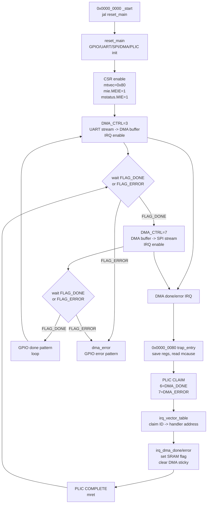

### IRQ ROM 핵심 layout

| 주소 | label | 역할 |
|---:|---|---|
| `0x0000_0000` | `_start` | reset vector, `reset_main` jump |
| `0x0000_0080` | `trap_entry` | register save, `mcause` 확인 |
| `0x0000_00C8` | `irq_external` | PLIC claim read |
| `0x0000_0138` | `irq_vector_table` | claim ID별 handler address table |
| `0x0000_0158` | `irq_unused` | 미사용 source complete |
| `0x0000_015C` | `irq_dma_done` | `FLAG_DONE=1`, DMA done clear |
| `0x0000_0174` | `irq_dma_error` | `FLAG_ERROR=1`, DMA error clear |
| `0x0000_018C` | `irq_complete` | PLIC complete write |
| `0x0000_01E0` | `reset_main` | peripheral/PLIC/CSR 초기화 |
| `0x0000_028C` | `main_loop` | RX/TX phase 제어 |
| `0x0000_02B8` | `wait_rx_irq` | RX 완료/error SRAM flag wait |
| `0x0000_031C` | `wait_tx_irq` | TX 완료/error SRAM flag wait |
| `0x0000_035C` | `dma_error` | error 상태 유지 |

### IRQ ROM register/flag 요약

| 항목 | 값/주소 | 의미 |
|---|---:|---|
| `PLIC_ENABLE` | `0x400F_0000 + 0x00` | DMA done/error source enable |
| `PLIC_CLAIM` | `0x400F_0000 + 0x0C` | highest claimable source ID read, read 자체는 pending을 지우지 않음 |
| `PLIC_COMPLETE` | `0x400F_0000 + 0x10` | 처리한 claim ID write, pending/gateway block 해제 |
| `PLIC_PRIO_DMA_DONE` | `0x400F_0000 + 0x34` | source bit 5, claim ID 6 |
| `PLIC_PRIO_DMA_ERROR` | `0x400F_0000 + 0x38` | source bit 6, claim ID 7 |
| `FLAG_DONE` | `0x2000_0000 + 0x00` | interrupt handler가 done 시 set |
| `FLAG_ERROR` | `0x2000_0000 + 0x04` | interrupt handler가 error 시 set |
| `LAST_IRQ_SOURCE` | `0x2000_0000 + 0x08` | debug용 마지막 claim ID |
| `IRQ_COUNT` | `0x2000_0000 + 0x0C` | debug용 interrupt 처리 횟수 |

### CSR/PLIC 초기화 snippet

```asm
  addi t0, zero, 1
  sw   t0, PLIC_PRIO_DMA_DONE(s4)
  sw   t0, PLIC_PRIO_DMA_ERROR(s4)
  sw   zero, PLIC_THRESHOLD(s4)
  addi t0, zero, PLIC_DMA_MASK   # 0x60 = bit5 | bit6
  sw   t0, PLIC_ENABLE(s4)

  addi t0, zero, 0x80
  csrw mtvec, t0
  lui  t0, 0x1
  addi t0, t0, -2048             # 0x800 = mie.MEIE
  csrw mie, t0
  addi t0, zero, 8               # mstatus.MIE
  csrs mstatus, t0
```

### PLIC claim/complete snippet

```asm
irq_external:
  lui  t0, 0x400F0
  lw   t1, PLIC_CLAIM(t0)
  beq  t1, zero, trap_exit

  addi t4, zero, IRQ_ID_DMA_DONE
  beq  t1, t4, irq_dma_done
  addi t4, zero, IRQ_ID_DMA_ERROR
  beq  t1, t4, irq_dma_error

irq_complete:
  lui  t0, 0x400F0
  sw   t1, PLIC_COMPLETE(t0)
  jal  zero, trap_exit
```

## 2. 기존 Polling RGB Forward ASM 한눈에 보기

소스: `Project/risc_axi/C/runtime/uart_dma_spi_forward.S`

현재 ROM은 CPU가 APB register를 설정하고, DMA completion을 polling하는 구조다. 이미지 payload byte는 CPU SRAM을 거치지 않고 DMA 내부 buffer에 머문다.

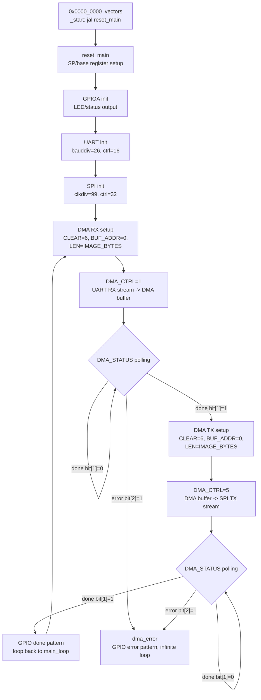

### ASM 블록 역할표

| ROM block | 역할 | 발표 멘트 |
|---|---|---|
| `.vectors / _start` | reset entry, `reset_main`으로 jump | "현재 vector section은 reset vector 역할만 한다." |
| `reset_main` | stack pointer와 MMIO base 설정 | "linker/loader 없이 ROM 시작 위치에서 직접 초기화한다." |
| GPIO init | LED/status 출력 방향 설정 | "FPGA 보드에서 상태를 확인하기 위한 debug 출력이다." |
| UART init | PC에서 들어오는 serial byte 수신 준비 | "RGB byte stream의 입력 endpoint다." |
| SPI init | slave FPGA로 byte stream 전송 준비 | "RGB byte stream의 출력 endpoint다." |
| DMA RX phase | UART stream을 DMA internal buffer에 저장 | "CPU는 data를 복사하지 않고 DMA register만 제어한다." |
| DMA TX phase | DMA internal buffer를 SPI stream으로 전송 | "같은 buffer를 다시 stream source로 사용한다." |
| `dma_error` | error sticky bit 감지 시 정지 | "DMA status bit를 polling해서 오류를 분리한다." |

### DMA register 관점

| Address | Register | 기존 polling RGB ROM 사용 |
|---:|---|---|
| `0x4006_0000 + 0x00` | `DMA_CTRL` | `1`: receive start, `5`: transmit start |
| `0x4006_0000 + 0x04` | `DMA_STATUS` | bit[1] done, bit[2] error polling |
| `0x4006_0000 + 0x08` | `DMA_LEN_BYTES` | RGB forward는 12,288 byte |
| `0x4006_0000 + 0x10` | `DMA_CLEAR` | done/error sticky clear |
| `0x4006_0000 + 0x14` | `DMA_BUF_ADDR` | buffer offset, 현재는 0 |

## 3. Vector Table: polling baseline과 최신 IRQ ROM

기존 polling ASM의 `.vectors`는 C runtime이나 일반적인 interrupt vector table이 아니라, ROM address 0에서 시작하는 reset jump slot이다.

```asm
.section .vectors, "ax"
_start:
  jal zero, reset_main
```

### 기존 polling ROM vector 구조

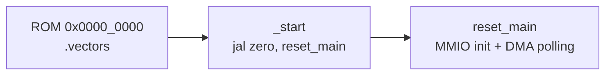

### 발표용 memory map

| 주소 영역 | 기존 polling ROM 역할 | 비고 |
|---:|---|---|
| `0x0000_0000` | `_start` reset jump | CPU reset 후 첫 instruction |
| `0x0000_0004...` | `reset_main` 이후 code | GPIO/UART/SPI/DMA setup |
| `0x0000_0088` 근처 | `wait_uart_to_dma` | DMA RX polling loop |
| `0x0000_00C8` 근처 | `wait_dma_to_spi` | DMA TX polling loop |
| `0x0000_00F4` 근처 | `dma_error` | error 상태 유지 |

주소는 기존 RGB forward dump 기준 예시다. 빌드 옵션이나 code 변경에 따라 label 주소는 바뀔 수 있으므로 PPT에는 "근처" 또는 "예시"로 표기한다.

### 최신 IRQ ROM vector/trap 구조

아래 구조는 최신 `uart_dma_spi_rgb_irq_forward.S`에 들어간 방향이다. ARM NVIC처럼 하드웨어가 interrupt 번호로 vector table을 직접 lookup하는 방식은 아니다. 대신 `mtvec=0x80` direct trap entry 하나로 진입한 뒤, software가 PLIC claim ID를 읽고 ROM 안의 `irq_vector_table`에서 handler address를 읽어 `jalr`로 분기한다.

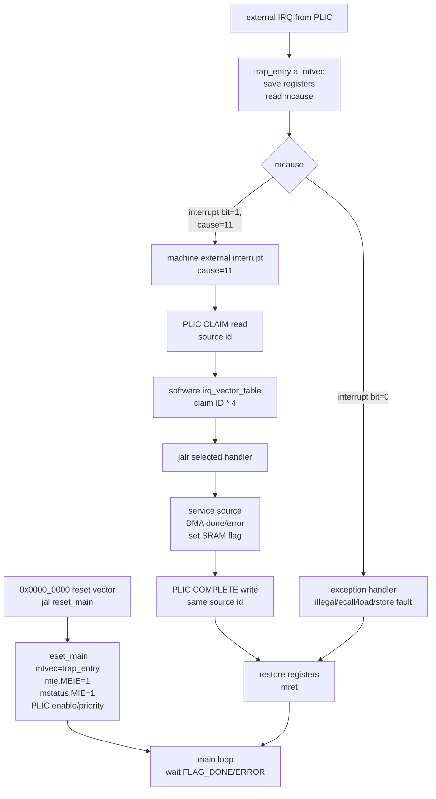

PPT 표현 추천:

> 최신 RGB IRQ ROM은 reset에서 `mtvec/mie/mstatus/PLIC`를 초기화하고, direct trap entry에서 PLIC claim ID를 읽은 뒤 software vector table로 DMA done/error handler를 선택한다.

## 4. CSR 구조: Trap을 기록하는 CPU 내부 상태

소스:

- `Project/risc_axi/src/core/pipeline/rv32i_pkg.sv`
- `Project/risc_axi/src/core/pipeline/CsrFile.sv`

### Machine-mode CSR table

| CSR | Address | 핵심 bit/역할 | reset/현재 의미 |
|---|---:|---|---|
| `mstatus` | `0x300` | bit[3] `MIE`, bit[7] `MPIE` | reset 0, interrupt global enable |
| `mie` | `0x304` | bit[3] MSIE, bit[7] MTIE, bit[11] MEIE | reset 0, interrupt source mask |
| `mtvec` | `0x305` | trap entry base | reset `0x0000_0080`, direct mode |
| `mip` | `0x344` | pending bits | SW/timer/external pending view |
| `mepc` | `0x341` | trap 전 PC | trap entry 때 저장 |
| `mcause` | `0x342` | bit[31] interrupt flag + cause | trap 원인 기록 |
| `mtval` | `0x343` | fault address/value | access fault/misaligned 등 보조 정보 |

`CsrFile`은 CSR read/write만 하는 블록이 아니라 trap entry와 `mret`에서 architectural state를 직접 갱신한다.

### Trap entry 시 CSR 변화

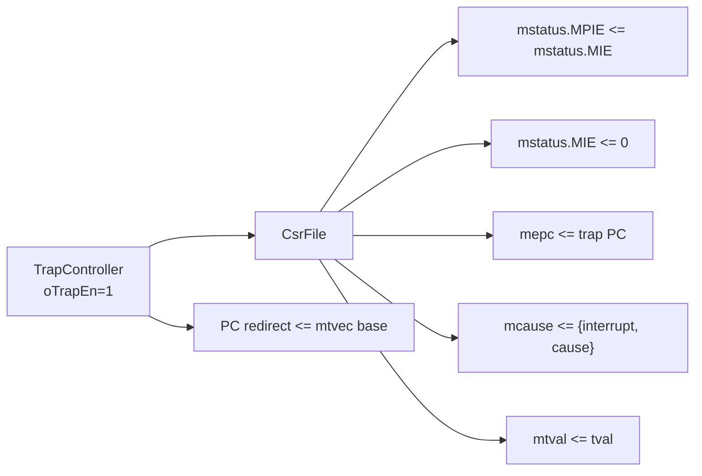

의미:

- trap에 들어가면 global interrupt enable인 `mstatus.MIE`가 꺼진다.
- trap 이전 enable 상태는 `MPIE`에 저장된다.
- 복귀 주소는 `mepc`, 원인은 `mcause`, fault 정보는 `mtval`에 남는다.
- 현재 parameter 기본값은 vectored mode disabled라서 trap target은 `mtvec` base direct 진입이다.

### MRET 시 CSR 변화

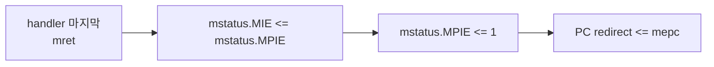

발표 멘트:

> CSR은 단순 설정 register가 아니라, trap 전후의 CPU 상태를 보존하는 작은 상태 머신처럼 동작한다.

## 5. TrapController: 예외와 인터럽트 중 하나를 고르는 중앙 관문

소스: `Project/risc_axi/src/core/pipeline/TrapController.sv`

`TrapController`는 pipeline에서 발생한 exception과 interrupt를 하나의 trap request로 정리한다.

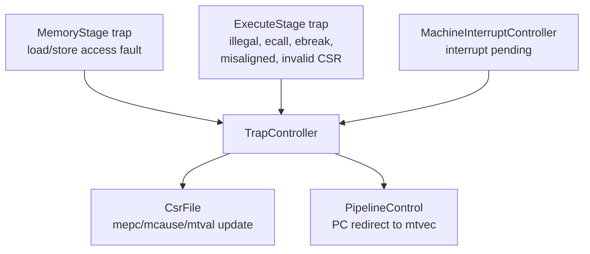

### Trap 우선순위

| Priority | Source | 이유 |
|---:|---|---|
| 1 | MEM trap | 이미 memory 단계까지 간 instruction의 fault를 먼저 정확히 기록 |
| 2 | EX trap | illegal/CSR/ecall/branch target 등 execute 단계 exception |
| 3 | IRQ | pipeline이 안전할 때만 interrupt 진입 |

### IRQ가 trap으로 인정되는 조건

`oIrqTrapEn`은 단순히 pending만 있다고 켜지지 않는다. 아래 조건이 모두 맞아야 한다.

| 조건 | 의미 |
|---|---|
| `iInterruptPending=1` | CSR mask와 pending이 모두 통과됨 |
| `!iBusWaitStall` | bus wait 중에 PC를 꺾지 않음 |
| `!iExRedirectPending` | branch/jump redirect와 충돌 방지 |
| `!iMemTrapEn` | memory fault 우선 |
| `!iExTrapEn` | execute fault 우선 |
| `!iExPcRedirectEn` | 일반 EX redirect와 충돌 방지 |

이 부분은 발표에서 "인터럽트가 아무 때나 끼어드는 게 아니라, pipeline이 redirect 가능한 안전한 순간에만 trap으로 들어간다"라고 설명하면 이해가 쉽다.

## 6. MachineInterruptController: mstatus/mie/mip로 IRQ를 거르는 블록

소스: `Project/risc_axi/src/core/pipeline/MachineInterruptController.sv`

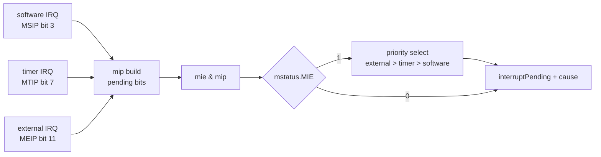

### Interrupt cause

| Source | mip/mie bit | `mcause` cause | 우선순위 |
|---|---:|---:|---:|
| Machine external | 11 | 11 | 1 |
| Machine timer | 7 | 7 | 2 |
| Machine software | 3 | 3 | 3 |

현재 `SocTop` 연결에서는 software IRQ는 0에 묶이고, timer IRQ는 APB timer, external IRQ는 APB PLIC-lite에서 들어간다.

## 7. PLIC-lite: 여러 peripheral IRQ를 하나의 external IRQ로 묶기

소스:

- `Project/risc_axi/src/bus/apb/ApbSubsystem.sv`
- `Project/risc_axi/src/bus/apb/ApbPlicLite.sv`
- `Project/risc_axi/src/bus/apb/ApbPlicGateway.sv`

### APB 주소

PLIC-lite는 APB peripheral window의 `0x400F_0000` 영역이다.

| Offset | Register | 역할 |
|---:|---|---|
| `0x00` | `ENABLE` | source enable mask |
| `0x04` | `PENDING` | pending bit read, write-one-clear |
| `0x08` | `ENABLED_PENDING` | enable과 pending이 모두 선 source |
| `0x0C` | `CLAIM` | 가장 높은 priority source ID read, read-side effect 없음 |
| `0x10` | `COMPLETE` | 처리 완료한 source ID write, pending clear + gateway unblock |
| `0x14` | `THRESHOLD` | 이 값보다 priority가 큰 source만 claimable |
| `0x18` | `ACTIVE` | debug/확장용 상태, 최신 구현에서는 claim read로 set하지 않음 |
| `0x20 + 4*n` | `PRIORITY[n]` | source별 priority, reset 기본값 1 |

### PLIC source mapping

`ApbSubsystem`의 `wIrqSources` 기준이다. PLIC claim ID는 source bit index + 1이다.

| Source bit | Claim ID | Source |
|---:|---:|---|
| 0 | 1 | UART TX IRQ |
| 1 | 2 | UART RX IRQ |
| 2 | 3 | SPI TX IRQ |
| 3 | 4 | SPI RX IRQ |
| 4 | 5 | reserved / external override 가능 |
| 5 | 6 | DMA done IRQ |
| 6 | 7 | DMA error IRQ |
| 7 | 8 | reserved / external override 가능 |

기존 polling ROM은 PLIC를 claim하지 않는다. 최신 RGB IRQ ROM은 DMA done/error claim ID `6`/`7`을 실제로 읽고 complete한다.

### PLIC claim/complete lifecycle

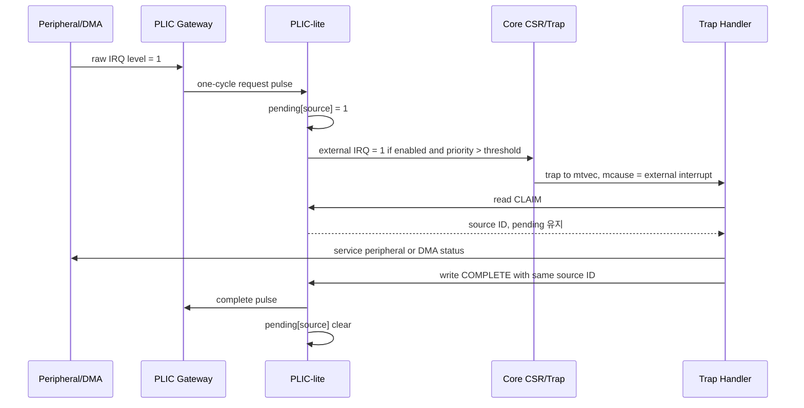

최신 `ApbPlicLite.sv` 기준으로 `CLAIM` read는 source ID만 돌려주고 pending bit를 지우지 않는다. 이전 PLIC 모델처럼 claim read 시 pending clear/active set이 일어나는 구조가 아니라, handler가 `COMPLETE`에 같은 source ID를 써야 pending이 clear되고 gateway block이 풀린다. 그래서 발표에서는 "claim으로 원인을 읽고, complete로 처리 완료를 확정한다"라고 말하는 것이 정확하다.

### Gateway가 필요한 이유

일반 peripheral IRQ는 level로 오래 유지될 수 있다. Gateway는 raw level 하나를 request pulse 하나로 바꾸고, software가 complete할 때까지 같은 source의 중복 pending을 막는다.

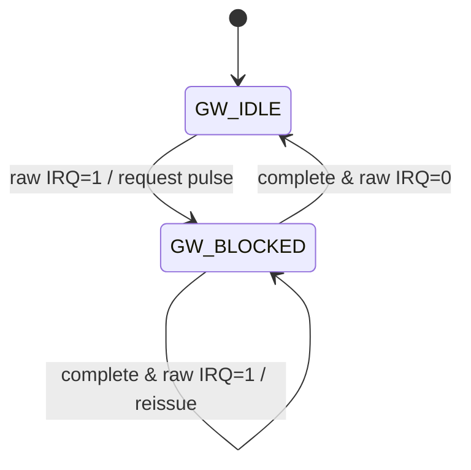

발표 멘트:

> PLIC는 interrupt를 단순 OR로 묶는 블록이 아니라, pending/active/priority/claim/complete 상태를 두고 CPU와 handshake하는 interrupt arbiter다.

## 8. RGB Demo interrupt 방식

기존 polling loop:

```text
while DMA_STATUS.done == 0:
    if DMA_STATUS.error:
        goto dma_error
```

최신 interrupt ROM 방식:

```text
reset_main:
    mtvec = trap_entry
    PLIC.priority[DMA_DONE] = 1
    PLIC.priority[DMA_ERROR] = 2
    PLIC.enable = DMA_DONE | DMA_ERROR
    mie.MEIE = 1
    mstatus.MIE = 1
    start DMA RX

trap_entry:
    save temporary registers
    if mcause == machine external interrupt:
        id = PLIC.CLAIM
        if id == DMA_DONE:
            clear DMA done
            advance RX->TX or TX->RX state
        if id == DMA_ERROR:
            clear DMA error
            set error LED
        PLIC.COMPLETE = id
    restore registers
    mret
```

### Polling baseline vs IRQ forward 발표 비교

| 항목 | 기존 polling RGB forward | 최신 RGB IRQ forward |
|---|---|---|
| 구현 난이도 | 낮음 | 높음 |
| 발표 안정성 | 높음 | handler/CSR/PLIC 초기화 필요 |
| CPU 동작 | DMA 완료까지 status loop | SRAM flag wait, 완료 원인은 interrupt handler가 기록 |
| 필요한 SW | reset/main loop만 필요 | trap handler/context save, PLIC claim/complete 필요 |
| 필요한 HW | DMA status register | CSR + TrapController + PLIC + peripheral IRQ |

이 비교는 느낀점과도 연결된다. compiler/linker/loader 없이 ROM assembly를 직접 구성하면 reset vector, trap entry, register save/restore, MMIO 순서를 모두 직접 챙겨야 하므로 MicroBlaze보다 bring-up 반복이 훨씬 불편하다.

## 9. PPT로 쪼개는 추천 슬라이드

| Slide | 제목 | 핵심 그림 | 한 줄 주장 |
|---:|---|---|---|
| SW-1 | RGB IRQ ROM Control Flow | IRQ ASM flowchart | 최신 RGB demo는 DMA done/error를 PLIC interrupt로 처리한다 |
| SW-2 | Polling Baseline | baseline flowchart | 기존 RGB forward는 polling 구조였고 IRQ ROM과 비교 대상이다 |
| SW-3 | CSR and Trap Entry | CSR state update diagram | trap은 PC redirect만이 아니라 CSR 상태 저장까지 포함한다 |
| SW-4 | PLIC Claim/Complete | sequence diagram | PLIC는 여러 peripheral IRQ를 pending/active/priority로 관리한다 |
| SW-5 | PLIC vs ARM NVIC | comparison table + flow | RISC-V PLIC는 claim/complete 중심이고 ARM NVIC는 vector table 직접 진입 중심이다 |
| SW-6 | Polling vs IRQ Forward | comparison table | polling baseline에서 interrupt-driven RGB ROM으로 고도화했다 |

## 10. PLIC와 ARM NVIC + Vector Table 방식 차이

STM32F103 같은 Cortex-M 계열을 먼저 보고 오면 interrupt를 "NVIC가 vector table에서 handler 주소를 바로 찾아서 들어가는 구조"로 생각하기 쉽다. RISC-V의 PLIC 방식은 그보다 software가 더 많이 개입한다.

### 핵심 비교

| 항목 | ARM Cortex-M NVIC + vector table | RISC-V PLIC + mtvec |
|---|---|---|
| interrupt controller 역할 | enable, pending, priority, vector 번호 관리 | external IRQ source pending, enable, priority, claim/complete 관리 |
| handler 진입 | 하드웨어가 vector table에서 handler 주소를 읽고 바로 branch | core는 `mtvec` trap entry로 들어가고, software가 `mcause`/PLIC claim으로 분기 |
| vector table 내용 | handler address table | RISC-V 표준은 `mtvec` base 중심, handler table은 software 설계 선택 |
| context save | Cortex-M exception entry가 일부 register 자동 stacking | RISC-V machine trap에서는 handler가 필요한 register를 직접 저장 |
| source 확인 | exception/IRQ number가 vector entry와 연결됨 | external interrupt cause는 보통 11이고, 실제 source는 PLIC `CLAIM`을 읽어 확인 |
| interrupt 완료 | peripheral flag clear + NVIC pending 처리 중심 | peripheral/DMA clear + PLIC `COMPLETE` write 필요 |
| local interrupt | NVIC 안에서 system exception/IRQ를 통합 관리 | timer/software interrupt는 PLIC 밖의 core-local path, external만 PLIC |
| 이번 core 상태 | 해당 없음 | `mtvec` direct mode, PLIC-lite, MachineInterruptController, TrapController 구현 |

### ARM NVIC 쪽 직관

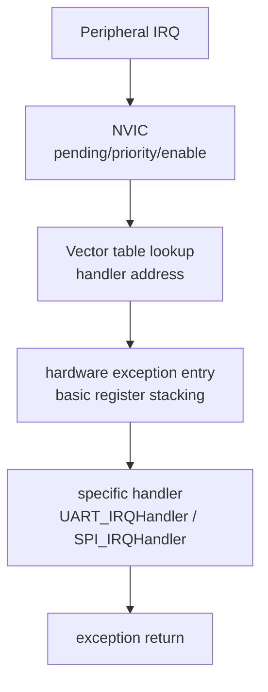

발표 멘트:

> ARM Cortex-M에서는 interrupt 번호가 vector table entry와 직접 연결되기 때문에, hardware가 handler 주소를 가져와 곧바로 해당 ISR로 들어가는 느낌이 강합니다.

### RISC-V PLIC 쪽 직관

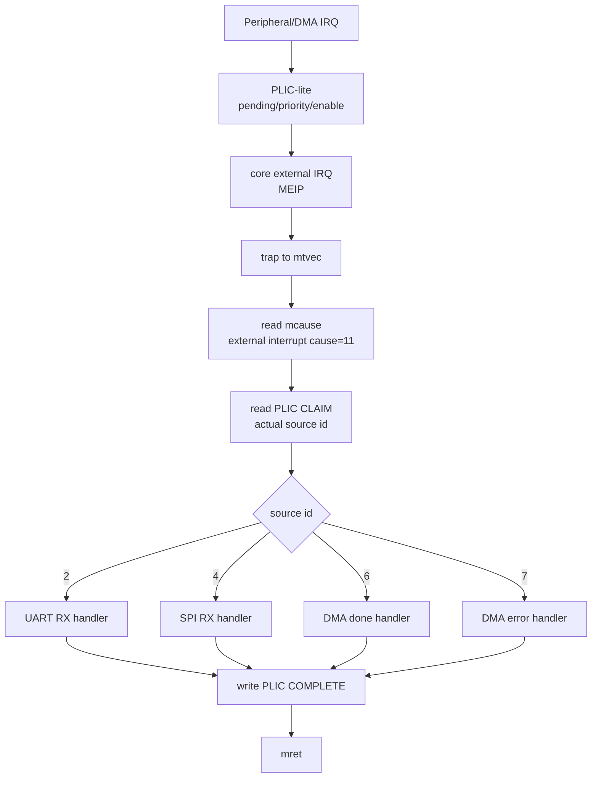

발표 멘트:

> RISC-V에서는 external interrupt가 들어오면 우선 `mtvec`로 trap entry에 들어갑니다. 그 다음 software가 `mcause`를 보고 external interrupt임을 확인하고, PLIC claim register를 읽어 실제 source를 구분합니다.

### 이 프로젝트에 적용해서 말하기

```text
STM32F103/NVIC 관점:
  IRQ 번호 -> vector table entry -> 특정 handler로 바로 진입

RISC_AXI/PLIC 관점:
  external IRQ -> mtvec trap entry -> mcause 확인 -> PLIC claim -> source별 handler 분기 -> PLIC complete
```

중요한 주의:

> 최신 RGB IRQ forward ROM은 RISC-V PLIC 흐름을 사용한다. ARM NVIC 비교는 STM32F103을 참고했던 초기 관점과 RISC-V PLIC/mtvec 설계 차이를 설명하기 위한 배경이다.

## 11. 발표 주의 문장

피해야 할 표현:

```text
기존 polling RGB ROM도 PLIC interrupt로 DMA done을 처리한다.
현재 software vector table이 ARM/NVIC처럼 하드웨어가 직접 참조하는 table이다.
```

권장 표현:

```text
기존 RGB forward ROM은 polling으로 DMA done/error를 확인한다.
최신 RGB IRQ forward ROM은 mtvec=0x80 direct trap entry로 들어온 뒤 PLIC claim ID를 읽는다.
그 claim ID를 ROM 내부 software irq_vector_table index로 사용해 DMA done/error handler를 고른다.
현재 ROM의 vector table은 ARM NVIC식 hardware vector table이 아니라 software dispatch table이다.
```

## 12. 근거 파일

| 주제 | 파일 |
|---|---|
| 최신 RGB IRQ forward ASM | `Project/risc_axi/C/runtime/uart_dma_spi_rgb_irq_forward.S` |
| 기존 polling RGB forward ASM | `Project/risc_axi/C/runtime/uart_dma_spi_forward.S` |
| SRAM invert extension ASM | `Project/risc_axi/C/runtime/uart_dma_sram_invert.S` |
| CSR address/cause 정의 | `Project/risc_axi/src/core/pipeline/rv32i_pkg.sv` |
| CSR trap/mret state | `Project/risc_axi/src/core/pipeline/CsrFile.sv` |
| interrupt pending/cause 선택 | `Project/risc_axi/src/core/pipeline/MachineInterruptController.sv` |
| trap arbitration/mtvec redirect | `Project/risc_axi/src/core/pipeline/TrapController.sv` |
| APB peripheral IRQ composition | `Project/risc_axi/src/bus/apb/ApbSubsystem.sv` |
| PLIC-lite register/claim/complete | `Project/risc_axi/src/bus/apb/ApbPlicLite.sv` |
| PLIC gateway level-to-pulse | `Project/risc_axi/src/bus/apb/ApbPlicGateway.sv` |
| DMA register/FSM | `Project/risc_axi/src/bus/apb/ApbAxiStreamDma.sv` |
| RGB IRQ mini TB | `Project/risc_axi/tb/soc/tb_SocTopRgbIrqMini.sv` |
| RGB IRQ mini sim Tcl | `Project/risc_axi/tools/run_rgb_irq_mini_sim.tcl` |
