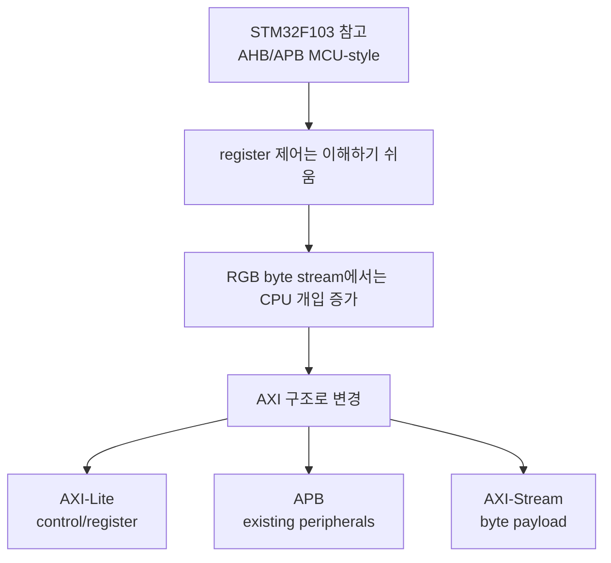
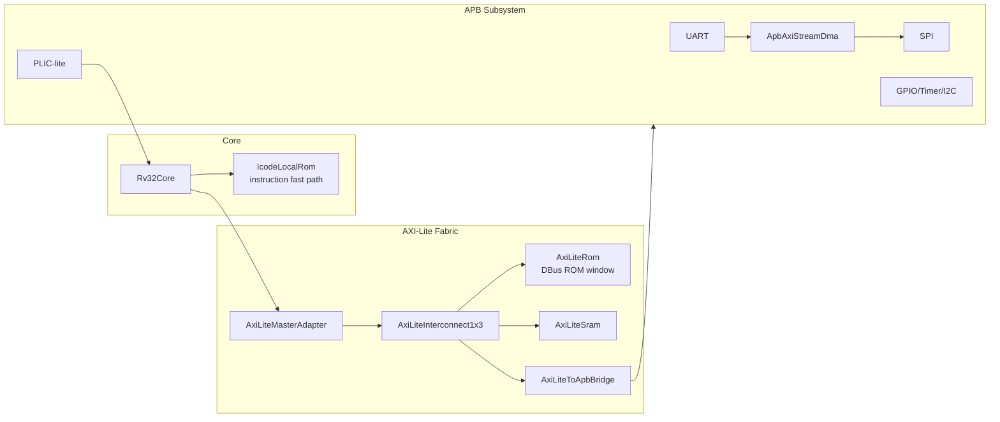
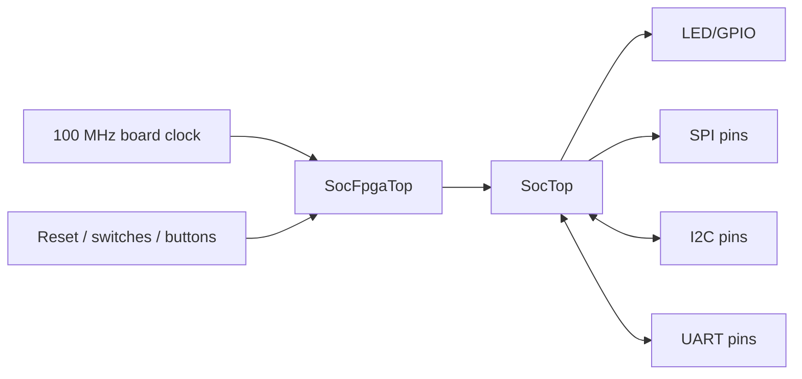
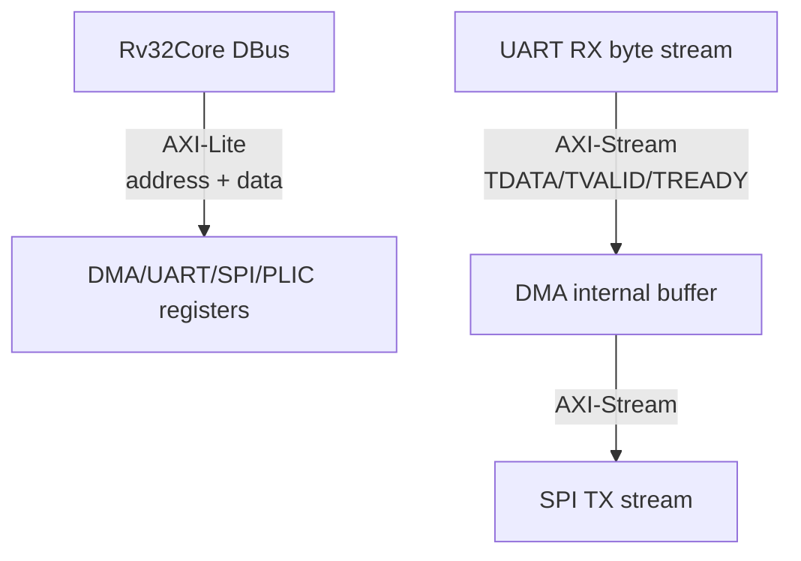
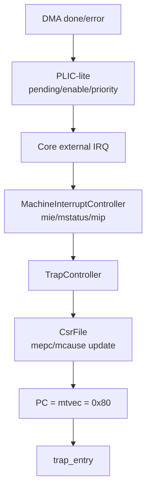
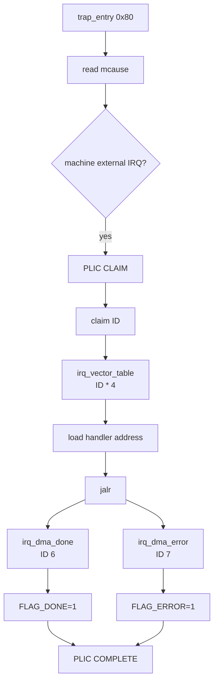
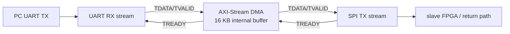
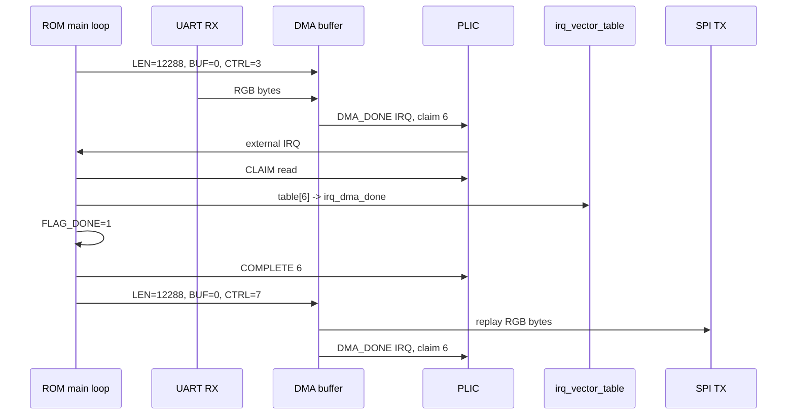
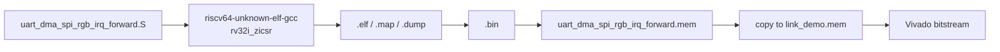

# RISC_AXI 최종 PPT 스토리보드

작성 기준: 2026-05-07 현재 `Project/risc_axi` 최신 ROM/RTL/리포트 상태.

발표 메인 기준은 `RGB IRQ forward` ROM이다. 기존 `RGB forward`는 DMA status polling baseline, `SRAM invert`는 appendix/확장 실험으로만 둔다.

## 0. 발표 전체 목차

| 순서 | 장 | 핵심 질문 |
|---:|---|---|
| 1 | 프로젝트 개요 | 무엇을 만들었나 |
| 2 | 시작점과 구조 변경 이유 | 왜 AHB 참고 구조에서 AXI 구조로 바꿨나 |
| 3 | Top 구조 | core, bus, peripheral, DMA가 어떻게 연결되나 |
| 4 | Bus 구조 | AXI-Lite, APB, AXI-Stream 역할이 어떻게 나뉘나 |
| 5 | Core와 interrupt | trap/CSR/PLIC/software vector table이 어떻게 동작하나 |
| 6 | DMA 구조 | CPU 대신 RGB byte stream을 어떻게 옮기나 |
| 7 | RGB IRQ ROM demo | 실제 ROM code가 어떤 순서로 동작하나 |
| 8 | 검증 | 어떤 증거로 동작을 보였나 |
| 9 | 느낀점 | 무엇이 어려웠고 무엇을 배웠나 |

## 1. 최종 슬라이드 구성

| Slide | 제목 | 한 줄 주장 | 메인 그림 |
|---:|---|---|---|
| 1 | RISC-V AXI SoC | 직접 만든 RV32I core로 AXI/APB/Stream SoC를 구성했다 | 전체 구조 한 줄 |
| 2 | Project Goal | CPU control과 DMA data movement를 분리하는 것이 목표였다 | goal diagram |
| 3 | AHB에서 AXI로 | STM32F103/AHB 참고에서 시작했지만 RGB stream에는 확장성이 부족했다 | AHB -> AXI 전환 |
| 4 | SocTop Architecture | IBus, DBus, APB peripheral, AXI-Stream DMA가 역할을 나눈다 | SocTop big picture |
| 5 | FPGA Top | `SocFpgaTop`은 board pin/clock/reset wrapper다 | board wrapper |
| 6 | Memory Map & Bus Roles | AXI-Lite는 제어, APB는 peripheral, AXI-Stream은 payload다 | address map + role table |
| 7 | AXI-Lite vs AXI-Stream | 주소 기반 register access와 valid/ready stream을 분리했다 | protocol comparison |
| 8 | Core Summary | core는 RV32I pipeline, local ICode ROM, DBus AXI-Lite path를 가진다 | core context |
| 9 | Interrupt Path | `mtvec=0x80` direct trap entry 뒤에서 PLIC claim을 software dispatch한다 | trap/PLIC diagram |
| 10 | Software Vector Table | ARM/NVIC table이 아니라 ROM 내부 software dispatch table이다 | vector table diagram |
| 11 | AXI-Stream DMA | UART RX stream을 DMA buffer에 받고 SPI TX stream으로 재생한다 | DMA data path |
| 12 | RGB IRQ ROM Flow | 12,288-byte RGB frame 완료는 PLIC interrupt와 SRAM flag로 처리한다 | ROM sequence |
| 13 | ROM Build Flow | custom core는 ROM `.mem`과 bitstream 반복 생성이 필요했다 | build pipeline |
| 14 | Verification | TB, mini sim 위치, timing/utilization, waveform 자리로 증거를 제시한다 | verification table |
| 15 | Result & Lessons | bus 구조, interrupt runtime, toolchain 어려움을 배웠다 | lesson summary |

## 2. Slide 1 - RISC-V AXI SoC

### 화면 문장

```text
Custom RV32I RISC-V Core
AXI-Lite Control Fabric
APB Peripheral Subsystem
AXI-Stream DMA RGB Data Path
```

### 그림


### 발표 멘트

> 이 프로젝트는 RISC-V core만 만든 것이 아니라, 그 core가 bus fabric을 통해 주변장치를 제어하고 DMA가 RGB byte stream을 이동시키는 SoC 구조까지 구성한 것입니다.

## 3. Slide 2 - Project Goal

### 슬라이드 주장

CPU가 모든 데이터를 직접 옮기는 구조가 아니라, CPU는 control register 설정을 담당하고 DMA가 payload byte stream을 담당하도록 설계했다.

### 화면 구성

| 역할 | 담당 |
|---|---|
| CPU | register 설정, interrupt 처리, phase 전환 |
| AXI-Lite | memory-mapped control transaction |
| APB | UART/SPI/GPIO/PLIC/DMA register 접근 |
| AXI-Stream DMA | RGB byte payload 이동 |

### 발표 멘트

> 핵심은 CPU와 DMA의 역할 분리입니다. CPU가 RGB byte를 한 byte씩 복사하지 않고, DMA가 UART stream을 buffer에 받고 SPI stream으로 내보냅니다.

## 4. Slide 3 - AHB에서 AXI로

### 슬라이드 주장

초기에는 STM32F103의 AHB/APB 구조를 참고했지만, RGB byte stream과 DMA 확장을 위해 AXI-Lite/APB/AXI-Stream 구조로 변경했다.

### 그림



### 말할 문장

```text
AHB/APB로 시작한 이유는 MCU-style 구조를 이해하기 쉬웠기 때문이다.
하지만 RGB image stream은 register access와 data movement의 성격이 달랐다.
그래서 control path는 AXI-Lite/APB로 두고 payload path는 AXI-Stream DMA로 분리했다.
```

## 5. Slide 4 - SocTop Architecture

### 슬라이드 주장

`SocTop`은 instruction fetch, DBus control access, APB peripheral, stream DMA path를 통합하는 SoC 본체다.

### 그림



### 주의 설명: ROM이 두 개처럼 보이는 이유

| ROM | 이유 |
|---|---|
| `IcodeLocalRom` | core IBus instruction fetch용 fast path |
| `AxiLiteRom` | DBus에서 같은 ROM image를 memory-mapped로 볼 수 있는 AXI-Lite ROM window |

> 발표에서는 "물리적으로 완전히 다른 프로그램 두 개"라고 말하지 말고, instruction fast path와 DBus-visible ROM window를 분리했다고 설명한다.

## 6. Slide 5 - FPGA Top

### 슬라이드 주장

`SocFpgaTop`은 board clock/reset/pin wrapper이고, 실제 SoC 통합은 `SocTop`이 담당한다.



### 발표 멘트

> FPGA top은 board pin과 clock/reset을 정리하는 wrapper이고, core/bus/peripheral/DMA 구조는 내부 `SocTop`에서 구성됩니다.

## 7. Slide 6 - Memory Map & Bus Roles

### 주소 맵

| 영역 | Base | 역할 |
|---|---:|---|
| ROM | `0x0000_0000` | ROM image window |
| SRAM | `0x2000_0000` | stack, software flags |
| Peripheral | `0x4000_0000` | AXI-Lite-to-APB bridge |

### APB map

| Peripheral | Address |
|---|---:|
| Timer | `0x4000_0000` |
| GPIOA | `0x4001_0000` |
| GPIOB | `0x4002_0000` |
| SPI | `0x4003_0000` |
| I2C | `0x4004_0000` |
| UART | `0x4005_0000` |
| DMA | `0x4006_0000` |
| GPIOC | `0x4007_0000` |
| PLIC-lite | `0x400F_0000` |

## 8. Slide 7 - AXI-Lite vs AXI-Stream

### 핵심 비교

| 항목 | AXI-Lite | AXI-Stream |
|---|---|---|
| 목적 | register/memory-mapped control | payload byte movement |
| 주소 | 있음 | 없음 |
| 핵심 신호 | AW/W/B, AR/R | TVALID/TREADY/TDATA |
| 이번 프로젝트 | CPU -> DMA/UART/SPI/PLIC register | UART RX -> DMA -> SPI TX |



### 발표 멘트

> AXI-Lite는 CPU가 "어느 register에 어떤 값을 쓸지" 정하는 경로이고, AXI-Stream은 RGB byte가 주소 없이 valid/ready로 흐르는 경로입니다.

## 9. Slide 8 - Core Summary

### 넣을 내용

| 항목 | 설명 |
|---|---|
| ISA | RV32I + CSR instruction 사용 |
| pipeline | IF/ID/EX/MEM/WB 구조 |
| IBus | `IcodeLocalRom` fast path |
| DBus | `AxiLiteMasterAdapter`를 통해 AXI-Lite fabric 접근 |
| interrupt | software/timer/external interrupt pending을 `MachineInterruptController`가 선택 |
| trap | `TrapController`가 trap redirect와 CSR update를 유도 |

### 성능 근거

| 항목 | 값 |
|---|---:|
| stress cycle | 539 |
| retired | 221 |
| CPI | 2.438914 |
| IBus wait | 32 |
| DBus wait | 192 |

### 발표 멘트

> AXI-Lite로 바꾸면서 instruction fetch까지 AXI-Lite transaction으로 처리하면 CPI가 크게 나빠졌기 때문에, IBus는 local ROM fast path로 분리했습니다. DBus만 AXI-Lite로 보내 control path를 구성했습니다.

## 10. Slide 9 - Interrupt Path

### 슬라이드 주장

DMA done/error는 PLIC를 통해 machine external interrupt로 core에 들어오고, core는 `mtvec=0x80` direct trap entry로 진입한다.



### 핵심 CSR

| CSR | 역할 |
|---|---|
| `mtvec` | trap entry base, 이번 ROM은 `0x80` |
| `mie.MEIE` | machine external interrupt enable |
| `mstatus.MIE` | global machine interrupt enable |
| `mcause` | interrupt 여부와 cause 기록 |
| `mepc` | trap 전 PC 저장 |

## 11. Slide 10 - Software Vector Table

### 가장 중요한 표현

```text
ARM/NVIC식 hardware vector table은 아니다.
RISC-V mtvec direct trap entry로 먼저 들어온다.
그 후 software가 PLIC CLAIM ID를 읽고,
ROM 내부 irq_vector_table을 claim ID로 indexing해서 handler를 고른다.
```

### 최신 ROM layout

| 주소 | label | 역할 |
|---:|---|---|
| `0x0000_0000` | `_start` | reset jump |
| `0x0000_0080` | `trap_entry` | direct trap entry |
| `0x0000_00C8` | `irq_external` | PLIC claim read |
| `0x0000_0138` | `irq_vector_table` | claim ID -> handler address |
| `0x0000_015C` | `irq_dma_done` | `FLAG_DONE=1` |
| `0x0000_0174` | `irq_dma_error` | `FLAG_ERROR=1` |
| `0x0000_018C` | `irq_complete` | PLIC complete |

### 그림



### ARM NVIC와 비교

| 항목 | ARM NVIC | 현재 RISC-V ROM |
|---|---|---|
| table lookup 주체 | hardware | software |
| entry 방식 | IRQ number -> vector entry | `mtvec=0x80` direct trap |
| source 구분 | IRQ number | PLIC claim ID |
| handler 분기 | hardware가 handler PC load | software가 table load 후 `jalr` |

## 12. Slide 11 - AXI-Stream DMA

### 슬라이드 주장

RGB payload는 CPU register/SRAM을 통해 한 byte씩 복사하지 않고, DMA internal buffer와 stream handshake로 이동한다.



### DMA register

| Offset | Register | RGB IRQ ROM 사용 |
|---:|---|---|
| `0x00` | `CTRL` | `3`: RX start+IRQ, `7`: TX start+IRQ |
| `0x08` | `LEN_BYTES` | 기본 `12288` |
| `0x10` | `CLEAR` | done/error sticky clear |
| `0x14` | `BUF_ADDR` | buffer offset 0 |

### 발표 멘트

> RGB888 64x64는 12,288 bytes이고 DMA buffer는 16 KB라서 한 frame을 담을 수 있습니다. CPU는 DMA length/direction/IRQ enable만 설정합니다.

## 13. Slide 12 - RGB IRQ ROM Flow

### ROM runtime sequence



### main loop 요약

```text
clear SRAM flags
clear DMA sticky
set DMA length and buffer address
start RX with IRQ enable
wait FLAG_DONE or FLAG_ERROR
start TX with IRQ enable
wait FLAG_DONE or FLAG_ERROR
show done/error GPIO pattern
loop
```

## 14. Slide 13 - ROM Build Flow

### 슬라이드 주장

MicroBlaze와 다르게 custom core는 firmware를 ROM image로 만들고, `.mem`을 bitstream에 반영하는 반복 과정이 필요했다.



### build 포인트

| 항목 | 값 |
|---|---|
| source | `Project/risc_axi/C/runtime/uart_dma_spi_rgb_irq_forward.S` |
| build | `Project/risc_axi/C/build_uart_dma_spi_rgb_irq_forward.ps1` |
| image size | `-ImageBytes`, default `12288` |
| mini sim | `ImageBytes=4` smoke scenario |
| bit output | `master_risc_axi_rgb_irq_forward.bit` |

## 15. Slide 14 - Verification

### 검증 표

| 항목 | 결과 |
|---|---|
| AHB trace scan | active source/TB/manifest에서 AHB 제거 |
| Vivado elaboration | `AXI_ELAB_CHECK_PASS`, 0 errors, 0 critical warnings |
| DMA stream TB | UART bytes -> DMA buffer -> SPI stream 확인 |
| SoC stress CPI | `cycle=539`, `retired=221`, `CPI=2.438914` |
| RGB IRQ bitstream timing | WNS `3.496 ns` at 20 ns, constraints met |
| RGB IRQ utilization | LUT 4492, FF 4042, BRAM 12, DSP 0 |
| RGB IRQ mini sim | TB/Tcl 위치 있음, PASS 로그는 별도 생성 후 추가 |

### waveform 자리

```text
검증 slide 오른쪽 또는 별도 slide:
1. ROM이 DMA LEN=12288 write
2. ROM이 DMA CTRL=3 write
3. UART RX stream TVALID/TREADY
4. DMA_DONE IRQ -> PLIC external IRQ
5. PC jumps to trap_entry 0x80
6. PLIC CLAIM = 6
7. irq_vector_table[6] -> irq_dma_done
8. FLAG_DONE set
9. DMA CTRL=7
10. SPI MOSI/SCLK/CS로 RGB byte 출력
```

## 16. Slide 15 - Result & Lessons

### 결과

```text
AHB 기반 참고 구조에서 AXI-Lite/APB/AXI-Stream 구조로 전환
RV32I core + AXI-Lite fabric + APB subsystem + AXI-Stream DMA 통합
RGB IRQ forward ROM으로 DMA done/error interrupt phase control 구현
PLIC claim ID 기반 software vector table dispatch 구현
50 MHz SoC clock 기준 timing met
```

### 느낀점 문장

> linker, compiler, loader까지 직접 설계하거나 연결하는 것은 생각보다 어려웠습니다. 구조는 이해하고 있었지만, MicroBlaze와 다르게 ROM code를 만들고 bitstream을 매번 다시 생성해야 해서 반복 개발이 불편했습니다.

> 처음에는 STM32F103을 참고해 AHB/APB 구조로 시작했지만, 확장성과 AXI 학습을 위해 구조를 바꾸었습니다. AXI-Stream과 DMA를 도입하면서 DMA를 단순 memory copy가 아니라 연속 byte stream 이동에 효율적으로 사용할 수 있다는 점을 배웠습니다.

> interrupt 쪽에서는 ARM NVIC처럼 hardware가 vector table을 바로 lookup하는 방식과, RISC-V에서 `mtvec`, PLIC claim, software dispatch를 직접 구성하는 방식의 차이를 체감했습니다.

## 17. 발표에서 피해야 할 표현

| 피할 표현 | 정확한 표현 |
|---|---|
| 모든 peripheral을 AXI로 바꿨다 | AXI-Lite control fabric 뒤에 APB peripheral을 유지했다 |
| DMA가 CPU SRAM에 RGB frame을 저장한다 | RGB payload는 DMA internal buffer에 있고, SRAM은 flag/debug에 사용한다 |
| ARM NVIC식 vector table을 구현했다 | `mtvec=0x80` direct trap entry 안에서 software `irq_vector_table`로 dispatch한다 |
| RISC-V vectored mode를 사용한다 | 현재는 `mtvec` direct mode다 |
| full PC-to-PC return path가 완성됐다 | master-side UART RX -> DMA -> SPI TX path와 IRQ ROM demo를 중심으로 발표한다 |

## 18. Gemini Canvas / PPT 디자인용 요약 프롬프트

```text
RISC-V AXI SoC 발표 자료를 디자인한다.
톤은 공학 프로젝트 발표, 깔끔한 block diagram 중심.
핵심 스토리는 STM32F103/AHB 참고 구조에서 출발해 AXI-Lite control, APB peripherals, AXI-Stream DMA data path로 구조를 바꾼 것이다.
메인 데모는 RGB IRQ forward ROM이다.
CPU는 DMA register를 설정하고, RGB byte stream은 UART RX -> DMA internal buffer -> SPI TX로 이동한다.
DMA done/error는 PLIC external interrupt로 들어오고, mtvec=0x80 direct trap entry에서 PLIC claim ID를 읽은 뒤 software irq_vector_table로 handler를 선택한다.
ARM/NVIC식 hardware vector table이 아니라 software dispatch table이라는 차이를 강조한다.
```

## 19. 근거 파일

| 내용 | 파일 |
|---|---|
| SoC top | `Project/risc_axi/src/soc/SocTop.sv` |
| FPGA wrapper | `Project/risc_axi/src/soc/SocFpgaTop.sv` |
| AXI-Lite fabric | `Project/risc_axi/src/bus/axi/` |
| APB subsystem | `Project/risc_axi/src/bus/apb/ApbSubsystem.sv` |
| DMA RTL | `Project/risc_axi/src/bus/apb/ApbAxiStreamDma.sv` |
| PLIC RTL | `Project/risc_axi/src/bus/apb/ApbPlicLite.sv` |
| RGB IRQ ROM | `Project/risc_axi/C/runtime/uart_dma_spi_rgb_irq_forward.S` |
| ROM dump | `Project/risc_axi/C/out/uart_dma_spi_rgb_irq_forward.dump` |
| ROM build | `Project/risc_axi/C/build_uart_dma_spi_rgb_irq_forward.ps1` |
| mini sim TB | `Project/risc_axi/tb/soc/tb_SocTopRgbIrqMini.sv` |
| bitstream report | `Project/risc_axi/output/master_rgb_irq_forward_bit/` |
