# RISC_AXI PPT 제작용 최신 자료

작성 기준: 2026-05-07 현재 `Project/risc_axi` 디스크 상태.

이 파일은 최종 PPTX를 만들기 전, 슬라이드에 바로 옮길 수 있는 문장/도표/그림 구성을 모은 소스 자료다. 전체 RTL을 설명하지 말고, `구조 변화 -> top 구조 -> RGB ROM 동작 -> DMA data path -> 검증 -> 느낀점` 순서로 발표한다.

현재 발표 메인 데모 기준은 `RGB IRQ forward`다. 기존 `RGB forward`는 polling baseline으로, `SRAM invert`는 확장 실험 또는 부록으로 다룬다.

추가 상세 자료:

- `SOC_TOP_RGB_DIAGRAMS.md`: RGB 기준 SocTop, AXI-Lite/APB/DMA 구조도.
- `RISC_AXI_ASM_PRESENTATION_GUIDE.md`: 예전 AHB assembly 발표자료 형식을 RISC_AXI RGB ROM 기준으로 옮긴 slide-by-slide ASM/ROM 가이드.
- `SW_TRAP_PLIC_VISUAL_GUIDE.md`: SW ASM 흐름, 현재 vector section, CSR trap entry, TrapController, PLIC claim/complete 시각화.

주의: 최신 `RGB IRQ forward` ROM은 DMA done/error를 PLIC interrupt로 처리한다. 기존 `RGB forward` ROM은 polling baseline이므로 두 ROM을 구분해서 발표한다.

## 0. 발표 핵심 스토리

### 한 줄 주제

직접 만든 RV32I RISC-V core를 중심으로 기존 AHB 기반 MCU-style SoC를 AXI-Lite 제어 경로, APB 주변장치, AXI-Stream DMA 데이터 경로로 재구성했다.

### 발표 흐름

```text
STM32F103/AHB 참고 구조로 시작
  -> 확장성, AXI 학습, DMA 활용 문제 발견
  -> AXI-Lite control fabric으로 구조 변경
  -> APB peripheral은 bridge 뒤에서 재사용
  -> AXI-Stream DMA로 UART/SPI byte stream 분리
  -> ROM code를 만들어 RGB forward 데모 구성
  -> DMA done/error를 PLIC interrupt로 처리하는 RGB IRQ forward ROM 추가
  -> SRAM invert는 image-processing 확장 예시로 정리
  -> TB, timing, utilization으로 동작 가능성 확인
```

### 말하면 좋은 결론

> 이번 설계의 핵심은 bus 이름을 바꾼 것이 아니라, CPU가 맡을 제어 경로와 DMA가 맡을 데이터 경로를 분리한 것이다.

## 1. 권장 PPT 구성

| Slide | 제목 | 한 줄 주장 | 메인 시각자료 |
|---:|---|---|---|
| 1 | RISC-V AXI SoC | Custom RISC-V core 기반 AXI/APB/Stream SoC를 구현했다 | title + 전체 한 줄 구조 |
| 2 | 시작점: AHB 구조 | STM32F103을 참고해 AHB/APB 구조로 출발했다 | AHB baseline path |
| 3 | 왜 구조를 바꿨나 | image/RGB byte stream에는 제어와 데이터 분리가 필요했다 | AHB -> AXI transition diagram |
| 4 | Top Architecture | Core, AXI-Lite, APB, Stream DMA가 역할을 나눠 동작한다 | 전체 top diagram |
| 5 | FPGA Top I/O | `SocFpgaTop`은 board pin과 `SocTop`을 연결한다 | board wrapper diagram |
| 6 | Bus 역할과 주소 맵 | AXI-Lite는 제어, APB는 주변장치, AXI-Stream은 데이터 | role table + address map |
| 7 | AXI-Lite Fabric | Core DBus를 AXI-Lite transaction으로 변환한다 | AXI fabric block diagram |
| 8 | AXI-Lite vs AXI-Stream | 제어 bus와 payload bus를 분리한 것이 핵심이다 | protocol role comparison |
| 9 | APB Peripheral Subsystem | 기존 APB peripheral은 bridge 뒤에서 재사용한다 | APB decode map |
| 10 | AXI-Stream DMA | CPU 대신 DMA가 UART/SPI byte stream을 이동한다 | DMA stream sequence |
| 11 | RGB ROM Demo: IRQ Forward | 12,288-byte RGB stream을 DMA buffer로 옮기고 DMA 완료는 PLIC interrupt로 처리한다 | RGB IRQ forward flow |
| 12 | SocTop 내부 상세 | control path, APB map, RGB stream path를 SocTop 기준으로 분해한다 | SocTop diagrams |
| 13 | ROM Build Flow | custom core는 ROM image와 bitstream 반복 생성이 필요했다 | build pipeline |
| 14 | 검증 결과 | 전체 시나리오와 핵심 파형으로 RGB byte 이동을 확인한다 | waveform + verification table |
| 15 | 결과와 느낀점 | 구조 설계, toolchain, DMA 활용을 깊게 이해했다 | lesson summary |

추가 선택 슬라이드:

| 위치 | 제목 | 넣는 이유 |
|---|---|---|
| Core/interrupt 설명 뒤 | PLIC vs ARM NVIC | STM32F103/NVIC 관점과 RISC-V PLIC/mtvec 관점의 차이를 설명 |

## 2. Slide 1 - RISC-V AXI SoC

### 화면 제목

`RISC-V Core 기반 AXI-Lite/APB/AXI-Stream SoC`

### 슬라이드 주장

직접 만든 RV32I core를 중심으로 FPGA에서 동작 가능한 SoC 구조를 구성했다.

### 화면 구성

- 왼쪽: 프로젝트 목표 3줄
- 오른쪽: 작은 전체 구조도
- 하단: `Control: AXI-Lite / Peripheral: APB / Data: AXI-Stream`

### 넣을 문장

```text
Custom RV32I core
AXI-Lite memory-mapped control path
APB peripheral subsystem
AXI-Stream DMA byte data path
```

### 발표 멘트

> 이 프로젝트는 RISC-V core 자체뿐 아니라 core가 주변장치를 제어하고, DMA가 데이터를 이동시키는 SoC 구조까지 직접 구성한 것입니다.

## 3. Slide 2 - 시작점: AHB 구조

### 슬라이드 주장

초기 구조는 STM32F103의 AHB/APB 계층을 참고한 MCU-style SoC였다.

### 그림

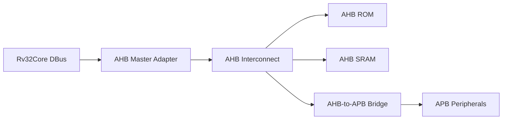

### 발표 멘트

> 처음에는 STM32F103처럼 CPU가 AHB를 통해 memory와 APB peripheral을 제어하는 구조를 참고했습니다. GPIO, UART, SPI 같은 register 기반 제어에는 이 구조가 이해하기 쉬웠습니다.

### 한계 문장

```text
AHB/APB는 register 제어에는 충분했지만,
image/RGB byte stream처럼 많은 데이터를 보내기에는 CPU 개입이 커지고
DMA 구조 확장도 제한적이었다.
```

## 4. Slide 3 - 왜 AXI로 바꿨나

### 슬라이드 주장

확장성과 DMA 활용을 위해 control path와 data path를 분리했다.

### 그림

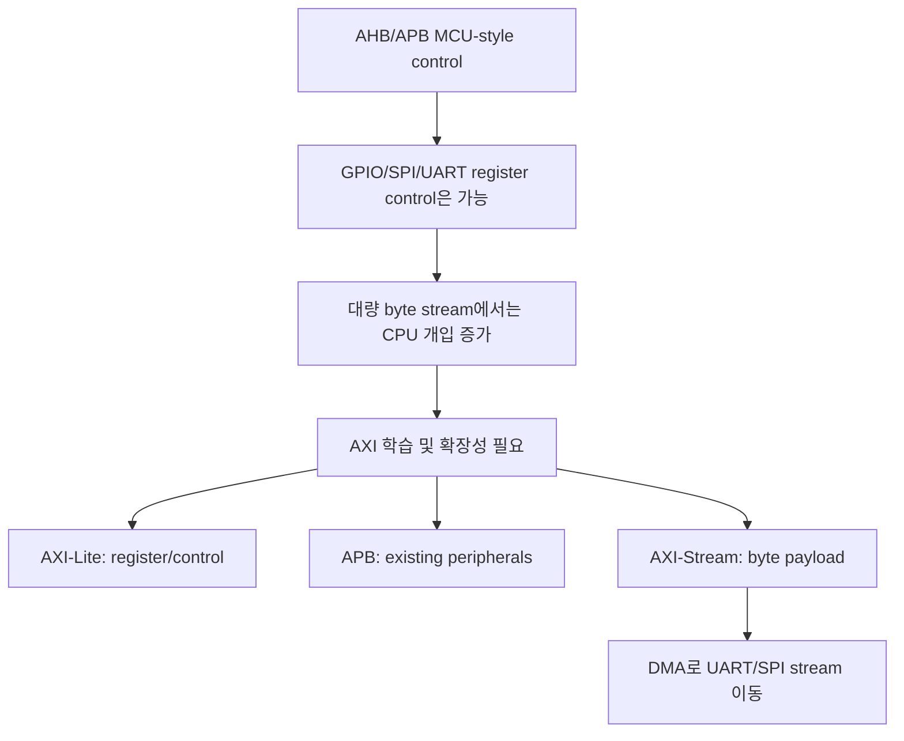

### 발표 멘트

> 구조를 바꾼 이유는 단순히 AXI를 써보기 위해서가 아니라, CPU는 control register를 설정하고 payload byte는 stream/DMA 경로로 이동하게 만들기 위해서입니다.

### STM32F103 참고에서 바뀐 설계 판단

| 처음 접근 | 바뀐 접근 | 이유 |
|---|---|---|
| STM32F103처럼 AHB/APB 계층 참고 | DBus는 AXI-Lite, peripheral은 APB 유지 | register 제어 구조는 유지하면서 AXI memory-map을 학습 |
| CPU가 peripheral register를 직접 제어 | CPU는 DMA register만 설정 | RGB byte를 CPU가 한 byte씩 옮기지 않게 함 |
| DMA를 memory-mapped bus master처럼 생각 | AXI-Stream DMA로 UART/SPI stream 연결 | UART/SPI payload는 address보다 valid/ready 흐름이 더 자연스러움 |
| MCU-style 단일 control 중심 | control path와 data path 분리 | 발표 핵심 구조가 명확해짐 |

### 발표 문장

```text
초기에는 STM32F103의 AHB/APB 구조를 참고했지만,
RGB 이미지 전송에서는 register control과 byte payload movement의 성격이 달랐다.
그래서 CPU control은 AXI-Lite/APB로 남기고,
실제 RGB byte는 AXI-Stream DMA로 분리했다.
```

## 5. Slide 4 - Top Architecture

### 슬라이드 주장

현재 top은 instruction fetch, control bus, peripheral, stream data path가 분리되어 있다.

### 핵심 그림

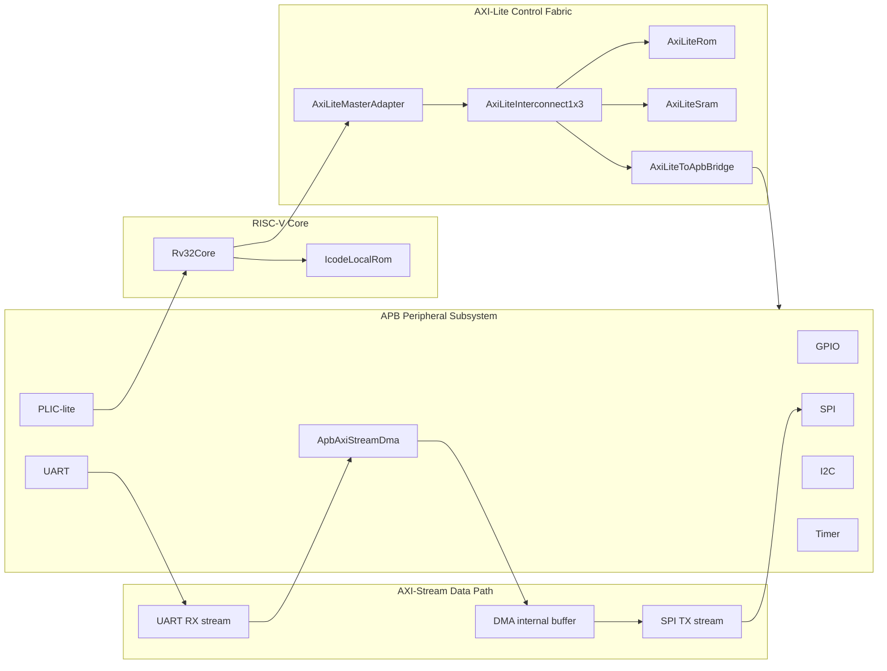

### 발표 멘트

> instruction fetch는 CPI를 위해 local ROM fast path로 두고, DBus만 AXI-Lite fabric으로 보냅니다. peripheral은 APB bridge 뒤에 유지했고, byte payload는 AXI-Stream DMA 쪽으로 분리했습니다.

### 근거 파일

`Project/risc_axi/src/soc/SocTop.sv`

## 6. Slide 5 - FPGA Top I/O

### 슬라이드 주장

`SocFpgaTop`은 board clock/reset/pin을 정리하고 내부 `SocTop`을 실제 FPGA 핀에 연결한다.

### 그림

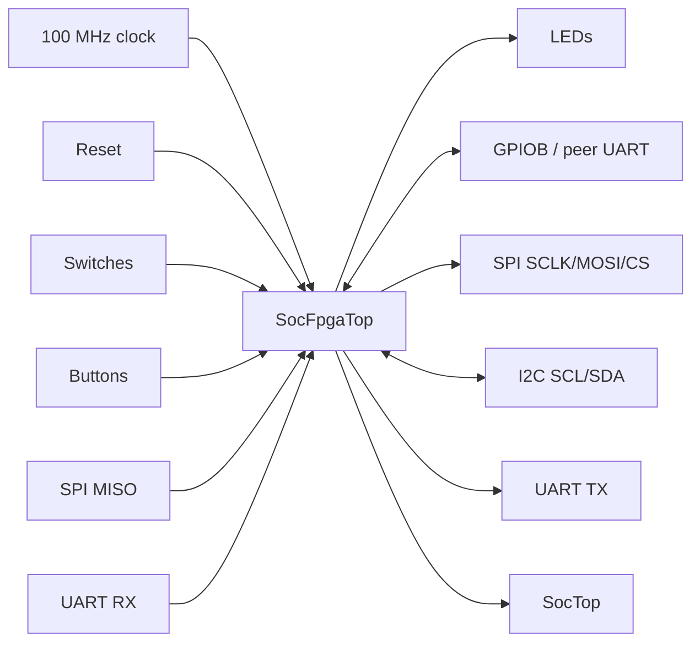

### 넣을 포인트

- 100 MHz 입력 clock을 50 MHz SoC clock으로 분주한다.
- `iSw[8]`로 UART 입력 source를 board UART와 GPIOB peer UART 중 선택한다.
- 넓은 debug bus는 FPGA top-level I/O에서 제거하고 내부에서만 사용한다.

### 근거 파일

`Project/risc_axi/src/soc/SocFpgaTop.sv`

## 7. Slide 6 - Bus 역할과 주소 맵

### Bus 역할 표

| Interface | 사용 위치 | 역할 |
|---|---|---|
| Local IBus | Core -> IcodeLocalRom | 빠른 instruction fetch |
| AXI-Lite | Core DBus -> ROM/SRAM/APB window | memory-mapped control |
| APB | Bridge -> peripheral | GPIO/SPI/UART/I2C/Timer/PLIC/DMA register |
| AXI-Stream | UART/DMA/SPI | continuous byte movement |

### 주소 맵

| 영역 | Base | 발표용 설명 |
|---|---:|---|
| ROM | `0x0000_0000` | code/ROM window |
| SRAM | `0x2000_0000` | CPU data buffer |
| APB window | `0x4000_0000` | peripheral base |
| GPIO | `0x4001_0000` | LED/status |
| SPI | `0x4003_0000` | board-to-board stream output |
| UART | `0x4005_0000` | PC byte input/output |
| DMA | `0x4006_0000` | stream DMA control/status |

### 발표 멘트

> 모든 peripheral을 AXI slave로 바꾼 것이 아니라, AXI-Lite window 뒤에 APB subsystem을 유지했습니다. 이 덕분에 기존 APB peripheral을 재사용하면서 AXI 구조를 학습할 수 있었습니다.

## 8. Slide 7 - AXI-Lite Fabric

### 슬라이드 주장

Core의 단순 local DBus request를 AXI-Lite read/write channel로 변환했다.

### 그림

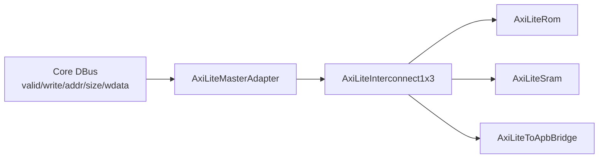

### 넣을 모듈 표

| 모듈 | PPT 설명 |
|---|---|
| `AxiLiteMasterAdapter` | local bus를 AXI-Lite master transaction으로 변환 |
| `AxiLiteInterconnect1x3` | ROM/SRAM/APB window decode |
| `AxiLiteToApbBridge` | AXI-Lite single transfer를 APB setup/access로 변환 |
| `AxiLiteSram` | byte strobe 지원 SRAM |

### 발표 멘트

> AXI-Lite는 AHB보다 channel이 더 나뉘어 있어 복잡하지만, register 제어용 single transfer에는 적합합니다. 여기서는 multiple outstanding보다 검증 가능한 단순 구조를 우선했습니다.

### AXI-Lite 핵심 설명

AXI-Lite는 burst가 없는 memory-mapped single transfer bus다. 이 프로젝트에서는 CPU DBus가 ROM/SRAM/peripheral window에 접근하는 제어 경로로 쓴다.

| Channel | 역할 | 이 프로젝트에서 보이는 상황 |
|---|---|---|
| AW | write address | DMA/UART/SPI register 주소 전달 |
| W | write data | register 설정값 전달 |
| B | write response | write 완료/오류 확인 |
| AR | read address | DMA status, peripheral status 주소 전달 |
| R | read data | status/data read 결과 반환 |

### AXI-Lite를 쓴 이유

```text
register 접근은 주소가 필요하다.
CPU는 "DMA LEN_BYTES에 12288을 써라", "DMA STATUS를 읽어라"처럼 동작한다.
따라서 control path에는 memory-mapped AXI-Lite가 맞다.
```

주의할 표현:

```text
AXI-Lite가 RGB pixel payload를 계속 밀어주는 bus는 아니다.
RGB payload는 AXI-Stream DMA 쪽으로 이동한다.
```

## 9. Slide 8 - AXI-Lite vs AXI-Stream

### 슬라이드 주장

AXI-Lite는 "어디에 접근할지"가 중요한 제어 bus이고, AXI-Stream은 "다음 byte를 받을 수 있는지"가 중요한 데이터 bus다.

### 비교표

| 항목 | AXI-Lite | AXI-Stream |
|---|---|---|
| 목적 | memory-mapped register/control | 연속 payload stream |
| 주소 | 있음 | 없음 |
| 대표 신호 | `AW/AR/W/R/B` channel | `TDATA/TVALID/TREADY/TLAST` |
| 이번 프로젝트 역할 | CPU DBus -> ROM/SRAM/APB window | UART RX -> DMA buffer -> SPI TX |
| RGB demo에서 의미 | DMA 길이/방향/status 설정 | 실제 12,288 byte RGB 이동 |

### 그림

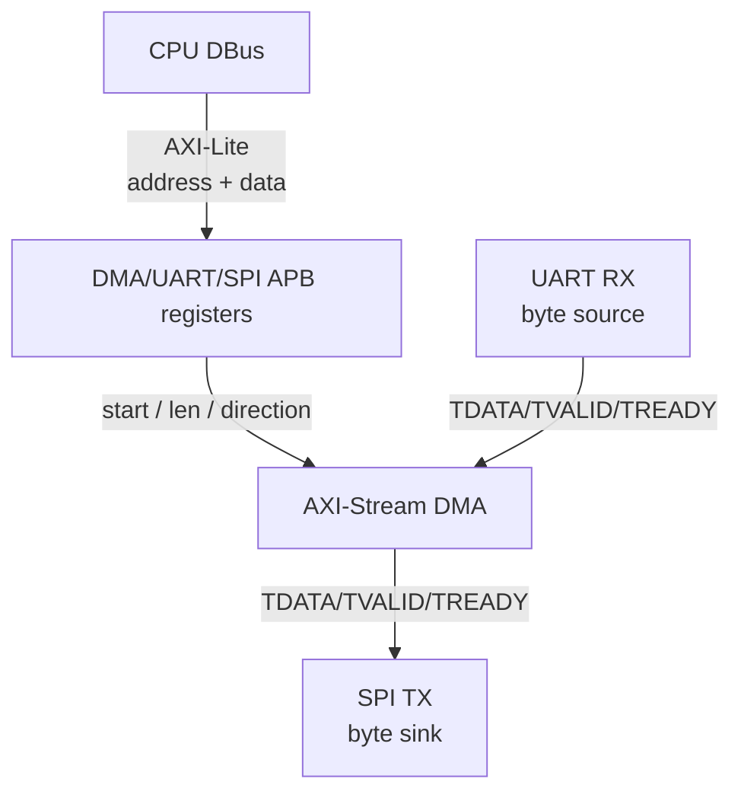

### 발표 멘트

> AXI-Lite는 CPU가 register를 읽고 쓰는 길이고, AXI-Stream은 RGB byte가 실제로 흐르는 길입니다. 이 둘을 분리했기 때문에 CPU가 payload를 직접 복사하지 않고 DMA가 stream handshake로 데이터를 이동할 수 있습니다.

## 10. Slide 9 - APB Peripheral Subsystem

### 슬라이드 주장

기존 APB 주변장치는 유지하고, AXI-Lite-to-APB bridge로 접근한다.

### 그림

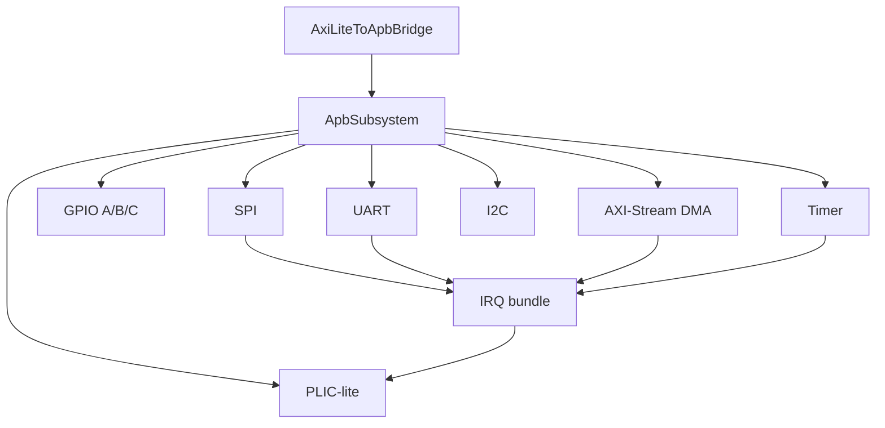

### 넣을 문장

```text
APB keeps low-speed register blocks simple.
AXI-Lite-to-APB bridge protects the existing peripheral boundary.
```

## 11. Slide 10 - AXI-Stream DMA

### 슬라이드 주장

DMA는 APB로 제어되고, payload는 AXI-Stream handshake로 이동한다.

### 그림

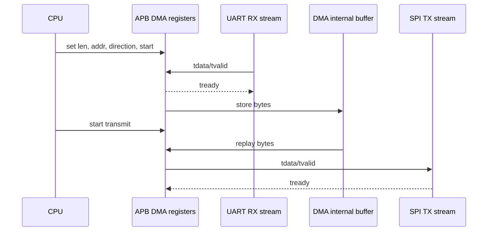

### DMA register 요약

| Offset | Register | 역할 |
|---:|---|---|
| `0x00` | CTRL | start / irq enable / direction |
| `0x04` | STATUS | busy / done / error |
| `0x08` | LEN_BYTES | byte count |
| `0x10` | CLEAR | sticky status clear |
| `0x14` | BUF_ADDR | internal buffer offset |
| `0x18` | BUF_DATA | debug buffer access |

### 발표 멘트

> CPU가 byte를 하나씩 복사하지 않고, CPU는 DMA register를 설정합니다. 실제 byte payload는 `tvalid/tready` handshake를 통해 DMA 내부 buffer와 UART/SPI 사이를 이동합니다.

### AXI-Stream handshake 설명

| Signal | 의미 | RGB path에서의 예 |
|---|---|---|
| `TDATA[7:0]` | 한 beat의 byte data | RGB byte 하나 |
| `TVALID` | source가 현재 byte를 유효하다고 표시 | UART RX FIFO 또는 DMA TX가 byte 보유 |
| `TREADY` | sink가 받을 준비가 됐다고 표시 | DMA RX 또는 SPI TX FIFO가 공간 보유 |
| `TLAST` | frame 마지막 beat 표시 | DMA 출력에서는 생성되지만 SPI 쪽 주 흐름에서는 필수 사용 아님 |

```text
전송 조건 = TVALID && TREADY
이 조건이 1인 clock에서만 byte가 실제로 이동한다.
```

발표 포인트:

> UART와 SPI는 byte 단위 peripheral이라 AXI-Stream의 valid/ready 모델과 잘 맞습니다. DMA는 중간에서 16 KB internal buffer를 두고 receive phase와 transmit phase를 나눕니다.

## 12. Slide 11 - RGB ROM Demo: IRQ Forward

### 슬라이드 주장

RGB IRQ forward ROM은 PC에서 들어온 12,288-byte RGB stream을 DMA buffer를 거쳐 SPI로 내보내고, DMA done/error phase 전환은 PLIC interrupt handler가 만든 SRAM flag로 처리한다.

### 동작 흐름

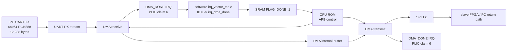

### RGB ROM 코드 흐름

```text
init UART/SPI/DMA
init PLIC priority/enable for DMA_DONE and DMA_ERROR
mtvec = 0x80
mie.MEIE = 1
mstatus.MIE = 1
software irq_vector_table:
  ID 6 -> irq_dma_done
  ID 7 -> irq_dma_error
DMA clear
DMA len = 12288
start UART -> DMA receive with IRQ enable
wait SRAM FLAG_DONE or FLAG_ERROR
DMA clear
start DMA -> SPI transmit with IRQ enable
wait SRAM FLAG_DONE or FLAG_ERROR
LED done/error pattern
```

### 최신 빌드 포인트

| 항목 | 값 |
|---|---|
| source assembly | `uart_dma_spi_rgb_irq_forward.S` |
| image bytes parameter | build script `-ImageBytes`, presentation default `12288` |
| RGB format | 64 x 64 x 3 bytes when `ImageBytes=12288` |
| generated ROM | `uart_dma_spi_rgb_irq_forward.mem` |
| generated bitstream | `master_risc_axi_rgb_irq_forward.bit` |
| PLIC source | claim `6`: DMA done, claim `7`: DMA error |
| trap/vector | `mtvec=0x80` direct trap entry + software `irq_vector_table` dispatch |
| PLIC behavior | `CLAIM` read reports source ID, `COMPLETE` clears pending/gateway block |

### 근거 파일

- `Project/risc_axi/C/runtime/uart_dma_spi_rgb_irq_forward.S`
- `Project/risc_axi/C/build_uart_dma_spi_rgb_irq_forward.ps1`
- `Project/risc_axi/tb/soc/tb_SocTopRgbIrqMini.sv`
- `Project/risc_axi/tools/run_rgb_irq_mini_sim.tcl`
- `Project/risc_axi/tools/build_master_rgb_irq_forward_bit.tcl`
- `Project/risc_axi/output/master_rgb_irq_forward_bit/master_risc_axi_rgb_irq_forward.bit`

### Polling baseline과 차이

| 항목 | 기존 RGB forward | 최신 RGB IRQ forward |
|---|---|---|
| 완료 확인 | `DMA_STATUS` polling | PLIC DMA done/error interrupt |
| CSR 설정 | 없음 | `mtvec`, `mie.MEIE`, `mstatus.MIE` |
| PLIC 사용 | 없음 | DMA done/error priority, enable, claim/complete |
| vector table | 없음 | ARM식 hardware vector table은 아니고 software `irq_vector_table` 사용 |
| main loop | status bit 직접 확인 | SRAM `FLAG_DONE/FLAG_ERROR` 대기 |

## 13. Slide 12 - SocTop 내부 상세

### 슬라이드 주장

`SocTop`은 control path와 RGB data path를 분리해서 묶는 SoC 본체다.

### SocTop 전체

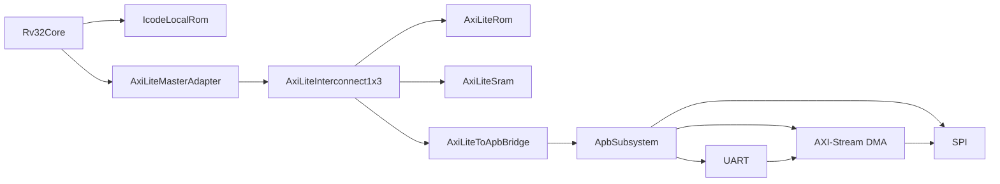

### 발표 멘트

> `SocTop` 안에서 CPU의 DBus는 AXI-Lite control path로 가고, RGB payload는 APB subsystem 내부의 UART/DMA/SPI stream path로 움직입니다.

### 추가 상세 자료

SocTop 상세 다이어그램은 별도 파일에 정리했다.

- `SOC_TOP_RGB_DIAGRAMS.md`

부록으로 SRAM invert를 설명할 경우:

- `Project/risc_axi/C/runtime/uart_dma_sram_invert.S`
- `Project/risc_axi/C/build_uart_dma_sram_rgb_invert.ps1`
- `Project/risc_axi/output/master_sram_invert_bit/`

## 14. Slide 13 - ROM Build Flow

### 슬라이드 주장

Custom core에서는 ROM image 생성과 bitstream 반영이 직접적인 bring-up 부담이었다.

### 그림

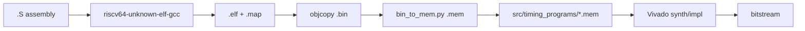

### 발표 멘트

> MicroBlaze처럼 toolchain, BSP, loader가 준비된 환경과 달리 custom RISC-V core에서는 linker script, ROM memory layout, `.mem` 변환, bitstream 재생성이 모두 맞아야 했습니다. 이 점이 어렵고 반복 개발도 느렸습니다.

### 넣을 파일명

| 단계 | 파일 |
|---|---|
| assembly | `C/runtime/*.S` |
| linker | `C/linker.ld` |
| memory image | `C/out/*.mem` |
| active ROM | `src/timing_programs/link_demo.mem` |
| build script | `C/build_uart_dma_*.ps1` |
| bit build | `tools/build_master*_bit.tcl` |

## 15. Slide 14 - 검증 결과

### 슬라이드 주장

기능 검증과 FPGA 구현 report 모두 현재 구조가 동작 가능함을 보여준다.

### 파형을 추가해야 하나?

넣는 것을 추천한다. 단, 모든 AXI channel 파형을 길게 보여줄 필요는 없다. 발표에서는 "전체 RGB 시나리오가 ROM code로 돌고, byte가 slave 방향 SPI로 나간다"를 보여주는 1장짜리 핵심 파형이면 충분하다.

### 추천 파형 캡처

| 구간 | 보여줄 신호 | 보여줄 의미 |
|---|---|---|
| ROM 실행 시작 | `PC`, `_start/reset_main` 근처 label, GPIO status | ROM code가 reset 후 실행됨 |
| AXI-Lite/APB control | `DMA_CTRL`, `DMA_LEN_BYTES`, `DMA_STATUS` write/read 또는 APB `PADDR/PWRITE/PWDATA` | CPU가 DMA를 register로 제어함 |
| UART -> DMA receive | UART RX stream `TDATA/TVALID/TREADY`, DMA count | PC에서 들어온 byte가 DMA buffer에 저장됨 |
| DMA -> SPI transmit | DMA output stream `TDATA/TVALID/TREADY`, SPI `SCLK/MOSI/CS` | DMA buffer byte가 SPI로 나감 |
| slave/peer 확인 | slave SPI shift register 또는 slave UART return byte | pixel byte가 peer 방향으로 도착함 |

### 최소 파형 한 장 구성

```text
1. DMA_LEN_BYTES = 12288 write
2. DMA_CTRL = 1 receive start
3. UART RX stream handshakes and DMA count increases
4. DMA_STATUS done
5. DMA_CTRL = 5 transmit start
6. DMA output stream handshakes
7. SPI MOSI에서 첫 pixel byte sequence 확인
```

### 발표 멘트

> 검증 파형은 전체 bus를 다 보여주기보다, ROM code가 DMA를 설정하고 UART로 들어온 RGB byte가 DMA buffer를 거쳐 SPI MOSI로 나가는 흐름을 한 화면에 보여주는 것이 좋습니다. AXI-Lite는 control write/read, AXI-Stream은 byte handshake가 보이면 충분합니다.

### 기능 검증 표

| 검증 | 결과 |
|---|---|
| AHB trace scan | active source/TB/manifest에서 AHB 제거 |
| Vivado elaboration | `AXI_ELAB_CHECK_PASS`, 0 errors, 0 critical warnings |
| APB subsystem stream TB | UART `12 34 56 78` -> DMA -> SPI `12 34 56 78` |
| SoC stress CPI TB | `cycle=539`, `retired=221`, `CPI=2.438914` |
| DBus wait breakdown | AR 44 / R 24 / AW 0 / W 0 / B 42 |

### 최신 구현 report

| Bitstream target | Timing | LUT | FF | BRAM | DSP |
|---|---|---:|---:|---:|---:|
| RGB IRQ forward, main | constraints met, WNS 3.496 ns at 20 ns | 4492 / 20800 | 4042 / 41600 | 12 / 50 | 0 / 90 |
| RGB forward, polling baseline | constraints met, WNS about 3.113 ns at 20 ns | 4174 / 20800 | 4037 / 41600 | 12 / 50 | 0 / 90 |
| SRAM invert, appendix | constraints met, WNS about 2.772 ns at 20 ns | 4331 / 20800 | 4040 / 41600 | 12 / 50 | 0 / 90 |

### RGB IRQ mini sim 자리

```text
tb_SocTopRgbIrqMini.sv:
  ImageBytes=4로 줄인 빠른 RGB IRQ smoke scenario
  UART 12 34 56 78 -> DMA RX -> DMA_DONE IRQ -> trap vector -> SPI frames >= 4 확인 목적
  현재 문서에는 testbench/Tcl 위치만 기록하고 PASS 로그는 별도 생성 후 추가
```

### 발표 멘트

> 구조 설계만 한 것이 아니라, stream integration test와 SoC stress test를 통과했고, 최신 RGB IRQ forward bitstream도 50 MHz SoC clock 제약을 만족했습니다.

### 검증 슬라이드 결론

```text
Simulation: UART byte -> DMA buffer -> SPI stream 경로 확인
Scenario waveform: ROM code가 DMA를 제어하고 pixel byte가 SPI/slave 방향으로 나감
Implementation: 50 MHz SoC clock timing met, WNS 3.496 ns
```

## 16. Slide 15 - 결과와 느낀점

### 완성된 것

- AHB 기반 active source 제거
- AXI-Lite control fabric 구성
- AXI-Lite-to-APB bridge 구성
- APB peripheral subsystem 유지
- APB-controlled AXI-Stream DMA 구현
- RGB IRQ forward ROM 생성
- RGB IRQ forward bitstream 산출
- 기존 RGB polling forward ROM은 baseline으로 보존
- SRAM invert 계열 ROM/bitstream은 확장 실험으로 확보
- testbench 및 timing/utilization report 확보

### 남은 것

- slave FPGA의 완전한 SPI RX -> UART TX return path 정리
- DMA가 SRAM을 직접 접근하는 AXI master 또는 memory DMA 구조
- AXI-Lite adapter/bridge focused TB 추가

### 느낀점 문장

> linker, compiler, loader까지 직접 연결하는 것은 생각보다 어려웠습니다. 구조는 이해하고 있었지만, MicroBlaze와 다르게 ROM code를 만들고 bitstream을 매번 다시 생성해야 해서 반복 개발이 불편했습니다.

> 처음에는 STM32F103을 참고해 AHB로 시작했지만, 확장성과 AXI 학습을 위해 구조를 바꾸었습니다. AXI-Stream과 DMA를 도입하면서 DMA를 단순 memory copy가 아니라 연속 byte stream 이동에 효율적으로 사용할 수 있다는 점을 배웠습니다.

> 결국 SoC 설계는 CPU, bus, peripheral, DMA가 각각 무엇을 담당할지 나누는 architecture 문제라는 것을 느꼈습니다.

## 17. PPT에 넣을 그림 우선순위

| 우선순위 | 그림 | 이유 |
|---:|---|---|
| 1 | Top Architecture | 발표 전체를 이해시키는 핵심 그림 |
| 2 | DMA Stream Path | AXI-Stream/DMA 도입 이유를 바로 보여줌 |
| 3 | ROM Build Flow | custom core에서 어려웠던 점 설명 |
| 4 | SocTop Internal Path | control/data path 분리 설명 |
| 5 | SRAM Invert Flow | 부록 또는 확장 실험 설명 |
| 6 | Verification Table | 결과 증거 |

## 18. 발표에서 조심할 표현

| 피할 표현 | 대신 쓸 표현 |
|---|---|
| 모든 peripheral을 AXI로 바꿨다 | AXI-Lite bridge 뒤에서 APB peripheral을 유지했다 |
| DMA가 CPU SRAM에 직접 쓴다 | 현재 DMA는 internal buffer 기반이고 SRAM copy는 CPU가 debug port로 수행한다 |
| 완전한 PC-to-PC image path가 끝났다 | master-side forward/invert bitstream과 stream path를 구성했고 return path는 정리 대상이다 |
| AXI라서 무조건 빠르다 | control/data 역할 분리와 stream backpressure 처리가 핵심이다 |

## 19. 근거 파일 인덱스

| 주제 | 파일 |
|---|---|
| Project manifest | `Project/risc_axi/fpga_auto.yml` |
| SoC top | `Project/risc_axi/src/soc/SocTop.sv` |
| FPGA board top | `Project/risc_axi/src/soc/SocFpgaTop.sv` |
| AXI address map | `Project/risc_axi/src/bus/axi/axi_lite_pkg.sv` |
| AXI-Lite adapter | `Project/risc_axi/src/bus/axi/AxiLiteMasterAdapter.sv` |
| AXI-Lite interconnect | `Project/risc_axi/src/bus/axi/AxiLiteInterconnect1x3.sv` |
| AXI-Lite-to-APB bridge | `Project/risc_axi/src/bus/axi/AxiLiteToApbBridge.sv` |
| APB subsystem | `Project/risc_axi/src/bus/apb/ApbSubsystem.sv` |
| AXI-Stream DMA | `Project/risc_axi/src/bus/apb/ApbAxiStreamDma.sv` |
| RGB IRQ forward ROM | `Project/risc_axi/C/runtime/uart_dma_spi_rgb_irq_forward.S` |
| Polling forward ROM | `Project/risc_axi/C/runtime/uart_dma_spi_forward.S` |
| SRAM invert ROM | `Project/risc_axi/C/runtime/uart_dma_sram_invert.S` |
| RGB IRQ forward build | `Project/risc_axi/C/build_uart_dma_spi_rgb_irq_forward.ps1` |
| RGB forward build | `Project/risc_axi/C/build_uart_dma_spi_rgb_forward.ps1` |
| RGB invert build | `Project/risc_axi/C/build_uart_dma_sram_rgb_invert.ps1` |
| RGB IRQ forward bit build | `Project/risc_axi/tools/build_master_rgb_irq_forward_bit.tcl` |
| RGB forward bit build | `Project/risc_axi/tools/build_master_rgb_forward_bit.tcl` |
| SRAM invert bit build | `Project/risc_axi/tools/build_master_sram_invert_bit.tcl` |
| Stream integration log | `Project/risc_axi/output/xsim_dma_stream/xsim.log` |
| SoC stress log | `Project/risc_axi/xsim.log` |
| RGB IRQ forward reports | `Project/risc_axi/output/master_rgb_irq_forward_bit/` |
| RGB forward reports | `Project/risc_axi/output/master_rgb_forward_bit/` |
| SRAM invert reports | `Project/risc_axi/output/master_sram_invert_bit/` |
