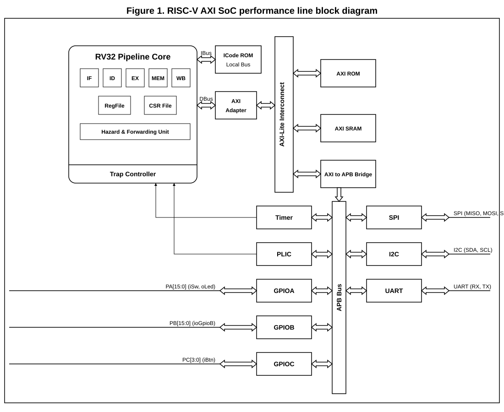
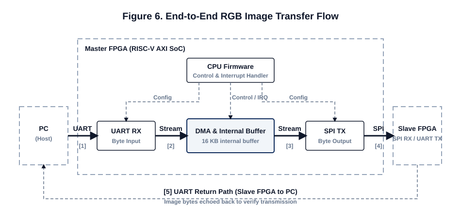
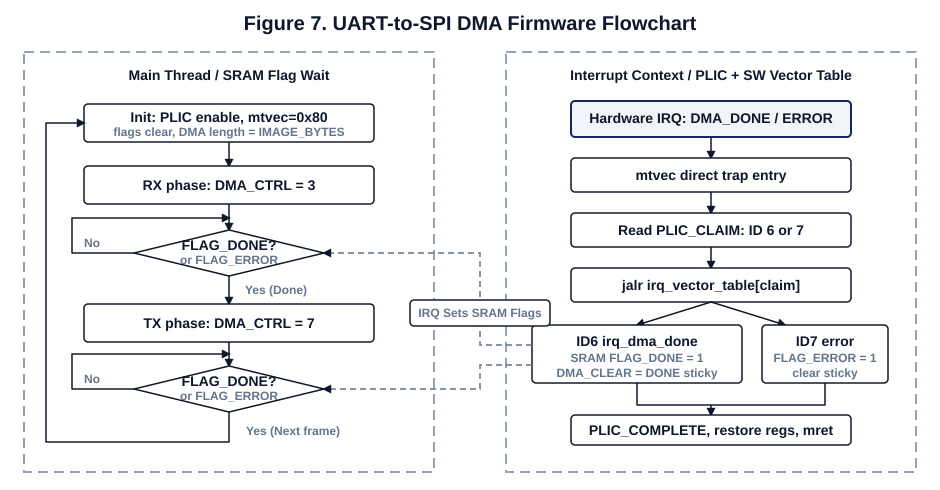

# RISC_AXI Mini MCU Project
> RV32I core, AXI-Lite/APB bus, PLIC-lite interrupt controller, AXI-Stream DMA, UART/SPI peripheral을 직접 연결해 만든 FPGA 기반 mini MCU 프로젝트입니다. PC에서 보낸 RGB image byte stream을 master FPGA가 UART로 받고, DMA buffer를 거쳐 SPI로 slave FPGA에 전달한 뒤 UART로 다시 PC에 반환하는 end-to-end data path를 구현했습니다.

## Project Info

| 항목 | 내용 |
|---|---|
| 기간 | `2026.05` |
| Platform | `FPGA` `Vivado` |
| Language | `SystemVerilog` `RISC-V Assembly` `Python` |
| Bus / Interface | `AXI-Lite` `APB` `AXI-Stream` `UART` `SPI` |
| Core Keywords | `RV32I Core` `Mini MCU` `DMA` `PLIC-lite` `Trap/Interrupt` `ROM Firmware` |

## Summary

- STM32F103 구조를 참고해 MCU를 `core -> bus -> peripheral -> interrupt -> firmware` 관점으로 분해한 뒤, RISC-V RV32I 기반 custom mini MCU로 재구성했습니다.
- CPU의 DBus는 AXI-Lite master adapter를 통해 interconnect로 연결되고, peripheral register 영역은 AXI-Lite to APB bridge를 거쳐 UART/SPI/GPIO/DMA/PLIC-lite에 접근합니다.
- RGB888 64x64 image frame은 `64 * 64 * 3 = 12,288 bytes`이며, CPU가 byte를 직접 복사하지 않고 APB register로 DMA를 설정한 뒤 AXI-Stream data path로 이동시킵니다.
- DMA 완료와 에러는 PLIC-lite external interrupt로 CPU에 전달되며, ROM firmware는 `mtvec=0x80`, PLIC claim/complete, software IRQ vector table로 RX/TX phase를 전환합니다.

## Architecture

### End-to-End Dataflow

`PC UART TX -> master UART RX -> AXI-Stream DMA buffer -> SPI master -> slave SPI RX -> slave UART TX -> PC compare`

## What Makes This Project Strong

- CPU, bus fabric, peripheral register map, interrupt controller, bare-metal firmware가 모두 맞물려야 동작하는 SoC 통합 프로젝트입니다.
- AXI-Lite는 register control path, AXI-Stream은 byte payload data path로 역할을 분리했습니다.
- PLIC-lite는 단순 IRQ OR가 아니라 priority/enable/pending/claim/complete 흐름을 가진 interrupt controller로 구성했습니다.
- ROM firmware는 polling만 하는 예제가 아니라 DMA done/error interrupt를 받아 software vector dispatch로 handler를 실행합니다.
- PC Python tool까지 포함해 hardware simulation이 아니라 실제 image byte sequence 송수신/비교 흐름을 검증할 수 있도록 구성했습니다.

## Key Modules

### 1. `SocTop.sv`

- RV32 core, local ROM, AXI-Lite interconnect, APB subsystem, DMA, UART/SPI, PLIC-lite를 연결한 top-level SoC입니다.
- instruction fetch는 local ROM, data/peripheral access는 AXI-Lite/APB path로 분리했습니다.

### 2. `Rv32Core.sv`, `CsrFile.sv`, `TrapController.sv`

- RV32I pipeline core와 CSR/trap path입니다.
- external interrupt가 들어오면 `mtvec`으로 PC를 redirect하고, firmware trap entry가 PLIC claim ID를 읽어 handler를 선택합니다.

### 3. `AxiLiteMasterAdapter.sv`, `AxiLiteInterconnect1x3.sv`, `AxiLiteToApbBridge.sv`

- core DBus request를 AXI-Lite transaction으로 변환하고, ROM/SRAM/peripheral address 영역을 decode합니다.
- APB peripheral에는 setup/enable phase를 가진 단순 register access로 변환합니다.

### 4. `ApbAxiStreamDma.sv`

- APB register로 제어되는 AXI-Stream DMA입니다.
- 내부 16 KB byte buffer를 사용해 UART RX stream을 저장하고, 같은 buffer를 SPI TX stream으로 replay합니다.
- `CTRL=3`은 RX start + IRQ enable, `CTRL=7`은 TX start + IRQ enable 동작입니다.

### 5. `ApbPlicLite.sv`, `ApbPlicGateway.sv`

- DMA done/error, UART/SPI IRQ source를 claim/complete 방식으로 관리하는 PLIC-lite입니다.
- RGB IRQ demo에서 실제로 사용하는 claim ID는 `6 = DMA_DONE`, `7 = DMA_ERROR`입니다.

### 6. `uart_dma_spi_rgb_irq_forward.S`

- reset vector, `mtvec=0x80` direct trap entry, PLIC claim/complete, software IRQ vector table을 포함한 bare-metal ROM firmware입니다.
- main loop는 DMA status register를 계속 polling하지 않고, interrupt handler가 SRAM flag를 set하면 RX/TX phase를 전환합니다.

## Firmware Flow

1. GPIO, UART, SPI, DMA, PLIC, CSR 초기화
2. RX phase: PC UART byte stream을 DMA buffer에 저장
3. DMA done interrupt 발생
4. trap entry에서 PLIC claim ID 확인 후 `irq_dma_done` handler 실행
5. TX phase: DMA buffer를 SPI stream으로 전송
6. slave FPGA가 SPI byte를 UART로 PC에 반환
7. PC script가 원본/수신 image byte sequence 비교

## Verification and Result

- `tb_CoreInterruptPath.sv`: CSR/trap/interrupt redirect path 검증
- `tb_SocTopRgbIrqSpiWave.sv`: RGB IRQ firmware가 DMA TX phase로 넘어가고 SPI pin으로 byte stream을 출력하는 흐름 검증
- `transfer_compare.py`: PC에서 image를 송신하고 slave 반환 결과를 수신해 byte-level 비교
- 발표 패키지에는 SPI waveform, SoC block diagram, PLIC flow, DMA stream flow를 함께 정리했습니다.

## Demo

- [Demo Video](./demo/risc_axi_demo.mp4)
- [HTML Slides](./slide.html)
- [Presentation PPTX](./presentation/우상욱_RISC_AXI_Mini_MCU_Project.pptx)
- [Speaker Notes PDF](./presentation/PRESENTATION_SPEAKER_NOTES_STUDY_GUIDE.pdf)

## Files

| 구분 | 경로 |
|---|---|
| SoC top | [`rtl/master_risc_axi/SocTop.sv`](./rtl/master_risc_axi/SocTop.sv) |
| FPGA wrapper | [`rtl/master_risc_axi/SocFpgaTop.sv`](./rtl/master_risc_axi/SocFpgaTop.sv) |
| RV32 core | [`rtl/master_risc_axi/Rv32Core.sv`](./rtl/master_risc_axi/Rv32Core.sv) |
| AXI-Lite master adapter | [`rtl/master_risc_axi/AxiLiteMasterAdapter.sv`](./rtl/master_risc_axi/AxiLiteMasterAdapter.sv) |
| AXI-Lite to APB bridge | [`rtl/master_risc_axi/AxiLiteToApbBridge.sv`](./rtl/master_risc_axi/AxiLiteToApbBridge.sv) |
| AXI-Stream DMA | [`rtl/master_risc_axi/ApbAxiStreamDma.sv`](./rtl/master_risc_axi/ApbAxiStreamDma.sv) |
| PLIC-lite | [`rtl/master_risc_axi/ApbPlicLite.sv`](./rtl/master_risc_axi/ApbPlicLite.sv) |
| ROM firmware | [`firmware_rom/uart_dma_spi_rgb_irq_forward.S`](./firmware_rom/uart_dma_spi_rgb_irq_forward.S) |
| ROM image | [`firmware_rom/uart_dma_spi_rgb_irq_forward.mem`](./firmware_rom/uart_dma_spi_rgb_irq_forward.mem) |
| SoC waveform TB | [`testbench/tb_SocTopRgbIrqSpiWave.sv`](./testbench/tb_SocTopRgbIrqSpiWave.sv) |
| Core interrupt TB | [`testbench/tb_CoreInterruptPath.sv`](./testbench/tb_CoreInterruptPath.sv) |
| PC transfer tool | [`pc_tools/python_comport/src/transfer_compare.py`](./pc_tools/python_comport/src/transfer_compare.py) |

## Portfolio Note

이 폴더는 포트폴리오 열람용으로 정리한 핵심 산출물 모음입니다. Vivado cache, simulation database, 중간 실험용 RTL은 제외했고, 구조 설명과 코드 확인에 필요한 발표자료/다이어그램/핵심 RTL/ROM/TB/PC tool만 포함했습니다.
