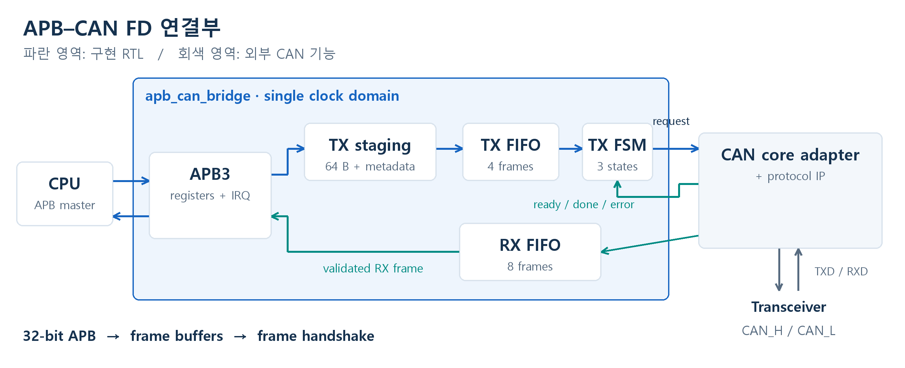

# CAN FD IP 연결용 APB 인터페이스 RTL 설계

32비트 APB 레지스터 접근을 CAN 프레임 송수신 요청으로 연결하는 SystemVerilog 프로젝트다. 완성 프레임을 FIFO에 보관하고, 외부 CAN core의 수락·완료에 맞춰 전송을 제어한다.

**[설계 보고서 PDF](docs/report.pdf) · [보고서 읽기](docs/report.md) · [코드 설명](docs/code_walkthrough.md)**

| 항목 | 내용 |
|---|---|
| 기간 | 2026.10 |
| 인터페이스 | APB3 slave, 32-bit data, 12-bit address, zero wait |
| 프레임 | 11-bit ID data frame, Classic CAN 0~8 B / CAN FD 최대 64 B |
| 버퍼 | TX 4 / RX 8프레임, 깊이 파라미터화 |
| 구현 | APB 레지스터, TX staging, TX/RX FIFO, 송신 FSM, 상태·인터럽트 |
| 도구 | SystemVerilog, Vivado XSim 2025.2, WaveDrom |

## 설계 구조



CPU가 ID·제어·데이터를 작성한 후 PUSH하면 TX FIFO에 프레임을 등록한다. CAN core가 바쁘면 요청을 유지하고, 수락 후 완료를 기다린다. 수신 데이터는 RX FIFO에 저장하며 CPU가 POP하기 전까지 보존한다.

APB가 50 MHz에서 2클럭마다 32비트를 전달하면 이론상 800 Mbit/s다. CAN FD 데이터 구간을 2 Mbit/s로 가정할 때 순수 데이터 기준 400배 차이가 있어, 프레임 FIFO로 순간적인 입출력 속도 차이를 흡수한다. 실제 CAN 프레임에는 헤더·CRC·중재 대기 등이 추가된다.

## 검증한 상황

| 상황 | 확인한 동작 |
|---|---|
| 정상 송수신 | 지원 길이별 ID·데이터·순서 일치 |
| CAN core 대기 | valid와 프레임 유지 |
| TX full | 추가 PUSH 오류, 기존 데이터 보존 |
| RX full | 새 프레임 폐기, overflow 표시 |
| full 동시 입출력 | 기존 head 소비 및 새 프레임 저장 |
| 미완성·잘못된 프레임 | 등록 거절 |
| 전송 대기·진행 중 reset | FIFO·FSM 초기화 |
| 오류·인터럽트 경합 | 오류 표시, 새 이벤트 보존 |

Vivado XSim에서 확인한 시나리오다. 보고서의 타이밍 그림은 실제 VCD의 신호 전이를 WaveDrom으로 재작성한 캡처이며, 편집 가능한 JSON도 함께 제공한다. 보고서에는 실제 Vivado GUI의 TX/RX 캡처와 신호·마커를 저장한 WCFG도 포함했다.

## 파일 구성

| 경로 | 역할 |
|---|---|
| [rtl/apb_can_bridge.sv](rtl/apb_can_bridge.sv) | APB 레지스터·staging·인터럽트 |
| [rtl/can_tx_ctrl.sv](rtl/can_tx_ctrl.sv) | 3상태 송신 FSM |
| [rtl/frame_fifo.sv](rtl/frame_fifo.sv) | 동기식 프레임 FIFO |
| [tb/](tb/) | APB/FIFO 테스트벤치와 CAN 동작 모델 |
| [docs/design_spec.md](docs/design_spec.md) | 레지스터 맵·인터페이스 계약 |
| [docs/naming_conventions.md](docs/naming_conventions.md) | RTL 네이밍 규칙 |
| [docs/wavecfg/](docs/wavecfg/) | 실제 XSim 캡처의 신호·시간 범위·마커 |
| [docs/wavedrom/](docs/wavedrom/) | 타이밍 WaveJSON 원본 |
| [docs/diagrams/](docs/diagrams/) | 구조·FSM·프레임·타이밍 그림 |

## XSim 실행

Python 3와 Vivado가 필요하다. 프로젝트 폴더에서 기본 깊이의 시나리오를 한 번 실행한다.

```powershell
python scripts/run_xsim.py --smoke --vivado-bin "C:/AMDDesignTools_vivado/2025.2/Vivado/bin"
```

Vivado가 PATH에 등록되어 있거나 `VIVADO_BIN`이 설정되어 있으면 `--vivado-bin`은 생략할 수 있다. 실행 성공 시 `PASS bridge`가 출력되고 `results/xsim/`에 파형이 생성된다. Vivado Tcl Console에서 아래 명령으로 파형을 연다.

```tcl
source scripts/open_xsim_capture_views.tcl
```

FIFO 깊이와 입력 패턴을 확장해 확인하려면 `--smoke`를 생략한다.

## WaveDrom 그림과 보고서 재생성

```powershell
npm ci
npx playwright install chromium
npm run waves
python -m pip install -r requirements-docs.txt
python scripts/build_report.py
```

WaveDrom이 JSON을 SVG로 렌더링하고 Chromium이 PNG로 캡처한다. 보고서는 이 PNG를 사용한다. PDF는 기본으로 Windows 맑은 고딕을 사용하며, 다른 환경에서는 `KOREAN_FONT` / `KOREAN_BOLD_FONT`로 글꼴을 지정한다.

## 구현 범위

CAN core는 프레임 단위 동작 모델로 검증했다. 중재·CRC·bit stuffing·bit timing은 외부 core, CAN_H/CAN_L은 외부 transceiver의 역할이다. 실제 CAN IP 통합, FPGA 보드 시험 및 STA는 수행하지 않았다. FIFO는 등록 순서를 유지하며 ID 우선순위 재정렬, 완료 timeout, wrapper 자체 재시도는 제공하지 않는다.
