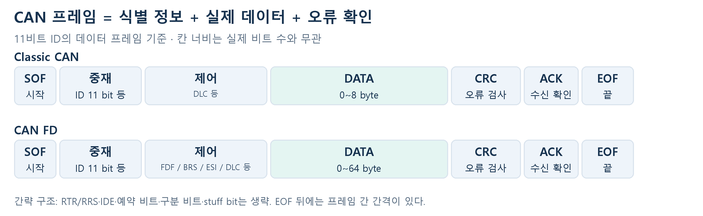
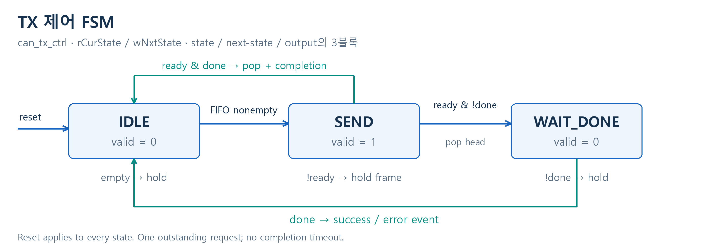
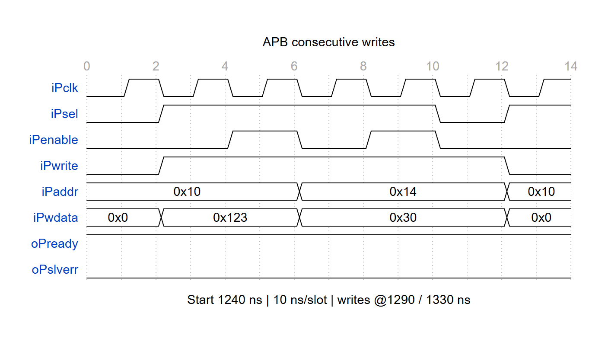
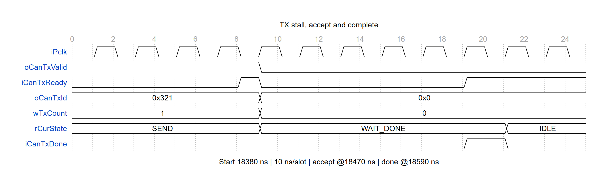
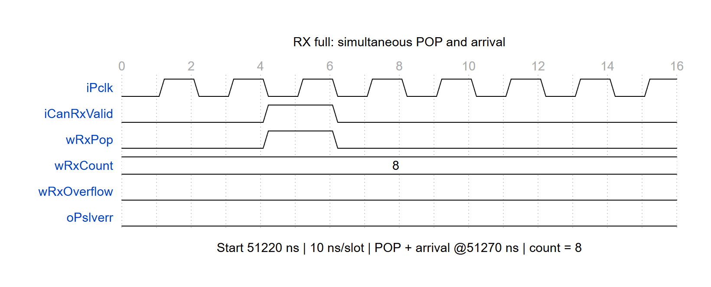
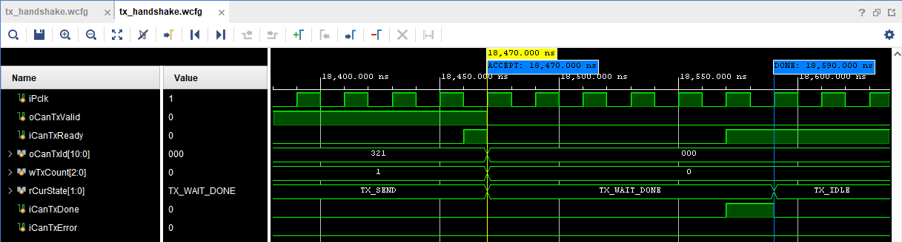
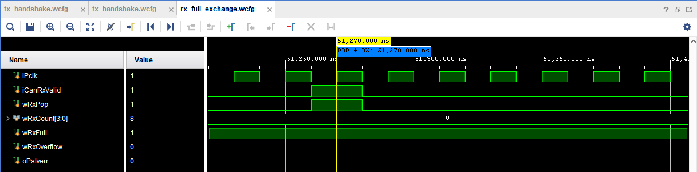

# CAN FD IP 연결용 APB 인터페이스 RTL 설계

CAN 개념 · 속도 비교 · 구현 범위 · 시나리오 검증

## 01 · CAN 개념과 프레임 구조

CAN은 여러 제어기가 같은 버스에서 메시지를 주고받는 직렬 통신이다. 버스가 비어 있으면 각 노드가 송신을 시작할 수 있는 multi-master 방식이다. 이 프로젝트는 CPU 쪽에서 APB slave로 동작하며, CAN 통신은 외부 CAN core에 요청한다.

동시에 송신하면 중재로 순서를 정한다. 같은 11비트 ID 형식에서는 작은 ID가 우선한다. 예를 들어 0x100과 0x200이 동시에 시작하면 0x100이 이긴다. 0(dominant)이 1(recessive)보다 우세하며, 1을 보냈는데 0을 읽은 노드는 송신을 멈추고 수신한다. 이 중재는 외부 CAN core가 처리한다. [1]

Classic CAN과 CAN FD의 간략 프레임 구조. 실제 CAN 선로에서 전송하는 형식이다.

| 필드 / 용어 | 쉽게 읽는 방법 |
|---|---|
| ID / 중재 | 메시지 식별과 버스 우선순위를 나타낸다. CPU 메모리 주소가 아니다. |
| DLC / DATA | DLC는 데이터 길이 코드, DATA는 실제 내용이다. FD의 DLC 9~15는 12/16/20/24/32/48/64바이트를 뜻한다. |
| FDF / BRS / ESI | FD 형식 표시 / 빠른 비트율 전환 여부 / 송신 노드의 오류 상태 표시다. ESI는 외부 core가 관리한다. |
| CRC / ACK / EOF | 전송 오류 검사 / 정상 수신한 노드의 응답 / 프레임 끝. ACK는 응용 SW가 데이터를 처리했다는 뜻은 아니다. |

Classic CAN은 프레임당 최대 8바이트, CAN FD는 최대 64바이트다. FD는 BRS=1일 때 프레임 도중 더 빠른 비트율로 전환할 수 있다. BRS=0이면 비트율을 바꾸지 않는다. 이 RTL은 11비트 ID의 데이터 프레임을 지원한다. [2, 3]

> CAN_H / CAN_L의 차동 전기 신호는 외부 transceiver가 만든다. RTL은 ID·길이·데이터를 외부 core에 넘기며, core가 중재·CRC·비트 전송을 수행한다.

## 02 · APB와 CAN은 얼마나 속도가 다른가?

APB는 칩 내부에서 여러 비트를 동시에 옮기고, CAN은 외부 선로에서 비트를 순서대로 보낸다. 32비트는 APB의 데이터 폭이고, 50 MHz는 클록 주파수다. 두 값을 함께 사용해야 전송량을 계산할 수 있다.

> APB 가정: 50 MHz, 32비트, wait 없음, 연속 접근. 1클럭=20 ns → SETUP+ACCESS 2클럭=40 ns → 4 byte/40 ns = 100 MB/s = 800 Mbit/s. 테스트벤치 클록을 사용한 이론값이며 CPU 실측 처리량이나 STA 보장값은 아니다.

| 비교 대상 | 속도 조건 | APB와 비율 |
|---|---|---|
| APB 32비트 | 50 MHz / 전송당 2클럭 → 800 Mbit/s | 기준 |
| Classic CAN | 최대 1 Mbit/s에서 비교 [3] | APB가 800배 |
| CAN FD 데이터 구간 | 2 Mbit/s를 예시로 가정 | APB가 400배 |
| CAN FD 중재 구간 | 500 kbit/s를 예시로 가정 | 프레임 전체가 2 Mbit/s는 아님 |

### 64바이트를 보낼 때 걸리는 시간

| 구간 | 계산 | 시간 |
|---|---|---|
| APB 데이터 작성만 | 16 word × 40 ns | 0.64 µs |
| APB 프레임 등록 | DATA 16회 + ID/CTRL/PUSH 3회 | 0.76 µs |
| CAN FD 데이터 비트만 | 64 × 8 bit ÷ 2 Mbit/s | 256 µs |
| 실제 CAN FD 프레임 | 헤더·CRC·ACK·stuff bit 등이 추가됨 | 256 µs보다 길다 |

0.64 µs와 256 µs가 순수 데이터 기준 400배 차이다. APB 등록 시간은 FIFO에 공간이 있고 CPU가 빈 클럭 없이 접근할 때의 최소값이다. CAN은 버스 중재 대기나 재전송까지 생기면 더 늦어진다. Classic CAN의 64바이트는 최소 8개 프레임으로 나눠야 한다.

### 그래서 프레임 FIFO를 둔다

TX FIFO는 CPU가 먼저 써 둔 프레임을 CAN이 처리할 때까지 보관한다. RX FIFO는 CAN에서 받은 프레임을 CPU가 읽을 때까지 보관한다. 기본값은 TX 4프레임 / RX 8프레임이며, 64바이트 데이터 기준 저장량은 각각 256 / 512바이트다. ID와 제어 정보도 각 항목에 함께 저장한다.

4/8은 기능 검증용 시작값이다. 실제 깊이는 순간적으로 몰리는 프레임 수와 CPU의 최악 응답 지연으로 정한다. RX는 대략 ‘최대 도착률 × CPU가 읽지 못하는 시간 + 여유’가 필요하다. 작은 프레임은 더 자주 도착하므로 64바이트 예시만으로 깊이를 보장할 수 없다. 지속 입력이 출력보다 빠르면 어떤 유한 FIFO도 결국 가득 찬다.

2 Mbit/s와 500 kbit/s는 설명용 조건이다. 이번 동작 모델은 프레임 수락·완료를 모사하며, 실제 CAN 비트율을 설정하거나 선로 전송 시간을 측정하지 않는다.

## 03 · 이번 RTL의 역할과 동작 순서

CPU → APB 레지스터 → 프레임 FIFO → 외부 CAN core로 이어지는 연결부를 구현했다. APB의 32비트 단어를 모아 최대 64바이트 프레임을 만들고, CAN core가 받을 수 있을 때 전달한다.

파란 영역이 직접 구현한 RTL이다. 외부 CAN core는 검증에서 동작 모델로 대체했다.

| 방향 | 사용 순서 |
|---|---|
| 송신 TX | ID/CTRL 설정 → DATA 작성 → PUSH=1 → FIFO 대기 → core 수락 → 완료/오류 표시 |
| 수신 RX | core에서 완성 프레임 도착 → FIFO 저장 → CPU가 ID/CTRL/DATA 읽기 → POP=1 |

IDLE: 요청 대기 / SEND: core 수락 대기 / WAIT_DONE: 수락한 프레임의 완료 대기.

SEND에서 ready=0이면 valid와 프레임을 유지한다. valid와 ready가 모두 1인 에지에 FIFO에서 꺼내고, done으로 완료를 확인한다. FIFO는 들어온 순서대로 전송한다. 버스의 ID 중재와 별개로, 이 FIFO에는 ID 우선순위 재정렬 기능이 없다.

주요 코드: apb_can_bridge.sv(APB·저장·IRQ), frame_fifo.sv(순서·개수 관리), can_tx_ctrl.sv(송신 FSM). i/o/r/w + PascalCase 규칙을 적용했다. 모든 인터페이스는 같은 클록을 사용한다.

## 04 · 상황별로 확인한 동작

테스트벤치가 CPU처럼 레지스터에 값을 쓰고 읽는다. CAN 동작 모델은 ‘지금 받을 수 있음 / 잠시 바쁨 / 완료 / 오류’를 반환한다. 기대한 데이터·순서·오류 표시와 실제 RTL 결과를 비교했다. 아래 8개 항목은 XSim으로 확인한 정상 동작과 코너 케이스다.

| 검증 시나리오 | Stimulus (시험 조건) | 기대 동작 | 결과 |
|---|---|---|---|
| ① 정상 송수신 | Classic 0~8 B, FD의 모든 지원 길이로 송신·수신 | ID·길이·데이터 일치. RX는 POP 전까지 유지. | PASS |
| ② CAN core가 바쁨 | ready=0으로 유지하고 다음 송신 데이터도 작성 | 대기 중 프레임과 valid 유지. ready=1에서 한 번 수락. | PASS |
| ③ TX FIFO 가득 참 | 더 꺼내지 않는 상태에서 새 PUSH | APB 오류 응답. 기존 프레임과 순서 보존. | PASS |
| ④ RX FIFO 가득 참 | CPU가 읽지 않을 때 새 프레임 도착 | 새 프레임만 폐기. 기존 데이터 보존, overflow 표시. | PASS |
| ⑤ full에서 동시 입출력 | 가득 찬 FIFO에서 같은 클록에 POP과 새 입력 | 기존 head를 꺼내고 새 프레임 저장. 저장 개수 유지. | PASS |
| ⑥ 덜 쓴 / 잘못된 프레임 | 필수 DATA word 누락 또는 Classic 형식 위반 후 PUSH | 등록 거절, FIFO 내용 유지. 실패한 PUSH는 staging 유지. | PASS |
| ⑦ 전송 중 reset | 수락 전 대기 / 수락 후 완료 대기 중 reset | FIFO와 FSM 초기화. 이전 요청을 다시 보내지 않음. | PASS |
| ⑧ 오류·알림 경합 | 송신 오류 반환 / IRQ clear와 새 이벤트 동시 입력 | TX error 표시. 새 이벤트가 clear보다 우선해 보존. | PASS |

### 결과를 읽는 기준

Vivado XSim 2025.2에서 위 동작을 확인했다. 표의 PASS는 APB 연결부와 프레임 FIFO의 기능 결과다. 실제 CAN 버스 중재·CRC·차동 파형의 적합성 시험을 뜻하지 않는다. FIFO 깊이 1과 비 2의 거듭제곱 깊이에서도 경계 동작을 별도로 점검했다.

기본 깊이 TX 4 / RX 8을 사용한다. TX의 개수는 대기 프레임 수이며, core가 이미 수락한 전송 중 프레임은 제외된다. RX full 때 새 프레임을 버리는 정책과 TX full 때 오류를 반환하는 정책을 구분했다.

> 현재 결과는 RTL 기능 시뮬레이션과 구조 점검까지다. 실제 CAN IP 연결·FPGA 보드 시험·STA는 후속 작업이며, core 완료 timeout과 wrapper 자체 재시도는 구현 범위에 포함하지 않았다.

## 05 · WaveDrom 타이밍 다이어그램

XSim VCD의 신호 전이를 WaveDrom으로 재작성하고 브라우저에서 캡처했다. 상단 눈금은 칸 번호이며 한 칸은 10 ns다. 구간 시작 시각은 그림 하단에 표시했다. PCLK는 50 MHz다. CAN_H/CAN_L 파형이 아니다.

APB 연속 쓰기: PSEL을 유지하고 SETUP → ACCESS를 반복한다. 전송당 2클럭을 확인한다.

상황 ②: ready가 낮을 때 valid·데이터를 유지하고, 수락 후 done까지 기다린다.

상황 ⑤: RX full에서도 POP과 새 수신이 동시에 발생하면 새 프레임을 저장하고 개수를 유지한다.

## 06 · Vivado XSim 실제 파형

Vivado 2025.2 GUI에서 시뮬레이션 WDB를 열고 핵심 신호와 이벤트 마커를 배치해 캡처했다. 앞 페이지의 WaveDrom은 동작 설명용이며, 아래 그림은 실제 시뮬레이터의 파형 화면이다.

### TX backpressure → 수락 → 완료

XSim GUI 캡처 · ACCEPT 18,470 ns / DONE 18,590 ns. ID는 16진수, FSM은 상태 이름으로 표시했다.

Stimulus: CAN core의 ready를 낮게 유지한 뒤 수락을 허용하고, 이후 done을 반환한다. 수락 전에는 valid=1과 ID=0x321을 유지한다. 18,470 ns에 요청을 수락하면 wTxCount가 1→0, FSM이 TX_SEND→TX_WAIT_DONE으로 바뀐다. 18,590 ns에 완료를 처리하고 TX_IDLE로 돌아간다.

### RX full 상태에서 POP과 수신 동시 발생

XSim GUI 캡처 · POP + RX 51,270 ns. wRxCount는 10진수로 표시했다.

Stimulus: RX FIFO가 8프레임으로 가득 찬 상태에서 POP과 새 수신을 같은 클록에 발생시킨다. 51,270 ns 상승 에지에 기존 head를 소비하면서 새 프레임을 저장한다. wRxCount=8, wRxFull=1이 유지되고 wRxOverflow=0, oPslverr=0으로 정상 처리된다. 새 데이터와 순서는 테스트벤치 비교로 확인한다.

재현: python scripts/run_xsim.py --smoke 실행 후 Vivado Tcl Console에서 source scripts/open_xsim_capture_views.tcl. docs/wavecfg의 WCFG에 신호 목록·확대 범위·마커를 저장했다.

## 참고 자료와 상세 문서

- [[1] CiA · CAN CC / 중재](https://can-cia.org/can-knowledge/can-cc)
- [[2] CiA · CAN FD / 프레임과 BRS](https://can-cia.org/can-knowledge/can-fd-the-basic-idea)
- [[3] Bosch · CAN FD / 속도와 데이터 길이](https://www.bosch-semiconductors.com/products/ip-modules/can-protocols/can-fd/)
- [[4] Arm · APB specification / SETUP·ACCESS](https://documentation-service.arm.com/static/63fe2c1356ea36189d4e79f3)

[상세 명세](design_spec.md) · [코드 설명](code_walkthrough.md) · [네이밍](naming_conventions.md)
